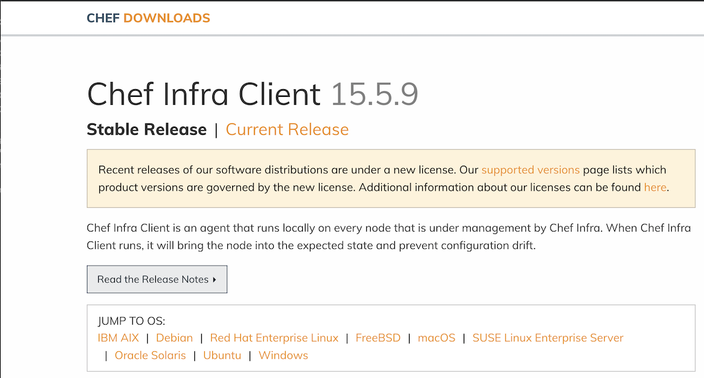

# **第一节 Chef 介绍和安装**

* Chef是什么 
* 为什么企业需要Chef 
* 在Linux下安装Chef开发工具
* 在`Mac OS X`下安装`Chef`开发工具

## **1、Chef是什么**

`Chef`是可以用来配置和管理物理数据中心或云中基础架构的自动化平台。可以把它部署到公司最适合的基础架构类型中。可以用`Chef`来加速应用程序部署，甚至完成持续部署流程。

`Chef`的关键威力在于它将基础架构变为代码。 用代码来表示基础架构意味着计算环境拥有一些与其应用程序一样的属性。

* 基础架构可以有不同版本。 
* 基础架构可以被随时重建。 
* 基础架构可以拥有完整的测试来保证正确性。 

图展示了`Chef`的基本架构。 

`Chef`开发包的组件可以帮助支持你在开发机器上写`Chef`代码；`Chef`服务器的组件可以帮 助延伸配置管理能力，使你可以管理成百上千或更多的服务器。 


## **2、为什么企业需要Chef** 

当`Adam Jacob`在2009年最开始创建`Che`时，他有三个重要的观点来解决他在其他配置管理工具中看到的不足。 

1. 配置管理工具应该对云基础架构提供顶级支持。 
2. 任何一个基础架构都是独一无二的。复杂的企业基础架构要能够极大地得益于将其IT基础架构和应用程序部署流程以代码来建模。 
3. 卓越的工具和点子来源于活跃的用户社区。光靠一个人的力量是不够的。 


### **2-1 多种用法** 

你可以通过很多方式使用Chef. `Chef`可以在无服务器模式独立运行或配合中央服务器（`Chef`服务器）运行。你也可以选择使用推送或拉（轮询）模式（或两种结合） 来做部署。

### 透明 

`Chef`分析平台强化`Chef`，让你可以在重要改变生效的时候收到通知来保证对标准的遵循。 

`Chef`独特的特性体现出强大的灵活性。你不需要为适应`Chef`而挣扎，而是让Chef适应你 和你的环境。你可以部署到云或本地基础架构，也可以在代码中描述任何资源，无论它们和标准的配置有多么不同。 

使用`Chef`，通常并不需要从零开始写描述基础架构的代码。许多标准的基础架构配置和 任务的菜谱都已经在`Chef`超市（`https://supermarket.chef.io/`）中，免费的。 

一旦掌握`Chef`，就可以用它来做以下事情。 

* 完全自动化部署，包括内部和面向用户的系统。 
* 自动化伸缩基础架构。 
* 让基础架构自我修复。 

举例而言，Tom Hallet使用`Chef`创建了一个叫`SoloWizard`的工具来自动化其`Mac OS X`开发机器的部署。

SoloWizard基于`Pivotal Labs`所做的促进开发者和最终用户使用自动化的工作。正像图中所示，`SoloWizard`允许你一键创建一个新的开发环境。你甚至可以通 过在一个简单的网站上做选择来个性化输出的脚本。此工具在`Solo Wizard`网站（`http://www.solowizard.com`）可以找到。 


## **3、在Linux下安装Chef开发工具** 

在Linux上安装Chef开发上具需要连接互联网以及对使用的心庙拥有root权限。

访问`Chef`下载页面(`https://downloads.chef.io/chefdk`)， 针对自己的Linux类型和版本下载合适的安装包。

点击`Chef Development Kit (Chefdk开发包）`链接.


如果针对具体`Linux`版本没有可用的`Chef`开发包的安装程序，需要安装针对的`Chef`客户端以及一些额外的工具。记住，使用Chef开发包安装程序十分便不是必须的，因此没有也没什么大不了的。在此情况一厂，回到`Chef`下载页面 `https://downloads.chef.io/`）并选择下载、安装`Chef Client` (Chef客户端）。

 
在下载页而`Chef Client` (`Chef`客户端）下，选择`Linux`分发类型和版本，选择好后，将得到安装包的下载链接。 




To start with the installation procedure, install the pre-requirement packages before installing Chef application. Execute the following command.

```
sudo  yum install -y wget curl git
```

After installing the pre-required packages, download the Chefdk package from its official site by running the wget command followed by the download link.

```
$ wget  https://packages.chef.io/files/stable/chefdk/4.5.0/el/7/chefdk-4.5.0-1.el7.x86_64.rpm
--2019-11-17 10:23:12--  https://packages.chef.io/files/stable/chefdk/4.5.0/el/7/chefdk-4.5.0-1.el7.x86_64.rpm
Resolving packages.chef.io (packages.chef.io)... 151.101.194.110, 151.101.2.110, 151.101.66.110, ...
Connecting to packages.chef.io (packages.chef.io)|151.101.194.110|:443... connected.
HTTP request sent, awaiting response... 200 OK
Length: 95156237 (91M) [application/x-rpm]
Saving to: 'chefdk-4.5.0-1.el7.x86_64.rpm'

100%[===================================================================================================================================>] 95,156,237   787KB/s   in 6m 37s

2019-11-17 10:29:50 (234 KB/s) - 'chefdk-4.5.0-1.el7.x86_64.rpm' saved [95156237/95156237
```

The package is downloaded to the target system. Next install the chefdk by executing the rpm command.


```
$ sudo rpm -ivh chefdk-4.5.0-1.el7.x86_64.rpm
warning: chefdk-4.5.0-1.el7.x86_64.rpm: Header V4 DSA/SHA1 Signature, key ID 83ef826a: NOKEY
Preparing...                          ################################# [100%]
Updating / installing...
   1:chefdk-4.5.0-1.el7               ################################# [100%]
Thank you for installing ChefDK!
You can find some tips on getting started at https://learn.chef.io
```

Chef开发包的安装程序会自动将`Chef`和`Ruby`安装到`/opt/chefdk/emhedded`目录，这些目录 通常封：不会在默认环境的路径（`PATH`)中。


 
Chef开发包包含一个`chef shell-init`命令来更改现有壳环境来使用这些路径。假设使用 `Linux`的默认bash壳，运行以下命令可以永久性启用这个路径（`PATH`)设置。 

**安装Chef开发包：** 

```
echo 'eval "$(chef shell-init bash)"' >> ~/.bash_profile
```

**`Chef`客户端安装**

```
export PATH='/opt/chef/embedded/bin:$PATH 
```

更改`＄HOPE/.bash_profile`以后，需要对这个文件执行`source`来设定正确的路径 (`*PATH`)。或者可以彻底关闭并重启命令行程序来重新加载`$HOME/.bash_profile`

``` 
$ source $HOME/.bash_profile 
```

### **3-1 验证Linux下的Chef开发包、Chef客户端安装** 


取决于安装的是**`Chef`开发包**还是**`Chef`客户端**，确保在以`$PATH`更改后系统使用在`opt/chefdk/embedded/bin`(Chef开发包）或`/opt/chef/embedded/bin`(Chef客户端）的`Ruby`脚本引擎。在命令行执行`which ruby`，会看到如下结果。 

如果安装的是`Chef`开发包 

```
$ which ruby
/opt/chefdk/embedded/bin/ruby
```


如果安装的是`Chef`客户端

```
$ which ruby
/opt/chef/embedded/bin/ruby
```

The Chef application is installed successfully in your system. You can also verify the ChefDK installation procedure by running the following command.

```
$ chef verify
+---------------------------------------------+
            Chef License Acceptance

Before you can continue, 3 product licenses
must be accepted. View the license at
https://www.chef.io/end-user-license-agreement/

Licenses that need accepting:
  * Chef Development Kit
  * Chef Infra Client
  * Chef InSpec

Do you accept the 3 product licenses (yes/no)?

> yes

Persisting 3 product licenses...
✔ 3 product licenses persisted.
...
```

```
$ chef-client --version
Chef Infra Client: 15.4.45
```

### **3-2 验证Linux下卸载Chef开发包、Chef客户端**


在RedHat企业`Linux`系统中，可以使用`rpm`来却载`Chef`开发包和`Chef`客户端。 

**`Chef`开发包却载**：

```
$ rpm -qa chefdk 
$ sudo yum remove -y 
＃如果你安装了其他的Ruby程序（gems)，手动删除/opt/chefdk
$ sudo rm -rf/ opt/chefdk 
＃从＄HOME/.bash_profile删除Chef的路径 
```

**`Chef`客户端却载**：

```
$ rpm -qa chef 
$ sudo yum remove -y <package> 
＃如果你安装了其他的Ruby程序（gems)，手动删除／opt/chef 
$ sudo rm一rf/opt/chef 
＃从＄HOME/.bash_profile删除Chef的路径 
```

### **3-3 在Linux下安装`Test Kitchen`（如果前面选择安装Chef客户端而不是开发包）**

在有些动手练习中，会使用`Test Kitchen`来创建虚拟的沙众环魂。`Chef`客户端安装程序片不安装`Test Kitchen`，因此需要你手动安装。 

需要安装`test-kitchen`的`Ruby`程序(gems) `gem`指用`Ruby`写并分发的库或应用程序 可以想象`gem`为`Ruby`程序的安装程序。

以`root`权限运行`gem install`命令可以安装`test一kitchen`程序, `--no-ri`和·no rdoc`参数可以通过免除安装和创建文档来节省时间 

```
sudo gem install test-kitchen --no-ri  --no-rdoc 
```

### **3-4 Ruby 程序被安装到哪了**

```
$ gem env
RubyGems Environment:
  - RUBYGEMS VERSION: 3.0.3
  - RUBY VERSION: 2.6.5 (2019-10-01 patchlevel 114) [x86_64-linux]
  - INSTALLATION DIRECTORY: /home/vagrant/.chefdk/gem/ruby/2.6.0
  - USER INSTALLATION DIRECTORY: /home/vagrant/.chefdk/gem/ruby/2.6.0
  - RUBY EXECUTABLE: /opt/chefdk/embedded/bin/ruby
  - GIT EXECUTABLE: /usr/bin/git
  - EXECUTABLE DIRECTORY: /home/vagrant/.chefdk/gem/ruby/2.6.0/bin
  - SPEC CACHE DIRECTORY: /home/vagrant/.gem/specs
  - SYSTEM CONFIGURATION DIRECTORY: /opt/chefdk/embedded/etc
  - RUBYGEMS PLATFORMS:
    - ruby
```

### 验证Linux下`Test Kitchen`的安装（如果前面选择安装Chef客户端而不是开发包） 

可以通过运行`gem list`命令来验证`test-kitchen`的安装。如果`Test Kitchen`已经安装， `gem list`命令会显示结果`true`:

```
gem list test-kitchen -i
true
``` 


## **4、在`Mac OS X`下安装`Chef`开发工具** 

[https://downloads.chef.io/chefdk/4.5.0](https://downloads.chef.io/chefdk/4.5.0)


`Chef`开发包的安装程序会自动将`Chef`和`Ruby`安装到`/opt/chefdk/embedded`目录，这些目录通常不会在默认环境的路径(PATH)中

`Chef`开发包包含一个`chef shell-init`命令来更改现有壳环境来使用这些路径。假设使用 
`Mac Os`默认`bash`壳运行以下命令可以永久性启用这个路径(`PATH`)设置。


**安装Chef开发包**

```
echo 'eval "$(chef shell-init bash)"' >> ~/.bash_profile
```

如果没有合适的`Chef`开发包版本而选择安装`Chef`客户端，`Chef`和`Ruby`将被安装到`/opt/chefdk/embedded`


我们推荐你把这个b加位置加到以下的路径（`PATH`)中。 可以把这一行加入到`$HOME/.bash_profile`文件，或在启动配置和设定中的指定其他配置文件（`profile`)，如果使用的是其他命令行壳 

```
export PATH="/opt/chef/embedded/bin:$PATH" 
```

更改`＄HOME/.bash_profile`以后，需要对这个文件执行`source`来设定正确的路径 
(`$PATH`）。或者可以彻底关闭并重启命令行程序来重新加载`＄HOME/bash_profile`: 

```
source $HOME/.bash_profile 
```

取决于安装的是`Chef`开发包还是`Chef`客户端，确保在以上`$PATH`更改后系统使用在`/opt/chefdk/embedded/bin` (Chef开发包）或`opt/chef/embedded/bin` (Chef客户端）的`Ruby`脚本引擎。在命令行执行`which ruby`，会看到如下结果。 

如果安装的是Chef开发包： 

```
$ which ruby
/opt/chefdk/embedded/bin/ruby
```

**如果安装的是`Chef`客户端**：

``` 
$which ruby 
/opt/chef/embedded/bin/ruby
```
 
如果没有得到任何结果，或如果结果不是`/opt/chefdk/embedded/bin/ruby`或`opt/chef/embedded/bin/ruby`，通常说明你没有安装成功或路径没有正确设定。应再次确认正确完成了以上所有步骤。 

```
$ ls /opt/chefdk/bin
berks				chef-service-manager		dco				ohai
chef				chef-shell			delivery			print_execution_environment
chef-apply			chef-solo			foodcritic			push-apply
chef-client			chef-vault			inspec				pushy-client
chef-resource-inspector		chef-windows-service		kitchen				pushy-service-manager
chef-run			cookstyle			knife
```

### **4-1 在`Mac OS`下安装`Test Kitchen`（如果前面选择安装Chef客户端而不是开发包）** 

在有些动手练习中，会使用`Test Kitchen`来创建虚拟的沙众环魂。`Chef`客户端安装程序片不安装`Test Kitchen`，因此需要你手动安装。 

需要安装`test-kitchen`的`Ruby`程序(gems) `gem`指用`Ruby`写并分发的库或应用程序 可以想象`gem`为`Ruby`程序的安装程序。

以`root`权限运行`gem install`命令可以安装`test一kitchen`程序, `--no-ri`和`no rdoc`参数可以通过免除安装和创建文档来节省时间 

```
sudo gem install test-kitchen --no-ri  -no-rdoc 
```

### **4-2 验证`Mac OS`下`Test Kitchen`的安装（如果前面选择安装Chef客户端而不是开发包）** 

可以通过运行`gem list`命令来验证`test-kitchen`的安装。如果`Test Kitchen`已经安装， `gem list`命令会显示结果`true`:

```
gem list test-kitchen -i
true
```

## **5、本节总结**

* Chef是什么
* 为什么企业需要Chef
* 在Linux下安装Chef开发工具
* 在Mac OS X下安装Chef开发工具

```
$ chef verify
$ chef-client --version
```