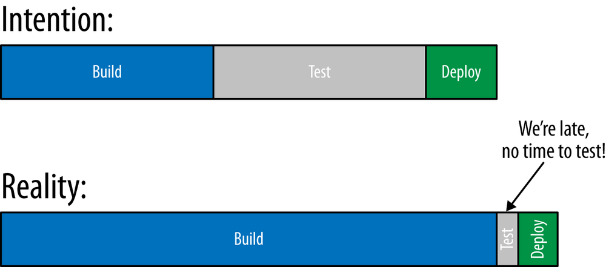
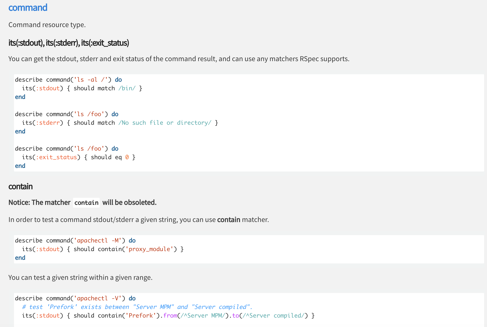
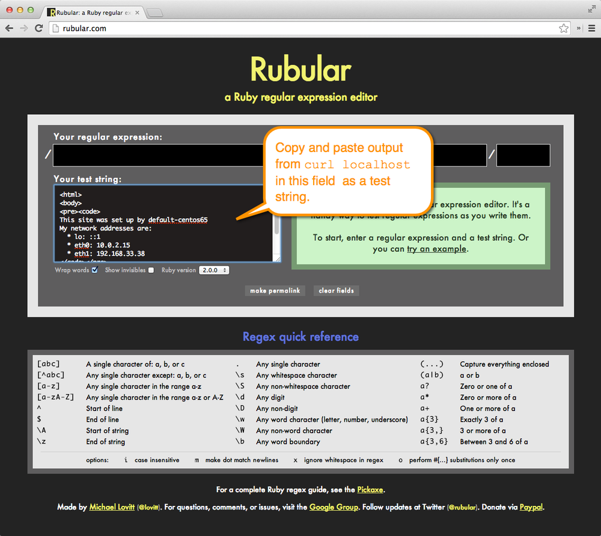
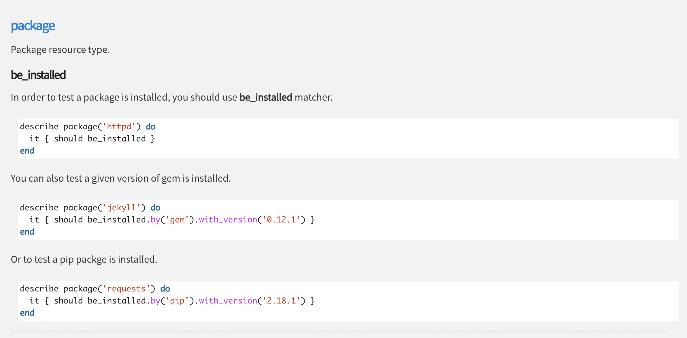
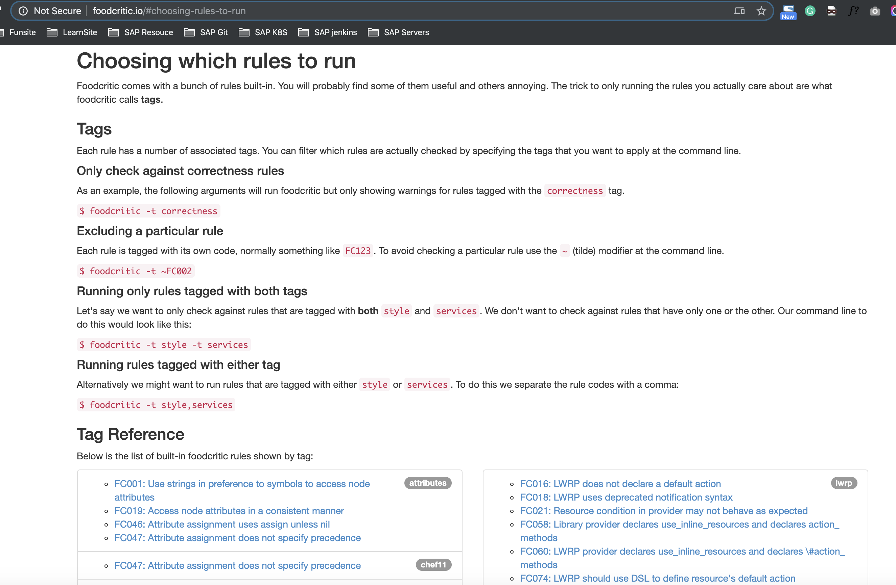
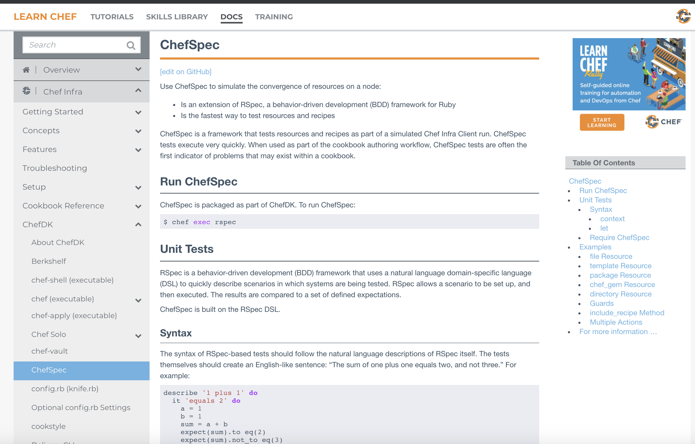
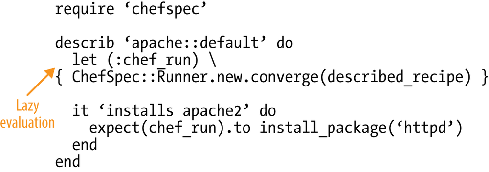

# **第十四节 测试**

* 重温Apache菜谱 
* 使用`Serverspec`进行自动化测试
* `RSpec DSL`语法 
* 使用`Foodcritic`进行自动化测试 
* 使用`ChefSpec`进行自动化测试
* 使用`Let`进行惰性求值 
* 在`spec_helper.rb`中共享测试代码

关于测试使用类似`Chef`的配置管理工具可以帮你实现50％的自动化测试和验证。因为由Chef进行 的基础架构自动化具备可重复性，它很自然地使应用程序运行环境更容易进行测试。

这也是为什么我们就介绍`Test Kitchen`的原因，这样你可以能在实践中理解到这个概念。在整本书的各个章节中，都使用`Test Kitchen`将`Chef`代码部署到本地的沙盒测试环境并进行测试和验证，这可以帮助确保如果将同样的代码部署到生产环境，其结果一样。 


自动化测试除了使用`Chef`以外的另外50%，则是关于测试和部署自动化代码的策略。就像在部署应用程序代码时最好一点一点渐进式部署一样，在最理想的情况下，部署基础架构的改变一样也最好是一步一步渐进式进行。图展示了理想的渐进式**开发-测试一部署周期**。这样的策略可以帮助保证完成足够的测试，从而得到高质量的基础架构和应用程序。 


渐进式短期开发周期相反的长期开发周期（开发完很大的新功能再考虑部署）中，你很难预测什么时候开发结束；而如果测试留在最后一刻才进行，往往需要使用更长的时间测试很大的新功能；因而测试时间往往被缩短而牺牲产品质量。


这样的习惯同样会形成“应用开发完了，现在让运维去部吧”这样的情形―应用在开发环境完美运行，却无法在生产环境中运作。类似`Chef`的配置管理工具尝试解决的正是这个问题。 



再者，寻找和修复软件和基础架构代码中的问题是需要成本的，而且发现问题的时间越接近周期结束修复这些问题的成本就越高。图展示了在开发流程中修复问题的相对成本。在这个角度看，基础架构代码遵循同样的道理： 

* 需求 
* 设计 
* 开发
* 开发测试 
* 整合测试 
* 生产环境 
 


在需求和设计阶段寻找和解决问题并不是那么昂贵， 然而在后面阶段走彻越远，修复问题的成本则越高。

等到所有开发代码都完成时再尝试寻找问题， 相比一早就发现问题需要的成本花费要高出20至50倍.

如果代码已经郎署到生产环境， 修复问题的花费相比早期高150倍

这应该提醒你在做Che颇目时应做到以下几点。 

1. 第一次就做对以免未来再修复问题 
2. 越早发现问匆越好越接近写代码的时族就发砚问越越立好 
3. 尽可能做渐进式的小改变胡试小的改变要容易很多 

`Chef`包含可以帮你做到达些目标的测试工其。所示`Chef`提供多种侧试工具在你撰写菜谱时尽早对代码中的问题提供反馈 


有多种不同的测试工具，因为是每个工具针对菜谱开发过程中的特定阶段。以下是对每 种测试工具的概览以及你应该在什么时候使用它：

 * 在编辑器中打入Chef代码的时候 
   * 使用`Foodcritic`可以分析你的`Chef`编程风格。 
* 在部署到测试节点之前 
  * 使用`ChefSpec`可以帮助你保证代码的组织和文档符合标准。 
* 在部署到测试节点后 
  * 使用`Serverspec`验证菜谱产生的行为与预期相符。 


如果使用`Chef`客户端，需要安装一些额外的Ruby应用来支持自动化测试。运行以下命令安装本章所需的工具： 

```
$ sudo gem install foodcritic --no-ri --no-rdoc
$ sudo gem install chefspec --no-ri --no-rdoc
```

如果是Chef开发包，那它己经包含所有所需工具了。 

## **1、重温Apache菜谱** 

Generate a cookbook called apache-test.


Chef Development Kit:

```
$ chef generate cookbook apache-test
$ cd apache-test
```

Chef Client:

```
$ knife cookbook create apache-test --cookbook-path .
$ cd apache-test
$ kitchen init --create-gemfile
$ bundle install
```

**`apache-test/kitchen.yml`**

```
---
driver:
  name: vagrant
  provider: vmware_desktop

provisioner:
  name: chef_zero
  always_update_cookbooks: true

platforms:
  - name: centos65
    driver:
      box: learningchef/centos65
      box_url: learningchef/centos65
      network:
      - ["private_network", {ip: "192.168.33.38"}]

suites:
  - name: default
    run_list:
      - recipe[apache-test::default]
    attributes:
```

**`apache-test/recipes/default.rb`**

```
#
# Cookbook:: apache-test
# Recipe:: default
#
# Copyright:: 2019, The Authors, All Rights Reserved.
package "httpd"

service "httpd" do
  action [ :enable, :start ]
end

template "/var/www/html/index.html" do
  source 'index.html.erb'
  mode '0644'
end
```

**Chef Development Kit:**

```
$ chef generate template index.html
```

**Chef Client:**

```
$ touch templates/default/index.html.erb
```

在模拟测试节点上有三个网络界面`lo`,`eth0`,`eth1` `ERB`中的脚本将渲染以下输出： 

* lo
* eth0
* eth1

提示：在ERB模板中要仔细分辨`＜% %＞`和`＜％=％＞`。

`ERB`模板中不包含等号的`＜% %＞`标签作为脚本执行；语句执行，但不作为字符串渲染到输出文件中。然后，我们使用带有等号的ERB标签`＜%= %＞`在脚本的条件符合时输出其结果。 

**`apache-test/templates/default/index.hmtl.erb`**

```
<html>
<body>
<pre><code>
This site was set up by <%= node['hostname'] %>
My network addresses are:
<% node['network']['interfaces'].keys.each do |iface_name| %>
  * <%= iface_name %>:
      <%= node['network']['interfaces'][iface_name]['addresses'].keys[1] %>
<% end %>
</code></pre>
</body>
</html>
```

```
kitchen converge
```


## **2、使用`Serverspec`进行自动化测试** 

### **2-1 撰写你的第一个`Serverspec`测试** 


默认情况下，`Test kitchen`会在`test/integration`子目录中寻找相关的文件.

`Serverspec`在`test/integration`目录下的一 些子目录中守找它的测试文件。

首先，在`test/integration `目录下需要针对每个测试套件的名字(`suite name`)有一个对应的测试目录：

```
<cookbook_root>
└── test
    └── integration
        └── <suite_name>
```


套件（`suite`) 的名字可以在`kitchen.yml`文件中的`suites:`部分找到。 
`default`是默认生成的套件名字。 


**Linux/Mac OS X:**

```
$ mkdir -p test/integration/default
```

**Windows:**

```
> mkdir test\integration\default
```

根据约定，`Serverspec`预期包含测试代码的文件以`spec.rb`结尾。如示例16-4所示，让我们 在`default/serverspec/default_spec.rb`子目录中创建`default_spec.rb`文件。 


```
set :backend, :exec

describe 'web site' do
  it 'responds on port 80' do
    expect(port 80).to be_listening 'tcp'
  end
end
```

```
require 'serverspec' 1

set :backend, :exec 2

describe 'web site' do 3
  it 'responds on port 80' do
    expect(port 80).to be_listening 'tcp'
  end
end
```

1. `require`语句用来加载`serverspec`的`gem`库，这样我们可以引用`Serverspec`的类和方法，比如set方法。 
2. `set`语句让我们配置`serverspec`如何运行。在本例中，我们将`:backend`属性设定为`:exec`来告诉`serverspec`测试代码将会在同一台机器运行。 
3. 测试用`RSpec DSL`（领域专用语言）写，使用`describe`和`it`语句。在本例中，我们使用`RSpec DSL`写检查网站是否使用`TCP`协议监听`80`端口（HTTP网站默认端口）的测试。 


我们将稍后在`“rspec-syntax`”中进一步解释`RSpec DSL`以及测试语法结构。现在，只需要明白这段代码是用来测试某个服务监听了`80`端口就好。 要运行这段侧试代码，首先需要确保所有的`gem`文件在测试节点一都已经安装好。我们可以使用`kitchen setup`命令。现在运行`kitchen setup:` 

```
$ kitchen setup
-----> Starting Kitchen (v2.3.3)
-----> Setting up <default-centos65>...
       Finished setting up <default-centos65> (0m0.00s).
-----> Kitchen is finished. (0m0.73s)
```


一旦测试节点拥有所有的测试库就可以通过运行`kitchen verify`命令来运行侧试。诸 现在就试试。如果代码没有语法错误，输出应该显示网站正常运行井响应80端口： 


```
$ kitchen verify
-----> Starting Kitchen (v2.3.3)
-----> Verifying <default-centos65>...
       Preparing files for transfer
-----> Installing Busser (busser)
       Fetching thor-0.19.0.gem
       Fetching busser-0.7.1.gem
       Successfully installed thor-0.19.0
       Successfully installed busser-0.7.1
       2 gems installed
-----> Installing Busser plugin: busser-serverspec
       Plugin serverspec installed (version 0.5.10)
-----> Running postinstall for serverspec plugin
       Suite path directory /tmp/verifier/suites does not exist, skipping.
       Transferring files to <default-centos65>
-----> Running serverspec test suite
-----> Installing Serverspec..
       Fetching rspec-expectations-3.9.0.gem
       Fetching rspec-3.9.0.gem
       Fetching multi_json-1.14.1.gem
       Fetching net-scp-2.0.0.gem
       Fetching rspec-mocks-3.9.0.gem
       Fetching rspec-its-1.3.0.gem
       Fetching net-ssh-5.2.0.gem
       Fetching diff-lcs-1.3.gem
       Fetching serverspec-2.41.5.gem
       Fetching net-telnet-0.1.1.gem
       Fetching specinfra-2.82.4.gem
       Fetching sfl-2.3.gem
-----> serverspec installed (version 2.41.5)
       /opt/chef/embedded/bin/ruby -I/tmp/verifier/suites/serverspec -I/tmp/verifier/gems/gems/rspec-support-3.9.0/lib:/tmp/verifier/gems/gems/rspec-core-3.9.0/lib /opt/chef/embedded/bin/rspec --pattern /tmp/verifier/suites/serverspec/\*\*/\*_spec.rb --color --format documentation --default-path /tmp/verifier/suites/serverspec
       
       web site
         responds on port 80
       
       Finished in 0.05453 seconds (files took 0.27863 seconds to load)
       1 example, 0 failures
       
       Finished verifying <default-centos65> (0m14.66s).
-----> Kitchen is finished. (0m15.13s)
```

前面展示了你可以使用`RSpc DSL`测试代码来代替手动验证确保菜谱正确运作

```
$ kitchen login
Last login: Mon Dec  9 10:01:56 2019 from 172.16.72.2
Welcome to your Packer-built virtual machine.
[vagrant@default-centos65 ~]$ sudo service httpd stop
Stopping httpd:                                            [  OK  ]
[vagrant@default-centos65 ~]$ exit
logout
Connection to 127.0.0.1 closed.
```

```
$ kitchen verify
-----> Starting Kitchen (v2.3.3)
-----> Verifying <default-centos65>...
       Preparing files for transfer
-----> Busser installation detected (busser)
-----> Busser plugin detected: busser-serverspec
       Removing /tmp/verifier/suites/serverspec
       Transferring files to <default-centos65>
-----> Running serverspec test suite
       /opt/chef/embedded/bin/ruby -I/tmp/verifier/suites/serverspec -I/tmp/verifier/gems/gems/rspec-support-3.9.0/lib:/tmp/verifier/gems/gems/rspec-core-3.9.0/lib /opt/chef/embedded/bin/rspec --pattern /tmp/verifier/suites/serverspec/\*\*/\*_spec.rb --color --format documentation --default-path /tmp/verifier/suites/serverspec
       
       web site
         responds on port 80 (FAILED - 1)
       
       Failures:
       
         1) web site responds on port 80
            Failure/Error: expect(port 80).to be_listening 'tcp'
              expected Port "80" to be listening
              /bin/sh -c netstat\ -tunl\ \|\ grep\ --\ :80\\\ 
              
            # /tmp/verifier/suites/serverspec/default_spec.rb:7:in `block (2 levels) in <top (required)>'
       
       Finished in 0.0632 seconds (files took 0.27264 seconds to load)
       1 example, 1 failure
       
       Failed examples:
       
       rspec /tmp/verifier/suites/serverspec/default_spec.rb:6 # web site responds on port 80
       
       /opt/chef/embedded/bin/ruby -I/tmp/verifier/suites/serverspec -I/tmp/verifier/gems/gems/rspec-support-3.9.0/lib:/tmp/verifier/gems/gems/rspec-core-3.9.0/lib /opt/chef/embedded/bin/rspec --pattern /tmp/verifier/suites/serverspec/\*\*/\*_spec.rb --color --format documentation --default-path /tmp/verifier/suites/serverspec failed
       !!!!!! Ruby Script [/tmp/verifier/gems/gems/busser-serverspec-0.5.10/lib/busser/runner_plugin/../serverspec/runner.rb /tmp/verifier/suites/serverspec] exit code was 1
>>>>>> ------Exception-------
>>>>>> Class: Kitchen::ActionFailed
>>>>>> Message: 1 actions failed.
>>>>>>     Verify failed on instance <default-centos65>.  Please see .kitchen/logs/default-centos65.log for more details
>>>>>> ----------------------
>>>>>> Please see .kitchen/logs/kitchen.log for more details
>>>>>> Also try running `kitchen diagnose --all` for configuration
```

**我们可以看到`Chef`发现`httpd`服务没有运行后将其开启** 


```
$ kitchen converge
```

```
$ kitchen verify
-----> Starting Kitchen (v2.3.3)
-----> Setting up <default-centos65>...
       Finished setting up <default-centos65> (0m0.00s).
-----> Verifying <default-centos65>...
       Preparing files for transfer
-----> Busser installation detected (busser)
-----> Busser plugin detected: busser-serverspec
       Removing /tmp/verifier/suites/serverspec
       Transferring files to <default-centos65>
-----> Running serverspec test suite
       /opt/chef/embedded/bin/ruby -I/tmp/verifier/suites/serverspec -I/tmp/verifier/gems/gems/rspec-support-3.9.0/lib:/tmp/verifier/gems/gems/rspec-core-3.9.0/lib /opt/chef/embedded/bin/rspec --pattern /tmp/verifier/suites/serverspec/\*\*/\*_spec.rb --color --format documentation --default-path /tmp/verifier/suites/serverspec
       
       web site
         responds on port 80
       
       Finished in 0.03277 seconds (files took 0.2189 seconds to load)
       1 example, 0 failures
       
       Finished verifying <default-centos65> (0m1.07s).
-----> Kitchen is finished. (0m1.60s)
```


## **3、RSpec DSL语法** 

在继续学习如何使用`Serverspec`之前，让我们先来看看`RSpec DSL`语法的基础，好让你了解`Serverspec`测试的语法基础。 


`RSpec DSL`使用`describe`代码块包含一组测试。每个`describe`代码块由以下格式定义： 

```
describe '<entity>' do
  <tests here>
end
```

`describe`代码块的用途是将测试根据意图分组并描述被测试的实体。每个分组的描述作为字符串传递给`describe`。这个字符串描述是给运行测试的人作为文档在测试输出中查看。我们使用以下`describe`代码块来注明正在测试我们的网站： 

```
describe 'web site' do
  <tests here>
end
```


> 说明：RSpec DSL在幕后为这些代码块创建Ruby类为测试分组。 


实际的测试代码在`describe`代码块里面的`it`代码块中定义，格式如下： 

```
describe '<entity>' do
  it '<description>'
    <examples here>
  end
end
```

`it`代码块也接受一个字符串参数来件为该具体的测试的文档

提供字符串`responds on port 80`即来说明我们的测试检查网站是否在`80`端口下运行

```
describe 'web site' do
  it 'responds on port 80' do
    ...
  end
end
```


在`RSpec 3.0`（当前的Chf开发包及客户端包含的版本）中, 测试应该以`expect`格式写 

```
describe '<entity>' do
  it '<description>'
    expect(resource).to matcher matcher_parameter
  end
end
```

资源(`resource`)，也称主题(`subject`）或命令（`command`)，**是`expect`代码块的第一个参数，它代表被测试的实体。诸如`Serverspec`和`ChefSpec`的测试框架提供特定的资源来 执行广泛的验证**。


匹配器（`matcher`）用来定义对于资源的等同或相反的期待值。它的格式以`expect(资源）.to` 来表示期待该资源等同于匹配器结果，以及以`expect（资源).not_to`表示期待该资源的结果相反于匹配器结果。


在我们使用的测试框架中也提供有特定用途的匹配器。 我们使用`port`资源（传递`80`作为参数）和`be_listening`匹配器（传递`tcp` 作为参数）来检查网站是否在`80`端口通过`TCP`协议运行： 

```
describe 'web site' do
  it 'responsponds on port 80' do
    expect(port 80).to be_listening 'tcp'
  end
end
```

如何知道类似`port`的资源和`be_listening`匹配器的存在呢?我们参考了`Serverspec`测试 框架的`Serverspec`文档（`http://serverspec.org`)，其中列举了它提供的资源和匹配器类。 在网页顶端点击`Resource Types`链接，你会看到指向`Serverspec`资源的链接


 


图展示如何将旧文档提供的`sould`格式代码转换为`expect`格式。


在`sould`格式中， 资源在`it`语句外部的`describe`语句中定义。

在`expect`格式中，它以参数传递给`expect`

**`should`格式中,`should`或`should not`用来表达预期结果应等同或相反**

**在`expect`格式中，预期结果以`.to`或`.not_to`方法表达。最后，在`should`格式中，匹配器的参数传递进`.with()`方法, 而在`expect`格式中，它只是匹配一个参数**。


## **4、Serverspec详解** 

供多个侧试文件共享的代码可以移到`spec_helper.rb`文件中, 在本例中我们只有一个测试文件，但现在请假设我们有多个测试文件。 注意这个文件包含`default_spec.rb`文件的前。

注意这个文件包含`default_spec.rb`文件前两行，如果我们有多个测试文件，这两行需要由所有测试执行进行，因此我们将其移到所有侧试共享的`spec_helper.rb`文件中以免需要重复多个测试文件中定义

**`apache-test/test/integration/default/serverspec/spec_helper.rb**

```
require 'serverspec'

set :backend, :exec
```

现在我们有了`spec_helper.rb`文件，修改`default_spec.rb`来使用`spec_helper`， 改变`require`语句并删除`set`语句， 

**`/test/integration/default/serverspec/default_spec.rb`**

```
require 'spec_helper'

describe 'web site' do
  it 'responds on port 80' do
    expect(port 80).to be_listening 'tcp'
  end
end
```

虽然在我们的例子里使用`spec_helper.rb`有点多此一举，但希望你能理解这个文件的意图一在有多个测试文件的时候，它可以帮助你将共享代码存放到同一个文件中以免在所有测试文件中重复。 


在测试代码中，你可以在每个`describe`代码块中包含多个测试，事实上在真实的环境中每个`describe`也通常有很多测试该主题的不同案例。让我们在`defauit_spec.rb`添加一个新的测试。
 
虽然写测试验证了网站在`80`端口运行，但我们并没有验证网站的内容是正确的。让我们写一个测试来验证内容。

**curl**



如添加一个新的测试到`default_spec.rb`文件。通过运行`curl localhost`命令，你可以检查网站的HTML输出来验证它的正确性。 

通过在`command`资源上使用`stdout`属性，我们可以查看`curl`命令返回的结果。根据约定， 程序将它们的输出生成到两个不同的标准文件句柄：`stdout`（正常程序输出）和`stderr `（错误输出）。这样，其他程序可以打开这些句柄来自动查看内容。

我们的例子并不在意`stderr`中的错误信息，因为对于我们的侧试代码来讲，如果发生错误，得到一个`Ruby`异常就已经足够。在错误情况下，`Serverspec`自动生成这样的错误异常。在我们的测试代码中，只在意`stdout`中的内容。 

运行`curl localhost:80`命令的结果以字符串返回。

我们通过称为正则表达式的`Ruby`功能，让`RSpec`匹配器`match`来在`curl`的执行结果中搜索特定内容。在 Ruby中，包含正则表达式的字符串被正斜杠字符（`//`）而不是单引号（`''`）或双引号（`""`）引用。 

正则表达式是一个特殊的字符串格式，用来指定搜索字符串。在本例中，我们使用正则表达式在输出中搜索字符串内容`eth1`。在设定网站内容的时候，我们将网络界面的字符串包含在页面内容中，如果页面内容不包含字符串`eth1`，则说明正确的内容未被渲染。 同时，检查`eth1`字符串同时保证我们的测试节点虚拟机启用了`eth1`适配器。 

**`apache-test/test/integration/default/serverspec/default_spec.rb`**

```
require 'spec_helper'

describe 'web site' do
  it 'responds on port 80' do
    expect(port 80).to be_listening 'tcp'
  end

  it 'returns eth1 in the HTML body' do
    expect(command('curl localhost:80').stdout).to match /eth1/
  end
end
```

首先，使用`kitchen login`命令登录到测试节点，并运行和我们测试中同样的`curl localhost:80`命令。以下例子展示了输出结果。复制输出的结果并运行`exit`命令返回开发机器： 

```
$ kitchen login
Last login: Tue Dec 10 05:36:34 2019 from 172.16.72.2
Welcome to your Packer-built virtual machine.
[vagrant@default-centos65 ~]$ curl localhost:80
<html>
<body>
<pre><code>
This site was set up by default-centos65
My network addresses are:
  * lo:
      ::1
  * eth0:
      172.16.72.158
  * eth1:
      192.168.33.38
</code></pre>
</body>
</html>[vagrant@default-centos65 ~]$ exit
logout
Connection to 127.0.0.1 closed.
```

https://rubular.com/




 


```
$ kitchen verify
-----> Starting Kitchen (v2.3.3)
-----> Verifying <default-centos65>...
       Preparing files for transfer
-----> Busser installation detected (busser)
-----> Busser plugin detected: busser-serverspec
       Removing /tmp/verifier/suites/serverspec
       Transferring files to <default-centos65>
-----> Running serverspec test suite
       /opt/chef/embedded/bin/ruby -I/tmp/verifier/suites/serverspec -I/tmp/verifier/gems/gems/rspec-support-3.9.0/lib:/tmp/verifier/gems/gems/rspec-core-3.9.0/lib /opt/chef/embedded/bin/rspec --pattern /tmp/verifier/suites/serverspec/\*\*/\*_spec.rb --color --format documentation --default-path /tmp/verifier/suites/serverspec
       
       web site
         responds on port 80
         returns eth1 in the HTML body
       
       Finished in 0.04039 seconds (files took 0.21886 seconds to load)
       2 examples, 0 failures
       
       Finished verifying <default-centos65> (0m1.05s).
-----> Kitchen is finished. (0m1.69s)
```

`package`资源需要`Serverspec`来检测操作系统信息。展示了`Serverspec`网站中对 `service`资源的文档。它可以用来检测某个程序包是否已经安装。在幕后，它其实首先需要检测是什运行什么操作系统，然后使用相应的命令，比如在`RedHat`中的`rpm -q`或 `Ubuntu/Debian`中的`dpkg -query`查看程序是否已经安装。 



在默认情况下，`Serverspec`试图自动检测操作系统，这在大多数`Linux`和`Unix`系统中没有 问题。然而在某些系统中，你需要通过`set`方法重写默认的操作系统设置。 


如果测试代码需要在`Windows`下运行，就需要在`spec.rb`文件中添加以下代码，因为 `Serverspec`在我们写作本书时无法自动检测`Windows`操作系统。更多相关信息可以在 `Serverspec`文档中找到。 


**`/default/serverspec/default_spec.rb`**

```
require 'spec_helper'

describe 'web site' do
  it 'responds on port 80' do
    expect(port 80).to be_listening 'tcp'
  end

  it 'returns eth1 in the HTML body' do
    expect(command('curl localhost:80').stdout).to match /eth1/
  end

  it 'has the apache web server installed' do
    expect(package 'httpd').to be_installed
  end
end
```

```
$ kitchen verify
-----> Starting Kitchen (v2.3.3)
-----> Verifying <default-centos65>...
       Preparing files for transfer
-----> Busser installation detected (busser)
-----> Busser plugin detected: busser-serverspec
       Removing /tmp/verifier/suites/serverspec
       Transferring files to <default-centos65>
-----> Running serverspec test suite
       /opt/chef/embedded/bin/ruby -I/tmp/verifier/suites/serverspec -I/tmp/verifier/gems/gems/rspec-support-3.9.0/lib:/tmp/verifier/gems/gems/rspec-core-3.9.0/lib /opt/chef/embedded/bin/rspec --pattern /tmp/verifier/suites/serverspec/\*\*/\*_spec.rb --color --format documentation --default-path /tmp/verifier/suites/serverspec
       
       web site
         responds on port 80
         returns eth1 in the HTML body
         has the apache web server installed
       
       Finished in 0.10077 seconds (files took 0.25413 seconds to load)
       3 examples, 0 failures
       
       Finished verifying <default-centos65> (0m1.23s).
-----> Kitchen is finished. (0m1.87s)
```

如果需要告诉`Serverspec`我们具体运行的是哪个操作系统（`CentOS 6`)，我们可以添加 以下代码使用`set`关键字，

`set :os, :family => 'redhat', :release => 6`

```
require 'spec_helper'

set :os, :family => 'redhat', :release => 6

describe 'web site' do
  it 'responds on port 80' do
    expect(port 80).to be_listening 'tcp'
  end

  it 'returns eth1 in the HTML body' do
    expect(command('curl localhost:80').stdout).to match /eth1/
  end

  it 'has the apache web server installed' do
    expect(package 'httpd').to be_installed
  end
end
```

`kitchen test`命令可以按顺序执行以下全部命令： 

1. kitchen destroy (if necessary)
2. kitchen create
3. kitchen converge
4. kitchen setup
5. kitchen verify
6. kitchen destroy


你正在撰写测试代码的时候往往并不想使用这个命令，因为往往还需要频繁登录到测 试节点上调试以及寻找测试中的问题。但等于写完所有测试后，在`Jenkins`等类似自动化系统中设定运行这些测试的时候，`kitchen test`是一个方便的命令，可以用来清除现有环境、创建虚拟机、运行测试并在运行后再次清理环境。

同时，在撰写测试后并将代码井入版本控制系统之前，在全新的环境运行一次`kitchen test`这也是一个不错的主意。
 
现在运行	kitchen test	命令。结束后它会自动删除我们的测试环境，因为它自动运行以上五个命令：  

```
$ kitchen test
-----> Starting Kitchen (v2.3.3)
-----> Cleaning up any prior instances of <default-centos65>
-----> Destroying <default-centos65>...
       ==> default: Stopping the VMware VM...
       ==> default: Deleting the VM...
       Vagrant instance <default-centos65> destroyed.
       Finished destroying <default-centos65> (0m22.79s).
-----> Testing <default-centos65>
-----> Creating <default-centos65>...
       Bringing machine 'default' up with 'vmware_desktop' provider...
       ==> default: Cloning VMware VM: 'learningchef/centos65'. This can take some time...
       ==> default: Checking if box 'learningchef/centos65' version '1.0.7' is up to date...
       ==> default: Verifying vmnet devices are healthy...
       ==> default: Preparing network adapters...
       WARNING: The VMX file for this box contains a setting that is automatically overwritten by Vagrant
       WARNING: when started. Vagrant will stop overwriting this setting in an upcoming release which may
       WARNING: prevent proper networking setup. Below is the detected VMX setting:
       WARNING: 
       WARNING:   ethernet0.pcislotnumber = "33"
       WARNING: 
       WARNING: If networking fails to properly configure, it may require this VMX setting. It can be manually
       WARNING: applied via the Vagrantfile:
       WARNING: 
       WARNING:   Vagrant.configure(2) do |config|
       WARNING:     config.vm.provider :vmware_desktop do |vmware|
       WARNING:       vmware.vmx["ethernet0.pcislotnumber"] = "33"
       WARNING:     end
       WARNING:   end
       WARNING: 
       WARNING: For more information: https://www.vagrantup.com/docs/vmware/boxes.html#vmx-whitelisting
       ==> default: Fixed port collision for 22 => 2222. Now on port 2201.
       ==> default: Starting the VMware VM...
       ==> default: Waiting for the VM to receive an address...
       ==> default: Forwarding ports...
           default: -- 22 => 2201
       ==> default: Waiting for machine to boot. This may take a few minutes...
           default: SSH address: 127.0.0.1:2201
           default: SSH username: vagrant
           default: SSH auth method: private key
           default: 
           default: Vagrant insecure key detected. Vagrant will automatically replace
           default: this with a newly generated keypair for better security.
           default: 
           default: Inserting generated public key within guest...
           default: Removing insecure key from the guest if it's present...
           default: Key inserted! Disconnecting and reconnecting using new SSH key...
       ==> default: Machine booted and ready!
       ==> default: Setting hostname...
       ==> default: Configuring network adapters within the VM...
       ==> default: Machine not provisioned because `--no-provision` is specified.
       [SSH] Established
       Vagrant instance <default-centos65> created.
       Finished creating <default-centos65> (0m44.58s).
-----> Converging <default-centos65>...
       Preparing files for transfer
$$$$$$ You must set your run_list in your Policyfile instead of kitchen config. The run_list in your config will be ignored.
$$$$$$ Ignored run_list: ["recipe[apache-test::default]"]
       Installing cookbooks for Policyfile /Users/.../Devops_sap/Chef_Doc/learningchef/chap12/apache-test/Policyfile.rb using `chef install`
       Installing cookbooks from lock
       Installing apache-test 0.1.0
       Updating policy lock using `chef update`
       Attributes already up to date
       Building policy apache-test
       Expanded run list: recipe[apache-test::default]
       Caching Cookbooks...
       Installing apache-test >= 0.0.0 from path
       
       Lockfile written to /Users/.../Devops_sap/Chef_Doc/learningchef/chap12/apache-test/Policyfile.lock.json
       Policy revision id: ade7da2f2a1dcabbfcf963ab2cf6bd1157b44c9782565bcc6194ab8faf6d018c
       Preparing dna.json
       Exporting cookbook dependencies from Policyfile /var/folders/r7/nml_dsbn44gcd2jlqh7s2w940000gn/T/default-centos65-sandbox-20191210-14778-1x4b0g2...
       Exported policy 'apache-test' to /var/folders/r7/nml_dsbn44gcd2jlqh7s2w940000gn/T/default-centos65-sandbox-20191210-14778-1x4b0g2
       
       To converge this system with the exported policy, run:
         cd /var/folders/r7/nml_dsbn44gcd2jlqh7s2w940000gn/T/default-centos65-sandbox-20191210-14778-1x4b0g2
         chef-client -z
       Removing non-cookbook files before transfer
       Preparing validation.pem
       Preparing client.rb
-----> Installing Chef install only if missing package
       Downloading https://omnitruck.chef.io/install.sh to file /tmp/install.sh
       Trying wget...
       Trying curl...
       Download complete.
       el 6 x86_64
       Getting information for chef stable  for el...
       downloading https://omnitruck.chef.io/stable/chef/metadata?v=&p=el&pv=6&m=x86_64
         to file /tmp/install.sh.3296/metadata.txt
       trying wget...
       trying curl...
       sha1     c332e5aef6cf70d1df1e1786926c474eedae1dc2
       sha256   ddb6e94a65568e6247aa335ef7d2dd69c300c9d2e2df098997b08cf9f6f0c473
       url      https://packages.chef.io/files/stable/chef/15.5.17/el/6/chef-15.5.17-1.el6.x86_64.rpm
       version  15.5.17
       downloaded metadata file looks valid...
       downloading https://packages.chef.io/files/stable/chef/15.5.17/el/6/chef-15.5.17-1.el6.x86_64.rpm
         to file /tmp/install.sh.3296/chef-15.5.17-1.el6.x86_64.rpm
       trying wget...
       trying curl...
       Comparing checksum with sha256sum...
       
       WARNING WARNING WARNING WARNING WARNING WARNING WARNING WARNING WARNING
       
       You are installing a package without a version pin.  If you are installing
       on production servers via an automated process this is DANGEROUS and you will
       be upgraded without warning on new releases, even to new major releases.
       Letting the version float is only appropriate in desktop, test, development or
       CI/CD environments.
       
       WARNING WARNING WARNING WARNING WARNING WARNING WARNING WARNING WARNING
       
       Installing chef 
       installing with rpm...
       warning: /tmp/install.sh.3296/chef-15.5.17-1.el6.x86_64.rpm: Header V4 DSA/SHA1 Signature, key ID 83ef826a: NOKEY
       Preparing...                ########################################### [100%]
          1:chef                   ########################################### [100%]
       Thank you for installing Chef Infra Client! For help getting started visit https://learn.chef.io
       Transferring files to <default-centos65>
       +---------------------------------------------+
       ✔ 2 product licenses accepted.
       +---------------------------------------------+
       Starting Chef Infra Client, version 15.5.17
       Creating a new client identity for default-centos65 using the validator key.
       Using policy 'apache-test' at revision 'ade7da2f2a1dcabbfcf963ab2cf6bd1157b44c9782565bcc6194ab8faf6d018c'
       resolving cookbooks for run list: ["apache-test::default@0.1.0 (daed588)"]
       Synchronizing Cookbooks:
         - apache-test (0.1.0)
       Installing Cookbook Gems:
       Compiling Cookbooks...
       Converging 3 resources
       Recipe: apache-test::default
         * yum_package[httpd] action install
           - install version 0:2.2.15-69.el6.centos.x86_64 of package httpd
         * service[httpd] action enable
           - enable service service[httpd]
         * service[httpd] action start
           - start service service[httpd]
         * template[/var/www/html/index.html] action create
           - create new file /var/www/html/index.html
           - update content in file /var/www/html/index.html from none to e9c94f
           --- /var/www/html/index.html 2019-12-10 06:36:06.112501991 +0000
           +++ /var/www/html/.chef-index20191210-3421-xm9pxz.html       2019-12-10 06:36:06.112501991 +0000
           @@ -1 +1,15 @@
           +<html>
           +<body>
           +<pre><code>
           +This site was set up by default-centos65
           +My network addresses are:
           +  * lo:
           +      ::1
           +  * eth0:
           +      172.16.72.159
           +  * eth1:
           +      192.168.33.38
           +</code></pre>
           +</body>
           +</html>
           - change mode from '' to '0644'
       
       Running handlers:
       Running handlers complete
       Chef Infra Client finished, 4/4 resources updated in 55 seconds
       Downloading files from <default-centos65>
       Finished converging <default-centos65> (1m33.79s).
-----> Setting up <default-centos65>...
       Finished setting up <default-centos65> (0m0.00s).
-----> Verifying <default-centos65>...
       Preparing files for transfer
-----> Installing Busser (busser)
       Fetching thor-0.19.0.gem
       Fetching busser-0.7.1.gem
       Successfully installed thor-0.19.0
       Successfully installed busser-0.7.1
       2 gems installed
-----> Installing Busser plugin: busser-serverspec
       Plugin serverspec installed (version 0.5.10)
-----> Running postinstall for serverspec plugin
       Suite path directory /tmp/verifier/suites does not exist, skipping.
       Transferring files to <default-centos65>
-----> Running serverspec test suite
-----> Installing Serverspec..
       Fetching rspec-expectations-3.9.0.gem
       Fetching rspec-3.9.0.gem
       Fetching multi_json-1.14.1.gem
       Fetching diff-lcs-1.3.gem
       Fetching rspec-mocks-3.9.0.gem
       Fetching rspec-its-1.3.0.gem
       Fetching net-ssh-5.2.0.gem
       Fetching net-scp-2.0.0.gem
       Fetching serverspec-2.41.5.gem
       Fetching net-telnet-0.1.1.gem
       Fetching specinfra-2.82.4.gem
       Fetching sfl-2.3.gem
-----> serverspec installed (version 2.41.5)
       /opt/chef/embedded/bin/ruby -I/tmp/verifier/suites/serverspec -I/tmp/verifier/gems/gems/rspec-support-3.9.0/lib:/tmp/verifier/gems/gems/rspec-core-3.9.0/lib /opt/chef/embedded/bin/rspec --pattern /tmp/verifier/suites/serverspec/\*\*/\*_spec.rb --color --format documentation --default-path /tmp/verifier/suites/serverspec
       
       web site
         responds on port 80
         returns eth1 in the HTML body
         has the apache web server installed
       
       Finished in 0.03509 seconds (files took 0.23573 seconds to load)
       3 examples, 0 failures
       
       Finished verifying <default-centos65> (0m15.53s).
-----> Destroying <default-centos65>...
       ==> default: Stopping the VMware VM...
       ==> default: Deleting the VM...
       Vagrant instance <default-centos65> destroyed.
       Finished destroying <default-centos65> (0m21.31s).
       Finished testing <default-centos65> (3m18.00s).
-----> Kitchen is finished. (3m18.69s)
```


## **5、使用`Foodcritic`进行自动化测试** 

`Severspec`是一个用于执行菜谱的点对点测试的非常强大的工具。然而，执行全部测试可能需要较长时间，而有些错误可以在执行这类测试之前更快发现。有一个称为`Foodcritic`的工具可以很快提供有限的反馈。 

`Foodcritic`被设计为在写Chef代码时使用，它甚至可以集成到编辑器中。在写`Chef`代码的时候， `Foodcritic`可以给你提供快速的关于代码风格的反馈，让你通过定义规则（`rules`) 来指定理想的代码风格。  

[foodcritic.io](http://www.foodcritic.io/)

`Foodcritic`命令需要在开发机器上执行，而不是测试节点，因此非常快。可以现在就试试。确保。`apache-test`菜谱是当前工作目录，然后运行以下命令。 





**Chef Development Kit:**

```
$ foodcritic .
```

**Chef Client:**

```
$ foodcritic .
FC008: Generated cookbook metadata needs updating: ./metadata.rb:2
FC008: Generated cookbook metadata needs updating: ./metadata.rb:3
```

```
$ foodcritic .
Checking 3 files
x.x
FC008: Generated cookbook metadata needs updating: ./metadata.rb:2
FC008: Generated cookbook metadata needs updating: ./metadata.rb:3
FC064: Ensure issues_url is set in metadata: ./metadata.rb:1
FC065: Ensure source_url is set in metadata: ./metadata.rb:1
FC067: Ensure at least one platform supported in metadata: ./metadata.rb:1
FC078: Ensure cookbook shared under an OSI-approved open source license: ./metadata.rb:1
FC093: Generated README text needs updating: ./README.md:1
```
```
$ foodcritic .
Checking 3 files
x..
FC064: Ensure issues_url is set in metadata: ./metadata.rb:1
FC065: Ensure source_url is set in metadata: ./metadata.rb:1
FC067: Ensure at least one platform supported in metadata: ./metadata.rb:1
FC078: Ensure cookbook shared under an OSI-approved open source license: ./metadata.rb:1
```

## **6、使用`ChefSpec`进行自动化测试** 


另一个可以帮助在开发周期早期进行测试的工具是`ChefSpec`, 你甚至可以在写代码前就先完成测试。

`ChefSpec`可以用来生成可运行的文档（`runnable documentation`). 它要用途是帮助你更好地组织代码以及完善文档。 


同时，`ChefSpec`测试有时也能在你更改代码的时候帮助发现问题。而且，以测试驱动的`Chef`代码往往具备更高的质量。 

和`Serverspec`类似，`ChefSpec`基于RSpec. `ChefSpec`使用`RSpec`的`describe`格式来创建可运行的文档。`ChefSpec`文档所用的格式和`Serverspec`的稍有不同，如下所示： 

```
describe '<recipe_name>' do
  <perform in-memory Chef run>
  <examples here>
end
```

例如，你会使用以下`describe`代码块来包含针对`apache-test::default`菜谱的测试： 


```
describe 'apache-test::default' do
  ...
end
```

要执行一次驻内存的`Chef`运行，需要使用`chef-spec gem`提供的类核方法，添加以下语句 到`describe`格式中。在本例中，要测试`apache-test::default`菜谱，就可以使用以下代 码： 

```
require 'chefspec'

describe 'apache::default' do
  chef_run = ChefSpec::Runner.new.converge('apache-test::default')
  <descriptions here>
end
```


`ChefSpec`使用类似`Serverspec`的`expect`格式。`ChefSpec`拥有其自己的资源命令及匹配器。以下这个例子可以展示`ChefSpec`检查我们的`Chef`代码，看是否已经安装`httpd`程序 包： 

```
require 'chefspec'

describe 'apache::default' do
  chef_run = ChefSpec::Runner.new.converge('apache-test::default')

  it 'installs apache2' do
    expect(chef_run).to install_package('httpd')
  end
end
```


记住，这些测试代码只是用来作为可运行的文档使用的。这里的`expect`语句并不会在驻内存的`Chef`运行时执行`httpd`程序包安装过程。`ChefSpec`只是通过驻内存的`Chef`运行来验证菜谱语法结构；

在本例中，确保`Chef`代码指示`Chef`安装这个程序包。简而言之，此类测试主要用来作为可运行的代码文档测试你的`Chef`代码包含预期的内容；而`Serverspec`测试则用来真正在和生产环境类似的虚拟机中运行`Chef`并测试运行结果是否与预期相符。 


在`expect`格式中使用的`ChefSpec`的资源命令通常是驻内存`Chef`运行的结果。

`ChefSpec`的匹配器的资源可以在其[https://docs.chef.io/chefspec.html](https://docs.chef.io/chefspec.html)找到， 




### **撰写你的第一个`ChefSpec`测试 **

让我们来写一些ChefSpec代码。我们将使用`install package`匹配器， `ChefSpec`测试的默认位置是菜谱目录下的`spec`目录。确保`apache-test`菜谱目录是当前的 工作目录，然后在该目录下创建一个`spec`目录： 

创建`default_spec.rb`文件。包含`ChefSpec`代码的文件根据约定应以`＊_spec.rb`结尾。 


**`spec/default_spec.rb`**


```
require 'chefspec'

describe 'apache-test::default' do
  chef_run = ChefSpec::Runner.new.converge('apache-test::default')

  it 'installs apache2' do
    expect(chef_run).to install_package('httpd')
  end
end
```

```
$ rspec --color
.

Finished in 0.00042 seconds (files took 1.12 seconds to load)
1 example, 0 failures
```


当rspec运行时，`ChefSpec`检查`Chef`代码并确保它包含`package`资源来安装`httpd`程序包。 如果`ChefSpec`确认代码中包含这些内容，测试则通过，你可以在刚刚的rspec命令结果 中看到测试成功通过。 


## **7、使用Let进行惰性求值** 

我们需要再介绍一个属于`Rspec`核心的语法：使用`let`方法进行惰性求值。图展示了 `ChefSpec`如何使用let方法来缓存`Che-fSpec::Runner`对象的结果。 




调用`ChefSpec::Runner`是一个相对比较占用资源的行为。`let(）`方法将`ChefSpec::Runner` 的计算延迟到它第一次被使用时才发生而不是当其被引用时，因此我们将这种机制称为 “惰性求值”。

使用let(）方法允许`RSpec将ChefSpec::Runner`的结果缓存，并在同一个测试中多次用到时直接使用其值。 再者，`let(）`语句允许你只指定正在测试的配方单一次，对比以下的不使用`let`以及使用`let`一的例子，注意在使用`le`t时，`ChefSpec::Runner`使用一个`described_recipe`宏来计算配方单名字而无须重复指定。这是个很小的优化，但挺有用的。 

**Without let:**

```
require 'chefspec'

describe 'apache::default' do
  chef_run = ChefSpec::Runner.new.converge('apache-test::default')

  it 'installs apache2' do
    expect(chef_run).to install_package('httpd')
  end
end
```

**With let:**

```
require 'chefspec'

describe 'apache::default' do
  let (:chef_run) { ChefSpec::Runner.new.converge(described_recipe) }

  it 'installs apache2' do
    expect(chef_run).to install_package('httpd')
  end
end
```

**`apache-test/spec/default_spec.rb`**

```
require 'chefspec'

describe 'apache-test::default' do
  let (:chef_run) { ChefSpec::Runner.new.converge(described_recipe) }

  it 'installs apache2' do
    expect(chef_run).to install_package('httpd')
  end
end
```

```
$ rspec --color
.

Finished in 0.00042 seconds (files took 1.12 seconds to load)
1 example, 0 failures
```


## **8、生成一份测试覆盖报告** 

另外一个有用的`ChefSpec`的帮助方法是`ChefSpec::Coverage.report!`。

它会生成一份列 表告诉你哪些配方单中使用的资源被测试覆盖，哪些没有。你可以用这份报告来引导测 试。 


编辑`default-spec.rb`，**`at_exit`**方法是`Ruby`核心的一部分，允许你在程序退出时运行一段指定的代码。在本例中，我们希望运行`ChefSpec::Coverage.report！`方法。

方法名字中的感叹号（`!`）是一个Ruby的约定，告诉开发者这个方法是危险的。在本例中，危险意味着`ChefSpec::Coverage.report！`必须在所有测试运行完成后再运行，并且每次程序运行时只能运行一次。我们使用`at_exit`来确保`report！`只在所有测试运行结束后运行一次。 


**`apache-test/spec/default_spec.rb`**

```
require 'chefspec'

at_exit { ChefSpec::Coverage.report! }

describe 'apache-test::default' do
  let (:chef_run) { ChefSpec::Runner.new.converge(described_recipe) }

  it 'installs apache2' do
    expect(chef_run).to install_package('httpd')
  end
end
```

```
$ rspec --color
.

Finished in 0.00337 seconds (files took 1.11 seconds to load)
1 example, 0 failures

ChefSpec Coverage report generated...

  Total Resources:   3
  Touched Resources: 1
  Touch Coverage:    33.33%

Untouched Resources:

  service[httpd]                     /recipes/default.rb:12
  template[/var/www/html/index.html]   /recipes/default.rb:16
```
  


## **9、在`spec_helper.rb`中共享测试代码** 

和`Serverspec`类似，`ChefSpec`也支持将通用的代码共享在`spec_helper.rb`文件中。 
和前面`ServerSpec`中的例子一样，这里我们需要假设有多个测试文件，然后移动一些共享的代码到`spec_helper.rb`。 

用所示的内容创建`spec/spec_helper.rb`文件。我们将`require`和`at_exit`移到这个共享文件中。 

**`spec/spec_helper.rb`**

```
require 'chefspec'

at_exit { ChefSpec::Coverage.report! }
```

**`apache-test/spec/default_spec.rb`**

```
require 'spec_helper'

describe 'apache-test::default' do
  let (:chef_run) { ChefSpec::Runner.new.converge(described_recipe) }

  it 'installs apache2' do
    expect(chef_run).to install_package('httpd')
  end
end
```


```
$ rspec --color
.

Finished in 0.00337 seconds (files took 1.11 seconds to load)
1 example, 0 failures

ChefSpec Coverage report generated...

  Total Resources:   3
  Touched Resources: 1
  Touch Coverage:    33.33%

Untouched Resources:

  service[httpd]                     /recipes/default.rb:12
  template[/var/www/html/index.html]   /recipes/default.rb:16
```

### **Testing Your Automation Code (Vagrant Version)**

[https://www.slideshare.net/misheska/testing-your-automation-code-vagrant-version-v02](https://www.slideshare.net/misheska/testing-your-automation-code-vagrant-version-v02)

## **10、本节小结**

* 重温Apache菜谱 
* 使用`Serverspec`进行自动化测试
* `RSpec DSL`语法 
* 使用`Foodcritic`进行自动化测试 
* 使用`ChefSpec`进行自动化测试
* 使用`Let`进行惰性求值 
* 在`spec_helper.rb`中共享测试代码

```
# chef client
$ sudo gem install foodcritic --no-ri --no-rdoc
$ sudo gem install chefspec --no-ri --no-rdoc

$ chef generate template index.html
$ kitchen verify
$ kitchen test

$ foodcritic .
$ rspec --color
```