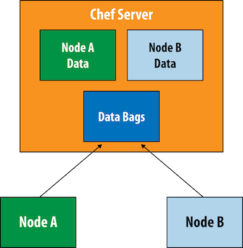

# **L16 Chef Tutorial Interview**


## **1 Chef 介绍和安装**

### **Chef Server** 

**Actions:**


* Reporting
* Push 

**Server Core:**

* On-premises
* Hosted

**Web Interface:**

* Management Console
* LDAP/AD Integration


### **Chef Deployment Kit** 


**Chef Client:**

* Cookbooks, DataBags, Environments
* Knife
* Solo
* Zero

**Test Driven Infrastructure:**


* Test Kitchen
* Berkshelf
* ChefSpec
* Serverspec


```
$ chef verify
$ chef-client --version
```

## **2 Chef 语法**

bash / `Chef_gem` / Cron / `deploy_revision` / directory / execute / file / `gem_package` / group / link / mount / package / `remote_file` / service / template / User


* `Chef_gem`: 在Chef内安装一个Ruby程序(gem)，在Chef内部使用。 如果你的Chef代码需要额外一个 的gem来执行一个函数, 可以用这个资源来在Chef内部安装这个额外的gem
* `deploy_revision`: 控制和管理应用程序部署部署, 在代码版本控制工具中的代码（如Rails应用程序)
* `gem_package`: 在Chef外安装一个Ruby程序（gem),比如在目标机器的系统中安装个应用程序或工具:

## **3 如何写 Chef 配方 & chef-apply**

* 配方单(recipe): 一系列用Ruby领域专用语言（DSL）来写的描述理想配置的指令。
* 源(resource)： 资源是Chef代码的组成部分。通过在配方单中使用不同的资源来告诉Chef你的理想配置。
* 属性（attribute)


## **4 用Test Kitchen管理沙盒测试环境**

* kitchen init： 向一个项目中添加Test Kitchen支持
* kitchen list: 显示Test Kitchen实例的信急
* kitchen create： 启动个Test Kitchen实例
* `Gemfile.lock`:  当bundle install运行时Bundler所需的gem和它所依赖的gem的列表 可以用来在另一个开发者的电脑上重现一样的环境。

`kitchen.yml`文件包含四个主要的部分。

* `driver`: 指定要使用的驱动动以及管理Test Kitchen环境的配的参数。你可以通过运行kitchen driver discover命令来得到一个可用的驱动列表
* `provision:` 指定使用哪个配界管理工其来创建指定驱动的环掩,以上的例子中我们使用`chef_solo`,当你运行kitchen setup时它将在实例上安装Chef客户端（如果目前尚未安 装的话）。
* `platforms`: 你希望Test kitchen创建的实例操作系统列表
* `suites`: 在使用Chef作为配置管理工具时（Test Kitchen不仅仅支持Chef)，指定每个实例上运行的配置。这包括指定在每个实例上运行的Chef配方单的列表来。


## **5 用 Chef 户端管理节点**

### **什么是节点**

* 只要这个节点安装了Chef客户端，就可以受Chef管理并运行Chef配方单。

node/kitchen.yml

```
---
driver:
  name: vagrant
  provider: vmware_desktop

provisioner:
  name: chef_solo

platforms:
  - name: centos65
    driver:
      box: learningchef/centos65
      box_url: learningchef/centos65

suites:
  - name: default
    run_list:
    attributes:
```

```
$ kitchen list
Instance          Driver   Provisioner  Verifier  Transport  Last Action    Last Error
default-centos65  Vagrant  ChefSolo     Busser    Ssh        <Not Created>  <None>

$ kitchen create default-centos65

# 确定你使用你的宿主机器,在沙盒中安装chef-client
$ kitchen setup default-centos65
```

Chef Solo安装Chef客户端但不把它配置为使用Chef服务器

通过使用`chef-client`程序来执行配方单中指定的动作通常被称作一次Chef运行

在命令行中输人`chef-client --local-mode hello.rb --log_level info`将执行你的第一次Chef运行。

* `--local-mode`选项防止`chef-client`在寻找不存在的Chef服务器时超时。
* 我们同时需要`--log_level info`选项，因为默认情况下`chef-client`只打印错误，而非信息消息，
* 这个选项将告诉`chef-client`打印来自`Chef::Log.info`命令的所有字符串。

### **Chef客户端的三种模式**

**本地模式**

当`chef-client`以本地模式运行时，它在内存中模拟一个完整的Chef服务器。任何本应保存到服务器的数据会被写入一个本地文件夹。 将服务器数据写在本地的过程叫做回写(writeback)。这是为什么chef-client创建了`nodes/`目录。 

本地模式是设计来支持通过使用完全在内存的`Chef Zero`服务器来进行快速的`Chef`配方单开发

**客户端模式**

当chef-client以客户端模式运行时，它假设你在网络中已经让Chef服务器正在运行。

在客户端模式中，chef-client是一个在被Chef管理的机器本地运行的代理人程序（或服务、后台程序). 

Chef服务器集中存储需要管理的基础架构的信息。如果需要同时管理多余一台机器，推荐使用Chef服务器

**Solo模式**

**在版本11.8中chef-client支持本地模式之前，唯一不需要Chef服务器运行Chef代码的方法是使用`chef-solo`.**

**chef-solo提供一个额外的客户端模式叫做Solo模式**。Solo模式提供了让Chef够本地运行的Chef功能的有限的子集。chef-solo不支持回写, 在大多数时候，本地模式都远远比Solo模式更方便使用。


### **命令行工具Ohai**

* 当Chef客户端运行时, 它使用一个额外的命令行工具ohai来收集系统信息。ohai将收集 到的节点信包储存在Chef的自动属性中
* ohai收集许多关于电脑当前状态的信息：**网络配置, Cpu状态、操作系统类型和版本、内存使用量等。**


属性是Chef管理的一个变量。在你的代码中，在中括号中用引号包围的字符串指定属胜的名称，Chef会返回属性的值。

在我们的例子中，我们要知道IP地址，在之前的`ohaI`输出中，我们知道其IP地址属胜的名称是`ipaddress,`因此可以用此名称在`Chef`代码中访问节点的属胜

* node是另外－个Chef代码中可以使用的属性。它包含在节点上运行ohai输出的所有信息和我们使用的ENV属性类似，node属性是一个键值对儿集合
* 键值对儿集合支持嵌套，这是为什么在ohai输出中会有多层缩进。因此，如果要访问节点使用用的虚拟软件信急（"虚拟系统”)，使用以下的嵌套键值对儿，`system`是 `virtualization`集合中的一个键


```
node['ipaddress']

node['virtualization']['system']

node[:virtualization][:system]
node['virtualization']['system']
node.virtualization.system
```

**访问节点信息**

属胜是Chef维护的一个变量

```
$ vi info.rb

log "IP Address: #{node['ipaddress']}"
log "MAC Address: #{node['macaddress']}"
log "OS Platform: #{node['platform']} #{node['platform_version']}"
log "Running on a #{node['virtualization']['system']} #{node['virtualization']['role']}"
log "Hostname: #{node['hostname']}"
```

## **6 撰写和使用菜谱**

**有了Chef开发包，我们推荐使用chef generate命令来管理菜语的目录结构**

chef generate命令拥有一些knife没有的功能。

* chef generate允许你自定义生成的配方单和菜谱模板。
* 同时chef generate允许你逐步创建目录结构, 每次只添加你所必要的组件。
* knife则只能一次性生成包含所有组件的目录结构

```
chef generate cookbook motd
# /motd/kitchen.yml

# 使用chef generate file motd命令在菜谱中生成motd文件所需的目录结构。我们只需要文件名，而不是路径
$ chef generate file motd

$ tree files
files
└── motd
```

编辑`recipes/default.rb`文件，使Chef在节点上更新`/etc/motd`

```
cookbook_file "/etc/motd" do
  source "motd"
  mode "0644"
end
```

`cookbook file`是一个Chef资源。cookbook file资源用来将菜谱中`files/`子目录下的文件传输到Chef管理的节点中

在命令行中，运行knife cookbook create命令可以创建菜谱的目录结构。knife将创建motd菜谱的主目录：

```
$ cd motd

$ knife cookbook create motd --cookbook-path .

$ kitchen init --create-gemfile
```

**第一次运行Chef**

```
$ kitchen converge default-centos65
```

### **剖析Chef运行**

**在生产环境中`chef-client`通常件为服务在背后持续定期运行， 比如15分钟执行一次chef随行．它查看服务器上有没有任何菜谱的改变或新的运行清单。**

* 开始运行Chef客户端
	* chef-client 进程在远程节点启动。 进程可能由一个服务， cron任务或某用户手动启 动。`chef-client`进程负责在目标节点上运行包含Chef代码的配方单的菜谱
* 创建节点
	* `chef-client` 进程在内存中构建node（节点）对象。它运行ohai并收集所有关于这个 节点的自动属性（比如主机名、FQDN平台、用户等）。
* 同步
	* 运行清单被发送到节点， 运行清单包含要在目标节点执行的配方单的清单
* 加载
	*  菜谱和Ruby组件在此步骤被加载。
		* **库(Libries)加载每个菜谱中`Libries/`目录下的所有文件**， 这样语言扩展或更改将会在余下的Chef运行步骤中可用
		* **属性（Attributes)加载每个菜谱中`attributes/`目录下的所有文件井与ohai属性结合**
		* **定义(Definitions)加载每个菜谱中`definitions/`录下的所有文件**。这些文件定义在配方单中用到的类似资源的可重用代码, 因此必须在加载配方单前加载.
		* **资源(Resource) 加载每个菜谱中(`resources/`)目录下的所有文件**。资源必须在配方单之前加载因为配方单会使用资源代码
		* **提供者(Providers)加载每个菜谱中(`providers/`)目录下的所有文件**，以便资源引用合适的提供者。
		* **配方单（Recipes)加载执行每个菜谱中`recipes/`目录下的所有文件**．在这个阶段， 配方单井未被执行来将节点转换为理想配置， 配方单中Ruby代码编译井转化成最后将在节点上执行的配方单， 每个资源也在此时被加人到资源集合中. 
* 收敛
	* 收敛阶段则是每次Chef运行中最重要的阶段。在**这个时候Chef配方单在目标节点执行并改变节点到理想状态，比如安装尚未安装的程序包、复制渲染好的模板或文件到目标位置等等**。
* 报告
	* 如果Chef客户端运行成功，节点会保存任何新的属性值；如果失败，客户端会抛出异常而节点对象也不会被更新，通知机制和异常处理器将运行来通知工作人
	* `recipe['＜菜谱名字＞::＜配方单名字＞']，`

**Kitchen converge**

`chef client ` -> `Build Node` -> Synchronize -> Load (Libraries/Attributes/Definitions/Resources/Providers/Recipes) -> Converge(收敛） -> Report(Seve Node/Exception) -> Handlers


### **菜谱架构**

```
chef generate cookbook

knife cookbook create
```
```
cookbook
├── .kitchen.yml
├── README.md
├── attributes
│    └── default/
├── chefignore
├── files/
│    └── default/
├── metadata.rb
├── recipes/
│    └── default.rb
└── templates/
    └── default/
```

* **chefignore**

此文件包含一个被Chef忽略的文件列表。当使用Chef服务器并将本地菜谱上传到服务器的时候，这个列表中的文件将被忽略。
 
 * **files**

`files`文件夹是此菜谱中集中存储将要分发到目标节点的文件的地方。

**要分发到所有节点的文件都会放在files/default/子目录内。**

* **metadata.rb**

metadata.rb文件包含该菜谱的所有元数据。每个菜谱必须有一个元数据文件 metadata.rb 来包含菜谱的名字、版本、依赖以及其他信息。

*  **recipes**

recipe目录包含Chef配方单。配方单文件包含Chef代码。此目录中包含多个.rb配方单文件。

* **templates**

templates目录存储Chef的模板。templates目录和files目录类似目的都是将文件分发到目标节点上。

然而，templates中的文件是嵌入式Ruby模板文件(ERB)，此类文件是可包含Ruby代码的纯文本文件，在复制到目标节点之前，文件中的Ruby代码被执行并渲染成相应的文件内容。

 
### **成菜谱结构**

```
# 成菜谱结构
$ chef generate cookbook apache
$ cd apache

# Chef客户端
$ knife cookbook create apache --cookbook-path .
$ cd apache
$ kitchen init --create-gemfile
$ bundle install
```

**`/apache/recipes/default.rb`**

```
package "httpd" do
    action :install
end

service "httpd" do
    action [ :enable, :start ]
end

template "/var/www/html/index.html" do
    source 'index.html.erb'
    mode '0644'
end
```

```
chef generate template index.html

# /apache/templates/default/index.hmtl.erb
This site was set up by Jacob on <%= node['hostname'] %>
```

## 7 属性

### **Chef 属性**

属性代表的是你的节点的相关信息。除了ohai自收集的节点相关信息之外， 你还可以在chef配方单或额外的属性文件中设定属性

```
<cookbook>
└── attributes
    └── default.rb
```

```
default["apache"]["dir"] = "/etc/apache2"

node.default["apache"]["dir"] = "/etc/apache2"
```

* **`Highest Proity`  <-----    `Lowest Proiority`**

* **`Automatic(ohai) > attributes defined in a recipe > attributes defined in an attribute file`**

**The higher Proity will be override by default**

### **Setting Attributes**

```
$ chef generate template motd

$ chef generate attribute default
```

**`/attributes/default.rb`**

```
include_recipe 'motd-attributes::message'

default['motd-attributes']['company'] = 'Chef'

node.default['motd-attributes']['message'] = "It's a wonderful day today!"

node.default['ipaddress'] = '1.1.1.1'
node.default['motd-attributes']['company'] = 'My Company'
node.default['motd-attributes']['message'] = "It's a wonderful day today!"

template '/etc/motd' do
  source 'motd.erb'
  mode '0644'
end
```

**`templates/default/motd.erb`**

```
Welcome to <%= node['motd-attributes']['company'] %>
<%= node['motd-attributes']['message'] %>
The hostname of this node is <%= node['hostname'] %>
The IP address of this node is <%= node['ipaddress'] %>
```

### **属性优先级基础**


* 在配方单中设定的`mode['motd_attributes']['company'］`的值My Company比属性文件中设定的值Chef拥有更高优先级，因此模板使用了配方单中设定的值。
* **在配方单中设定的`node['ipaddeess'］`值比ohai自动设定的10.0.2.15值有更低优先级**，因此在配方单中设定的值被忽略，**模板使用了高优先级的值。**
* 这些优先级体现了变量的使用方法在属胜文件中设定的值被设计为可以被配方单覆盖
* **而由ohai生成的自动属胜则不会被任何属性覆盖，因为它们代表重要的不应被篡改的系统信息，比如IP地址。**

### **`Include_Recipe`**

```
include_recipe 'motd-attributes::message'
```

### **属性优先级**

* 自动(Autormatic):  自动属性为ohai所生成的属性。
* 默认(Default): 通常由菜谱及属性文件设定的属性。
* 重写(Override):  最强的属性设定方法，务必请谨慎使用。

### **属性排错**

如果需要为属性拍错，比如找到他们哪里设定，node对象提供的`node.debug_value()`方法能给与很多帮助。

比如如果你不知道ohai设定了自动属性`node['ipaddress']`得知它是由。可以通过运行`node.debug_value()`得知由ohai设定的

```
require 'pp'
node.default['ipaddress'] = '1.1.1.1'
pp node.debug_value('ipaddress')

node.default['motd-attributes']['company'] = 'My Company'
node.default['motd-attributes']['message'] = "It's a wonderful day today!"

include_recipe 'motd-attributes::message'

template '/etc/motd' do
  source 'motd.erb'
  mode "0644"
end
```

* 从这里， 可以看出`node[ipaddress]`属性在automatic优先级被设定为`"172.16.72.142"`,在default优先级被设定为`"1.1.1.1"`
	* Chef的确处理了"1.1.1.1"这个值，但最终结果被高优先级的自动属性覆盖。
	* 要为同个优先级别被多次设定的属性排错比在不同优先级别设定的时候复杂一些
	* 但仍然非常可行。你只需要在`include_recipe`前后分别打印`node.debug_value(）`的值。

## **8 Chef 服务器同时管理多个节点**

### **配置企业Chef服务器**

* 新的菜谱chef-server和chef-manage

```
$ chef generate recipe adduser
$ knife client list
$ knife ssl fetch
$ knife bootstrap node-centos65.vagrantup.com --sudo --connection-user vagrant --connection-password vagrant --node-ssl-verify-mode none --no-host-key-verify


$ chef-solo -h
```

### **用Chef Solo配置Chef服务器**

你可以使用Chef Solo（而无需Test Kitchen）来自动化部署Chef服务器。

在未来，大多数Chef Solo的功能会被迁移到Chef Local或Chef Zero,然而Chef Solo仍然对自动化配置和部署Chef服务器本身非常有用，因为Chef Local或Chef Zero会令一些配置脚本无法辨识发送请求道哪个Chef服务器 (Chef Local/Zero还是正在配置的Chef服务器），因为Chef Zero自己也会启动一个驻内存的Chef服务器。

## **9 社区以及Chef-Client菜谱**

### **Chef服务器如何验证节点的请求**

Chef及务器验证validation.pem的签名（就像它验证client.pem的签名一样）。在knife初次准备（bootstrap）节点时，validation.pem创建在节点上的`/etc/chef/validation.pem`位置．

### Knife Cookbook Site 插件

```
$ knife cookbook site search chef-client

$ knife cookbook site show chef-client

$ knife cookbook site download chef-client 11.4.0
$ tar xvf chef-client*.tar.gz -C chef-repo/cookbooks

$ knife cookbook upload chef-client —cookbook-path cookbooks
```

### 配置Knife使用生产环境SSL设置

```
$ knife ssl fetch
$ knife ssl check 
```

### 配置Chef-client使用生产环境的SSL设置

chef-client菜谱包含用来自动生成`/etc/chef/client.rb`配置文件的`chef-client::config`配方单。

登录到节点井查看`/etc/chef/client.rb`文件。 `/client.rb`文件在你运行`knife bootsrap`时在节点上被创建用来配置chef-client设置。执行以下命令，并确保完成时退回到开发机器

```
$ cat /etc/chef/client.rb
```

```
node.default['chef_client']['config']['ssl_verify_mode'] = ':verify_peer'
```
```
{
  "chef_client": {
    "config": {
      "ssl_verify_mode": ":verify_peer"
    }
  }
}
```
```
$ knife node show --attribute "chef_client.config.ssl_verify_mode" \
> node-centos65.vagrantup.com

$ knife node show --attribute "chef_client.config.ssl_verify_mode" \
> node-centos65.vagrantup.com

$ knife node show --attribute "chef_client.config.ssl_ca_file" \
> node-centos65.vagrantup.c
```

## **10 Chef zero**

更少的内存启动一个Chef服务器作为测试用途岂不是很好。为此Chef开发包包含个精简版本的Chef服务器称作`chef-zero`.

`chef_zero`可以使用址少20MB内存来运行因为它很小所以启动很快因此很适合用作测试。

**由于要让Chef服务器用极少的内存即可运行，`chef-zero`也作出了一些牺牲它没有网页用户界面也小会永久存储任何数据一旦Chef Zero停止运行**,** 所有数据都将丢失但对于测试环境你井不需要网页用户界面或永久数据保存。**

```
---
driver:
  name: vagrant
  provider: vmware_desktop

provisioner:
  name: chef_zero
  always_update_cookbooks: true

platforms:
  - name: centos65
    driver:
      box: learningchef/centos65
      box_url: learningchef/centos65

suites:
  - name: default
    run_list:
      - recipe[zero::default]
    attributes:
```
```
$ chef-client --local-mode --log_level --chef-zero-port 8889 --json-attributes dna.json
$ chef-client --local-mode  --chef-zero-port 8889
```
### 搜索

```
$ chef-zero --port 9501

$  knife upload nodes

$ knife search <index> <search_query>
$ knife search node "*:*"

$ knife search <index> <search_query>
$ knife search node "*:*"
$ knife search node "ipaddress:192.168.33.32"
$ knife search node "ipaddress:192.*"
$ knife search node "platfo*:centos"
$ knife search node "platform_version:14.0?"
$ knife node show  snowman --long
$ knife search node "name:susu OR name:atwood"
$ knife search node "ipaddress:192* AND platform:ubuntu"
$ knife search node "*:*" -a ipaddress
```

## **11 数概包Databag**

Chef服务器支持存储全局的、可以在不同点上节点上使用的数据存储。这个功能称作数据包（data bag)。

**在Chef的概念中，数据包是包含代表你的基础架构而并不针对某一个节点的信息的容器。数据包包含需要在多个节点共享的信息**

* 通用的密码
* 软件安装的许可证钥匙
* 通用的用户或组的列表

除了数据包外,Chef节点之间无法共享数据。


 

### **使用Knife在命令行进行数据包的基本操作**

```
$ chef-zero --port 9501
$ mkdir -p data_bags/users
```

**`chef-playground/data_bags/users/alice.json`**

```
{
  "id": "alice",
  "comment": "Alice Jones",
  "uid": 2000,
  "gid": 0,
  "home": "/home/alice",
  "shell": "/bin/bash"
}
```

在Chef服务器上创建名为users的数据包，运行knife data create命令

```
$ knife data_bag create users
Created data_bag[users]
```

创建数据包项目，运行`knife data_bag from file`命令。

```
$ knife data_bag from file users alice.json
Updated data_bag_item[users::alice]
```

### **在配方单中使用数据包项目的数据创建本地用户**

```
$ chef generate cookbook users
```

注意我们在provisioner:中添加`data_bags_path`来指定数据包的位置。

```
provisioner:
  name: chef_zero
  data_bags_path: ../../data_bags
 ```

**`data_bags_path`:指向的目录中的所有文件将作为数据包上传到`chef-zero`服务器。在生 产环境中数据包的数据通常不会包含在菜谱文件结构中。**

```
provisioner:
  name: chef_zero
  data_bags_path: ../../data_bags
  always_update_cookbooks: true
```

**`cookbooks/users/recipes/default.rb`**

```
search("users", "*:*").each do |user_data|
    user user_data["id"] do
      comment user_data["comment"]
      uid user_data["uid"]
      gid user_data["gid"]
      home user_data["home"]
      shell user_data["shell"]
    end
end
```

我们使用each do结构。在这里，遍历数据包的每个项目并将每个项目的内容存在user_data变量中。`user_data`是一个字典（哈希）包含数据包项目的键值对儿

**update**

```
$ knife data_bag from file users eve.json
Updated data_bag_item[users::eve]
```

### 加密数据包

数据包项目可以被共享密钥加密使其可以在Chef服务器中存储高度安全的信包。比如 可以使用加密数据包存储

* SSL证书
* SSH密钥
* 密码
* 许可证号码

```
$ knife data bag create api_keys
Created data_bag[api_keys]

# 当数据包项目需要加密时,使用--secret-file参数来传递密钥
$ knife data bag from file api_keys payment.json \
--secret-file encrypted_data_bag_secret data_bag_item[api_keys::payment]

$ knife data bag show api_keys payment
```

### **Chef-valut**

```
$ sudo gem install chef-vault --no-ri --no-rdoc
```

`--admin`选项允许其创建的客户端针对它相对的节点以外的其他节点使用`knife client show`和`knife node commands`背后的`API`。默认情况下，`knife client create`将客户端 信息显示在一个编辑器内，允许你在。

client.pem密钥生成之前对客户端作出修改。在我们的例子中，默认值就可以满足我们的要求，因此我们传递`--disable-editing`参数来直接使用默认值。`--file`参数将客户端密钥。`client.pem`写出到一个指定的文件。
```
$  knife client create devhost  --disable-editing --file .chef/devhost.pem
Created client[devhost]
```

**`chef-vault`会安装一个knife命令的插件来管理加密数据包**。


这个插件将`chef-valut`的命令整合到knife vault命令中。运行以下命令来创建一个加密数据包项目并用`chef-vdult` 管理密钥：

```
$ knife vault create passwords mysql_root --json data_bags/passwords/mysql_root.json --search "*:*"  --mode client
```

```
$ knife data bag show passwords mysql_root

$ knife vault show passwords mysql_root --mode client=
```


## **12 角色**


**`chef-playground/roles/webserver.json`文件**

```
{
  "name": "webserver",
  "description": "Web Server",
  "json_class": "Chef::Role",
  "chef_type": "role",
  "run_list": [
    "recipe[motd]",
    "recipe[users]",
    "recipe[apache]"
  ]
}
```

**然后运行`knife role from file`命令将`webserver.json`作为参数传递，在`Chef`服务器中创建这个角色。**

**和数据包一样`knife role from file`命令假设`webserver.json`位于名为`roles`的子目录中，而不是在当前目录**

```
$ knife role from file webserver.json
Updated Role webserver

$ knife role show webserver
```

可以通过`knife node set`命令在服务器上设定节点的运行清单。

```
$ knife node run_list set snowman "role[webserver]"
snowman:
  run_list: role[webserver]
```

在Chef运行时，运行清单中的网页服务器(webserver)角色将展开至该角色的运行清单

* recipe[motd]
* recipe[users]
* recipe[apache]

### **属性和角色**

角色同时可以包含属性。

让我们创建一个.json文件来表示一个基本角色。这个角色包含我们在前面推荐运行在每个节点上的`chef-client::delete_validation`和`chef-client::default`配方单。

**`roles/base.json`**

```
{
    "name": "base",
    "description": "Common recipes for all nodes",
    "json_class": "Chef::Role",
    "chef_type": "role",
    "run_list": [
      "recipe[chef-client::delete_validation]",
      "recipe[chef-client]"
    ],
    "default_attributes": {
      "chef_client": {
        "init_style": "runit"
      }
    }
  }
```

```
$ knife role from file base.json
Updated Role base
```

* **`Highest Proity`  <-----    `Lowest Proiority`**

* **`Automatic(ohai) >  Defined in a Role > attributes defined in a recipe > attributes defined in an attribute file`**

* 角色的属性可以重写配方单或属性文件中定义的属性
* 但优先级比ohai定义的自动属性要低
* 角色中的属性设计为全局设定
* 并比在菜单中设定的属性拥有更高的优先级。

### **角色和搜索**

```
$ knife search role "run_list:recipe\[apache\]"

$ knife search node "recipe:<recipe_name>"
```

因为snowman节点的运行清单中并没有直接引用`recipe[apache::config] snowman`节包含`"role[webserner]"`角色展开后才包含`"recipe[apache]"`配方单。

```
$ knife search node "recipe:apache"
```

### **角色菜谱**

```
include_recipe "motd"
include_recipe "user"
```

```
knife search node role:webserver
```

## **13 环境**

**`chef-playground/environments/dev.json`**

```
{
  "name": "dev",
  "description": "For developers!",
  "cookbook_versions": {
    "apache": "= 0.2.0"
  },
  "json_class": "Chef::Environment",
  "chef_type": "environment"
}
```

运行`knife environment from file`并传递刚创建的`dev.json`文件。

```
$ knife environment from file dev.json
Updated Environment dev

$ knife environment show dev
chef_type:           environment
cookbook_versions:
  apache: = 0.2.0
default_attributes:
description:         For developers!
json_class:          Chef::Environment
name:                dev
override_attributes:
```

### **属性和环境**

`chef-playground/roles/production.json`

```
{
  "name": "production",
  "description": "For prods!",
  "cookbook_versions": {
    "apache": "= 0.1.0"
  },
  "json_class": "Chef::Environment",
  "chef_type": "environment",
  "override_attributes": {
    "motd": {
      "message": "A production-worthy message of the day"
    }
  }
}
```

```
$  knife environment from file production.json
Updated Environment production

$ knife environment show production
chef_type:           environment
cookbook_versions:
  apache: = 0.1.0
 ...
```

* **`Highest Proity`  <-----    `Lowest Proiority`**

* **`Automatic(ohai) >  Defined in a Role > Defined in the Environment  > attributes defined in a recipe > attributes defined in an attribute file`**
因此在使用环填属性时往往使用override attributes而不是default attributes

```
override_attributes:
  motd:
    message: A production-worthy message of the day
```

chef-zero/environments目录中创建一个环境定义。这会代表一个production（生产）环境．在此环境中我们也将以重写级别定义`node['motd']['message']`属性


**`chef-zero/environments/production.json`**

```
{
  "name": "production",
  "description": "For prods!",
  "cookbook_versions": {
    "apache": "= 0.1.0"
  },
  "json_class": "Chef::Environment",
  "chef_type": "environment",
  "override_attributes": {
    "motd": {
      "message": "A production-worthy message of the day"
    }
  }
}
```

```
provisioner:
  name: chef_zero
  nodes_path: ../../nodes
  environments_path: ../../environments
  always_update_cookbooks: true
```

同时，我们借此介绍`suites:`设定的新语句。

通过`client_rb`和environment语句为我们的沙盒节点在它的`/etc/chef/client.rb`中设定环境

```
suites:
  - name: prod
    provisioner:
      client_rb:
        environment: production
  ...
```

在此虚拟环境中，我们用Test Kitchen将想要的环境写到测试节点的`/etc/chef/client.rb`文件中

然而在真实环境中，应该用`chef-client::config`配方单来设定目标节点的`/etc/chef/client.rb`文件中的environment设定。

可以通过使用以下属性来控制设定的`ssl_verify_node`一样：

```
node.default['chef_client']['config']['environment'] = 'production'
```

## **14 测试**

* 使用Serverspec进行自动化测试
* 使用Foodcritic进行自动化测试
* 使用Let进行惰性求值
* 生成一份测试覆盖报告 `ChefSpec::Coverage.report`
* 在`spec_helper.rb`中共享测试代码


