# **L10 Ansible 自动化运维工具PPT**

Ansible 是近年来越来越火的一款开源运维自动化工具，通过Ansible可以实现运维自动化，提高运维工程师的工作效率，减少人为失误。

Ansible 通过本身集成的非常丰富的模块可以实现各种管理任务，其自带模块超过上千个。更为重要的是，它操作非常简单，即使小白也可以轻松上手，但它提供的功能又非常丰富，在运维领域，几乎可以做任何事。

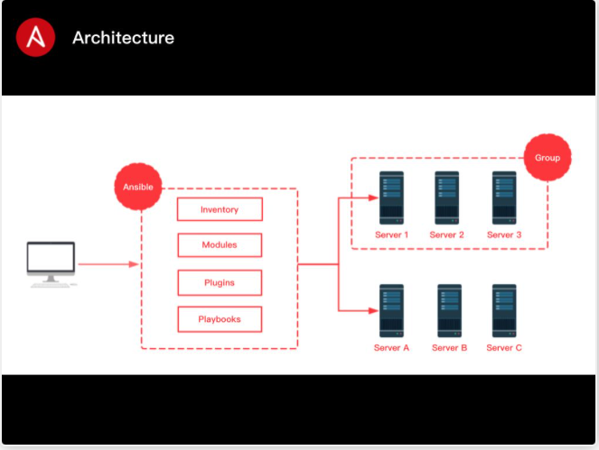

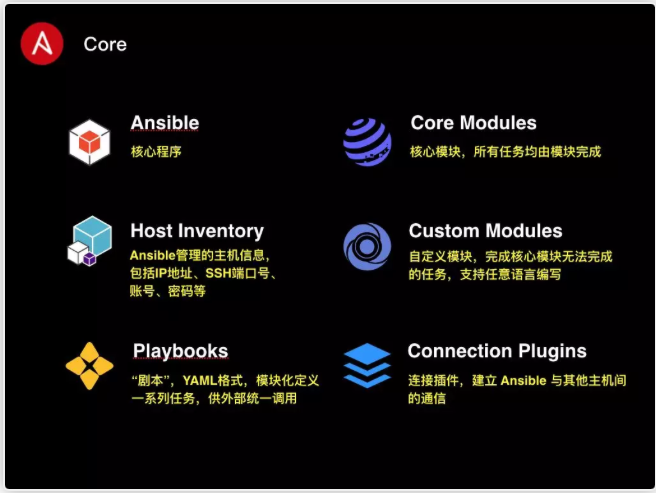

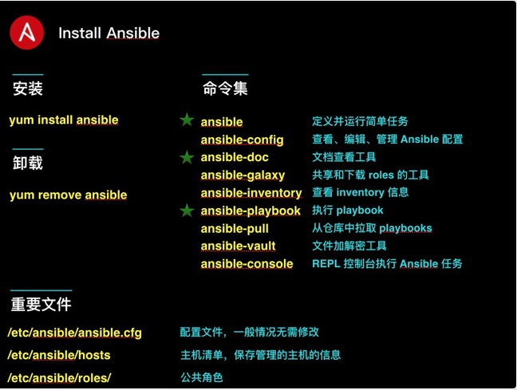

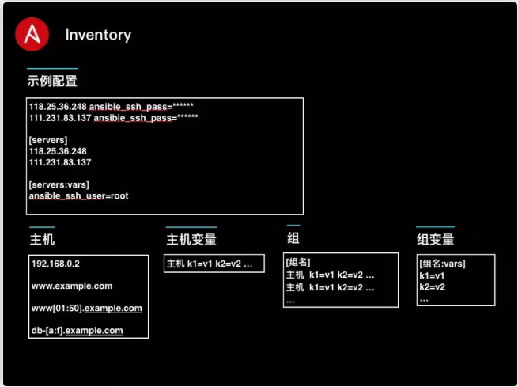

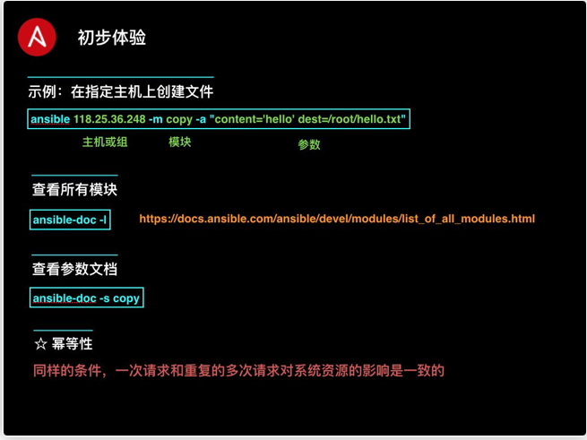

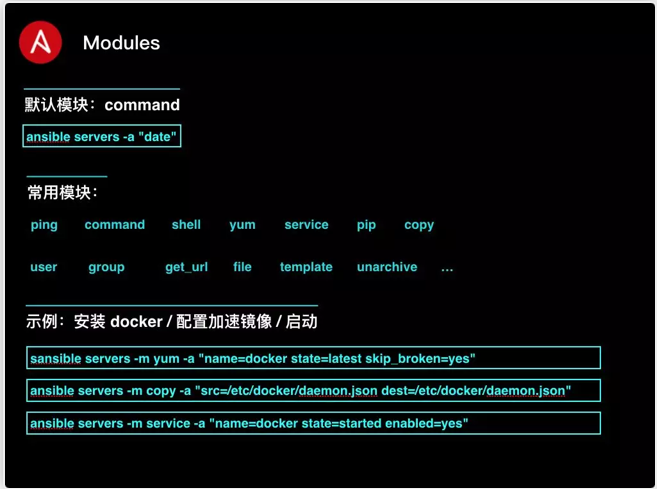

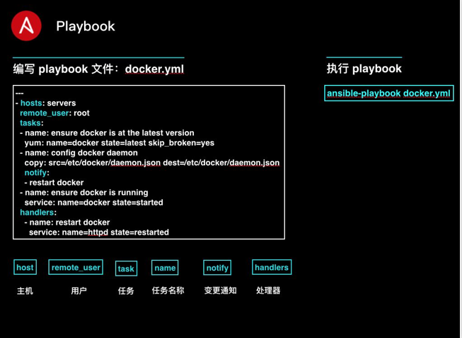

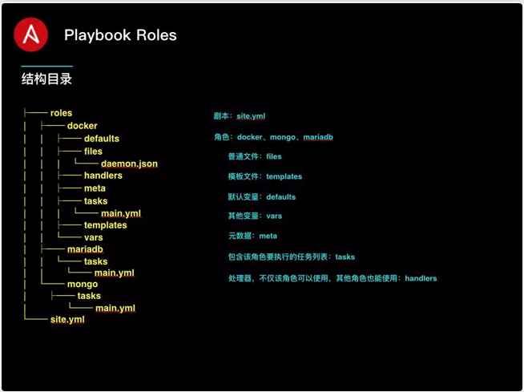

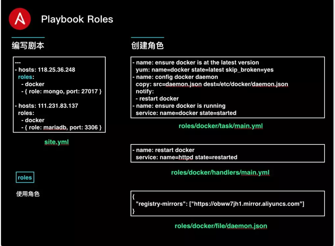

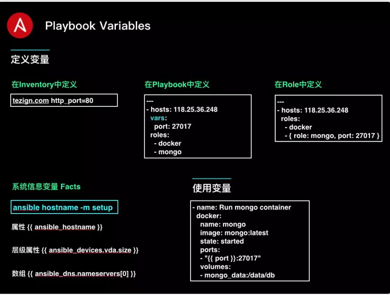

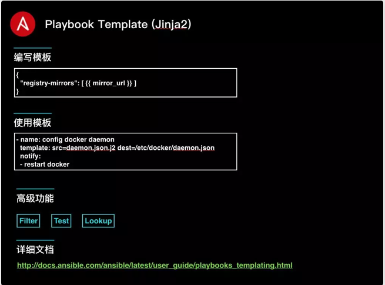

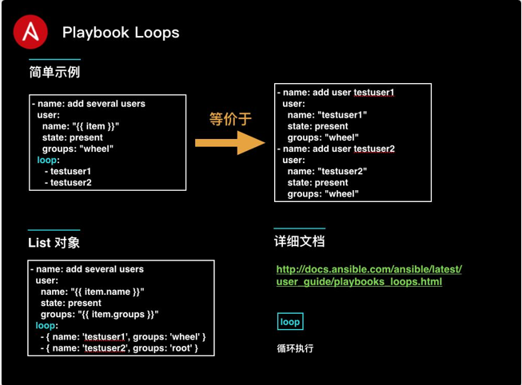

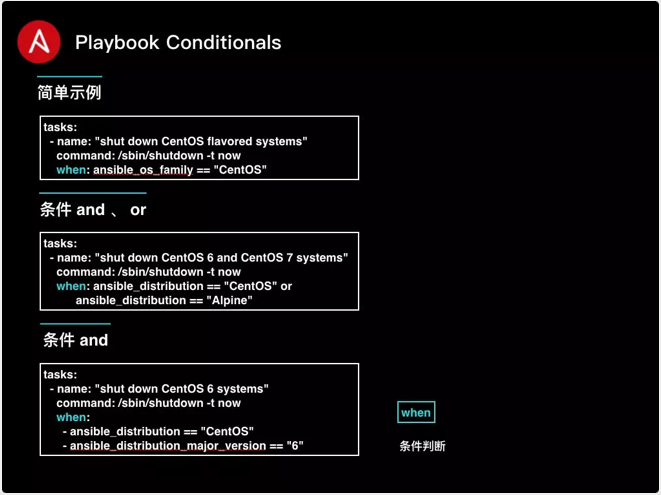

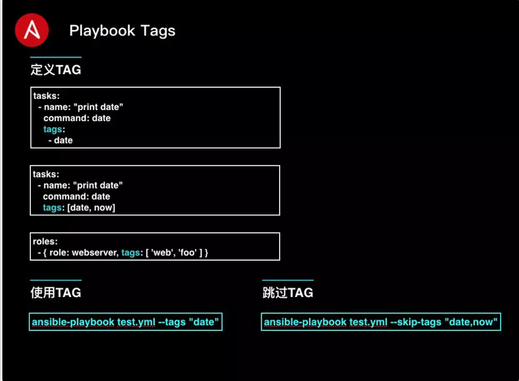

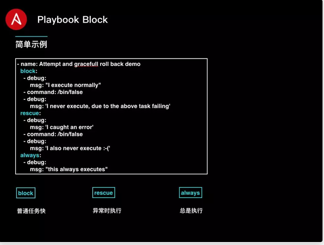

