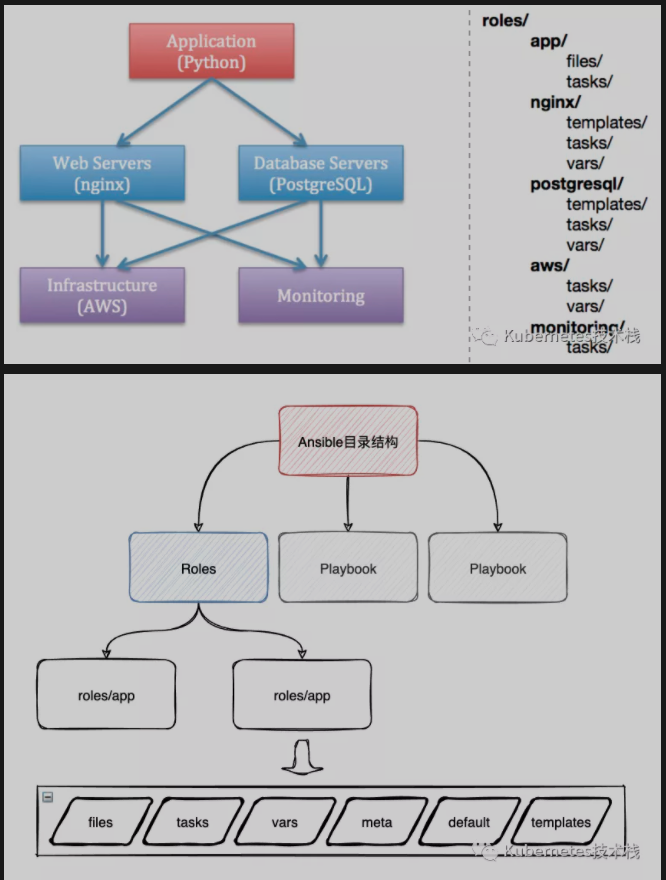

# **L12 任务中心之Ansible进阶篇**

## **1、`ansible-playbook`**

**playbook & yml 说明**

* playbook 由一个或多个 play 组成.
* playbook 中 每个play 必须包含 hosts 和 tasks.
* playbook 以 yaml 语法编写.
	* 可读性强
	* 脚本语言交互性能力强
	* 使用实现语言的数据类型
	* 一致性的信息模型
	* 易于实现
	* 基于流模式处理
	* 表达能力好, 扩展性强
	* YAML 约定以 `---` 开头 和 开始不同的`play` .
	* YAML 以 `#` 作为注释.
	* YAML 必须统一缩进, 空格 与 `tab` 不能混用, 缩进的级别也必须相同, 同级缩进代表同样的级别.
	* YAML 文件内容 是大小写敏感的, 跟 `Linux `一样区分大小写.
	* YAML `key/value` 形式可写在同一行也可以换行写. 同行使用 : 隔开.
	* YAML 一个完整的代码块功能最少包含2个元素. 如 `name: task`
	* YAML 一个 name 下只能包含一个 task
	* YAML - 开头的为列表,` key/value` 形式的为字典.
	* YAML 特性

## **2、playbook 核心元素**
	
* hosts 远程主机列表 ( `ip_addr/hostname/groupname` )
* tasks 任务集, 任务列表, 有两种写法。
	* action: module args action 参数。
	* module: args 参数 (一般使用这种)。
	* `ignore_errors`: True 当前 task 出错时仍然会向下执行。
* varniables 内置变量或自定义变量在 playbook 文件中调用。
* templates 模板，可替换模板文件中的变量并实现一些简单逻辑的文件。
* handles 与 notity 结合使用, 由特定条件触发的操作, 满足条件执行, 否则不执行。
* tags 标签 指定任务执行, 用于执行一个 playbook 中的部分代码. 主要用于测试ansible的语法与执行验证。


## **3、`ansible-playbook `命令**

`ansible-playbook`
	* `-C --check` Check 检查脚本运行情况, 不会在远程服务器里运行。
	* `--list-hosts` 列出执行此任务的主机。
	* `--list-tasks` 列出任务组的具体任务列表。
	* `--limit` 只对主机列表中的某台主机执行。
	* `-v -vv -vvv` 显示详细的执行DEBUG信息过程, 多个v参数等于DEBUG信息的叠加，显示更为详细

## **4、`ansible-playbook setup`**

介绍: 这个模块默认会被`playbooks`自动调用，用于收集远程主机的相关变量信息，获取到变量信息可以被playbooks调用。针对 setup模块，我们经常使用的是 `fact` ，在此只对` fact`做详细讲解，其他的就不过多叙述了，如果想了解详细信息，可以访问官方文档获取帮助。

* `fact` 是`ansible`模块`setup`的功能，主要用于获取相关信息作为变量继承给playbook子任务调用。
* `gather_facts`:

```
# ansible k3s-cluster -m setup
ubuntu20-bj03 | SUCCESS => {
    "ansible_facts": {
        "ansible_all_ipv4_addresses": [
            "10.0.16.4"
        ],
        "ansible_all_ipv6_addresses": [
            "fe80::5054:ff:fed6:42a8"
        ],
        "ansible_apparmor": {
            "status": "enabled"
        },
        "ansible_architecture": "x86_64",
        "ansible_bios_date": "04/01/2014",
        "ansible_bios_vendor": "SeaBIOS",
        "ansible_bios_version": "seabios-1.9.1-qemu-project.org",
        "ansible_board_asset_tag": "NA",
        "ansible_board_name": "NA",
        "ansible_board_serial": "NA",
        "ansible_board_vendor": "NA",
        "ansible_board_version": "NA",
        "ansible_chassis_asset_tag": "NA",
        "ansible_chassis_serial": "NA",
        "ansible_chassis_vendor": "Smdbmds",
        "ansible_chassis_version": "3.0",
        
        # 多余的冗余信息就不放了，自己可以执行验证下。
        # setup获得变量信息，都可以用于继承给playbook调用。
}
```

自定义Fact

**手动设置:**

ansible除了能获取到内置的fact的变量信息，还可以手动为某个主机组或者主机定制本地**fact**。

**本地 `fact `默认存放宿主机的`/etc/ansible/facts.d`目录下，支持的文件格式为`ini`、`json`**。

加载后的fact的key是`ansible_local`的特殊变量。

**`denis_test.fact`**

```
[general]
package = vsftpd
service = vsftpd
state = starte
```

**`setup_facts.yaml`**

```
---
- name: Install Remote Facts
  hosts: k3s-cluster
  vars: 
    remote_dir: /etc/ansible/facts.d
    facts_file: denis_test.fact
  tasks:
    - name: Create Directory
      file:
        state: directory
        recurse: yes
        path: "{{ remote_dir }}"
    - name: Install the new facts
      copy:
        src: "{{ facts_file }}"
        dest: "{{ remote_dir }}"
```

**执行测试**

```
# ansible-playbook setup_facts.yaml

# ansible test -m setup        
ubuntu20-bj03 | SUCCESS => {
    "ansible_facts": {
    
        # -----分隔符-----
        
        "ansible_local": {
            "custom": {
                "general": {
                    "package": "vsftpd",
                    "service": "vsftpd",
                    "state": "started"
                }
            }
        },

        # -----分隔符-----
```

**调用测试**

**`deniss_test.yaml`**

```
- name: Install Apache and starts the service
  hosts: k3s-cluster
  tasks:
    - name: Install Package
      yum: 
        name: "{{ ansible_facts.ansible_local.custom.general.package }}"
        state: latest
    - name: Start Service
      service: 
        name: "{{ ansible_facts.ansible_local.custom.general.service }}"
        state: "{{ ansible_facts.ansible_local.custom.general.state }}"
```

## **5、`ansible-playbook set_fact`**

使用`set_fact`设置新的变量

* `set_fact `可以自定义变量通过template或者变量的方式在playbook中继承使用。
* 如：假设你需要获取一个进程使用的内存的使用率，必须通过`set_fact`来进行计算之后得出结果，并将其值在playbook中继承使用。

**`deniss_fact_demo.yaml`**
 
```
- name: set_fact demo
  hosts: k3s-cluster
  tasks:
    - name: Calculate InnoDB buffer pool size
      set_fact: innodb_buffer_pool_size_mb="{{ ansible_memtotal_mb / 2 |int }}"      
    - debug: var=innodb_buffer_pool_size_mb
```

执行测试

```
# ansible-playbook deniss_fact_demo.yaml 
PLAY [set_fact demo] *****************************************************************************************************************************************************

TASK [Gathering Facts] ******************************************************************************************************************************************************
ok: [ubuntu20-bj03]

TASK [Calculate InnoDB buffer pool size] ************************************************************************************************************************************
ok: [ubuntu20-bj03]

TASK [debug] ****************************************************************************************************************************************************************
ok: [ubuntu20-bj03] => {
    "innodb_buffer_pool_size_mb": "2911.2"
}

PLAY RECAP ******************************************************************************************************************************************************************
ubuntu20-bj03                : ok=3    changed=0    unreachable=0    failed=0    skipped=0    rescued=0    ignored=0   
```

### **手动采集 fact**

**`gather_facts: False`**

我们在运行`playbook`的时候，Ansible会先`ssh`连接被控端采集`fact`，如果被控制端的`ssh`还没有完成运行，就会导致整个`playbook`执行失败。

**解决这个问题，可以先在配置中关闭`fact`采集，然后在`task`中通过`wait_for`探测被控端ssh端口是否正常监听，然后在task中在手动setup模块来采集fact**

```
- hosts: k3s-cluster
  name: test demo 
  gather_facts: False
  tasks：
    - name: wait for ssh to be running
      local_action: wait_for port=22 host="{{ inventory_hostname }}" search_regex=OpenSSH
    - name: gather facts
      setup:
```

### **fact缓存**

如果在playbook中需要继承fact，可启用fact缓存来提高效率。

**fact支持缓存 json、memcached、redis**

ansible.cfg中的配置说明:

json 以json格式文件作为fact缓存后端，ansible将会把采集的fact写入到宿主机的本地目录，最好是SSD硬盘。

 redis 使用redis做缓存。

 memcached 使用memcached做缓存。

* **smart 表示默认收集 facts，但 facts 已有的情况下不会收集，即使用缓存 facts**；
* **implicit 表示默认收集 facts，要禁止收集，必须使用 `gather_facts: False`；**
* **explicit 则表示默认不收集，要显式收集，必须使用 `gather_facts: Ture`**。

```
[defaults]
gathering = smart
# 缓存时间
fact_caching_timeout = 86400    
fact_caching = {jsonfile/redis/memcached}
# 指定ansible包含fact的json文件位置，如果目录不存在，会自动创建
# local
fact_caching_connection = /tmp/ansible_fact_cache
# redis
fact_caching_connection = 127.0.0.1:6379:admin
# memcached
fact_caching_connection = ['127.0.0.1:11211']
```
 
 
### **关闭fact（提高执行效率）**

在配置中关闭fact，整个playbookfact变量将不会在显示，可以提高执行效率，但是有时候又需要使用 facts 中的信息，这时候可以按照上述设置 facts 的缓存，在空闲的时候收集 facts，缓存下来，在需要的时候直接读取缓存进行引用。

```
# playbook 配置
- hosts: k3s-cluster
  gather_facts: no
# ansible.cfg 配置  
[defaults]
gathering = explicit
```

## **6、`ansible-playbook` 变量**

变量名要求: 只允许使用 **字母 、数字 、 `_ `** 组成, 而且只能以 **字母** 开头。

内置的公共变量:

* **`ansible k3s-cluster -m setup -a 'filter=*addresses*'`  可使用 `filter` 参数进行过滤**
* **使用 `ansible k3s-cluster -m setup` 可以获取到主机的系统变量名称**


**通过文件自定义变量:**

* **对主机组中的主机单独定义变量, 优先级高于公共变量**。
* 对主机组中的所有主机定义统一变量, 优先级低于对单独主机定义的变量。
* `/etc/ansible/hosts` 文件中定义

```
[appserver]
# 定义变量 node_id
10.0.8.2 node_id=17

# 对主机组 定义统一变量 domain_name
[k3s-cluster:vars]
domain_name=deniss.wang
```

**使用变量灵活配置不同主机的 `hostname`**

```
---
- hosts: k3s-cluster
  become: yes
  become_user: root

  tasks:
    - name: set hostname
      hostname: name={{ node_id }}.{{ domain_name }}
```


通过命令行定义变量: 通过命令行定义的变量优先级是最高的


```
ansible-playbook -e varname=valur
```

在 playbook 文件里 定义变量.

* **通过 `{{ 变量名 }}` 使用变量，另外需要注意的是，如果有中文，需要使用`""`把变量括起来。**
* **通过 `vars:` 列表 定义多个 变量.**

```
---
- hosts: k3s-cluster
  remote_user: root

  # 定义变量
  vars:
    - pkg_name: httpd
    - env_name: prod

  tasks:
    - name: {{ env_name }} install {{ pkg_name }}
      yum: name={{ pkg_name }}
```


通过定义单独的变量文件 用于统一存放变量, 可避免变量的重复定义。

* 定义单独的 变量文件, 只需要将所有变量以 `key: value` 形式写入到 `yaml `文件中既可。
* 在 `playbook` 文件中, 只需要使用 `vars_files:` 指定 yaml 文件路径既可。


**`vars.yaml` 变量文件**

```
---
pkg_name: httpd
file_name: deniss.wang
```

**`install.yaml`**

```
---
- hosts: k3s-cluster
  remote_user: root

  # 配置模板文件
  vars_files:
    # 指定文件的路径
    - vars.yaml

  tasks:
    - name: install {{ pkg_name }}
      yum: name={{ pkg_name }}
    - name: create {{ file_name }} file
      file: name=/tmp/{{ file_name }}.txt state=touch
```

执行 playbook 操作

```
# ansible-playbook install.yaml
PLAY [k3s-cluster] *******************************************************************************************************

TASK [Gathering Facts] *******************************************************************************************
ok: [10.0.8.2]

TASK [install httpd] *********************************************************************************************
changed: [10.0.8.2]

TASK [create deniss.wang file] **************************************************************************************
changed: [10.0.8.2]

PLAY RECAP *******************************************************************************************************
10.0.8.2                  : ok=3    changed=2    unreachable=0    failed=0    skipped=0    rescued=0    ignored=0
```

## **7 ansible-playbook template**

`template` 是`ansible-playbook`一个模块，用于存放生成配置的模板，使用jinja2语言编写，后缀为`xx.j2`，只能用于 playbook。

`templates `文件, 可嵌套引用脚本。

* 字符串: 使用单引号或双引号.
* 数字: 整数, 浮点数.
* 列表: [A1, A2, …]
* 元组: (B1, B2, …)
* 字典: {key1:value1, key2:value2, …}
* 布尔值: true/false
* 算术运算: `+, -, *, /, //, %, **`
* 比较操作: `==, !=, >, >=, <, <=`
* 逻辑运算: `and, or, not`
* 流表达式: `for, if, when`
* Jinja2 语法：


templates 根据模板块文件动态生成对应的配置文件

* **templates的模板文件必须存放于 `templates` 目录下, 并且以 `.j2` 为后缀**。
* **templates 目录需要与 `playbook` 的 `yaml` 文件在同级目录中**。

```
# tree nginx/
|-- nginx.yaml
|-- templates   
    |-- nginx.conf.j2
```

### **算术运算**

**`nginx.conf.j2`**

```
user nginx;
# 这里使用 环境变量 vcpus * 2，会根据操作系统CPU自动生成。
worker_processes {{ ansible_processor_vcpus * 2 }};
error_log /var/log/nginx/error.log;
pid /run/nginx.pid;

include /usr/share/nginx/modules/*.conf;

events {
    worker_connections 10240;
}

http {
    log_format  main  '$remote_addr - $remote_user [$time_local] "$request" '
                      '$status $body_bytes_sent "$http_referer" '
                      '"$http_user_agent" "$http_x_forwarded_for"';

    access_log  /var/log/nginx/access.log  main;

    sendfile            on;
    tcp_nopush          on;
    tcp_nodelay         on;
    keepalive_timeout   65;
    types_hash_max_size 2048;

    include             /etc/nginx/mime.types;
    default_type        application/octet-stream;

    include /etc/nginx/conf.d/*.conf;

    server {
        listen       80 default_server;
        listen       [::]:80 default_server;
        server_name  _;
        root         /usr/share/nginx/html;

        # Load configuration files for the default server block.
        include /etc/nginx/default.d/*.conf;

        location / {
        }

        error_page 404 /404.html;
            location = /40x.html {
        }

        error_page 500 502 503 504 /50x.html;
            location = /50x.html {
        }
    }
}
```

**nginx.yaml**

```
---
- hosts: k3s-cluster
  become: yes
  become_user: root

  tasks:
    - name: install nginx
      yum: name=nginx
    - name: nginx template conf
      # 如果yaml与templates在同一目录, src直接写.j2文件
      template: src=nginx.conf.j2 dest=/etc/nginx/nginx.conf
      notify:
        - restart nginx
    - name: start nginx
      service: name=nginx state=started enabled=yes

  handlers:
    - name: restart nginx
      service: name=nginx state=restarted
```

### **when 条件语句**

when 条件语句 例子

```
# tree nginx
|-- nginx.yaml
|-- templates   
    |-- nginx.conf.centos7.j2   
    |-- nginx.conf.centos8.j2
```

**playbook 文件**

```
---
- hosts: k3s-cluster
  become: yes
  become_user: root

  tasks:
    - name: install nginx
      yum: name=nginx
    - name: template centos 7 conf
      # 如果 yaml 与 templates 在同一目录, src 直接写.j2 文件。
      template: src=nginx.conf.centos7.j2 dest=/etc/nginx/nginx.conf
      # 使用 when 语句进行判断 如果变量为 "7" 执行以下操作
      when: ansible_distribution_major_version == "7"
      notify:
        - restart nginx
    - name: template centos 8 conf
      # 同上
      template: src=nginx.conf.centos8.j2 dest=/etc/nginx/nginx.conf
      # 使用 when 语句进行判断 如果变量为 'Ubuntu' 且版本为20 执行以下操作
   when: (ansible_distribution == "Ubuntu" and ansible_distribution_major_version == "20"
      notify:
        - restart nginx
    - name: start nginx
      service: name=nginx state=started enabled=yes

  handlers:
    - name: restart nginx
      service: name=nginx state=restarted
```

执行 playbook 文件

**`skipping` 状态表示跳过执行这个 TASK。**

```

# ansible-playbook nginx.yml

PLAY [k3s-cluster] *******************************************************************************************

TASK [Gathering Facts] *******************************************************************************
ok: [10.0.8.2]

TASK [install nginx] *********************************************************************************
ok: [10.0.8.2]

TASK [template centos 7 conf] ************************************************************************
changed: [10.0.8.2]

TASK [template centos 8 conf] ************************************************************************
skipping: [10.0.8.2]

TASK [start nginx] ***********************************************************************************
ok: [10.0.8.2]

RUNNING HANDLER [restart nginx] **********************************************************************
changed: [10.0.3.13]

PLAY RECAP *******************************************************************************************
10.0.8.2      : ok=5    changed=2    unreachable=0    failed=0    skipped=1    rescued=0    ignored=0
```

### **迭代变量 `with_tiems`**

* 迭代` with_items` 执行重复任务。
* 对于迭代选项, 固定变量名为 item 。
* 在 task 中使用 `with_items `指定需要迭代的元素列表。

```
---
- hosts: k3s-cluster
  become: yes
  become_user: root

  tasks:
    - name: create multi files
      # {{ item }} 为内置特殊变量, 代表 with_items 列表中的内容
      file: name=/tmp/{{ item }} state=touch
      with_items:
        - file_one
        - file_two
        - file_three
        - file_four
    - name: install multi software
      yum: name={{ item }}
      with_items:
        - vsftpd
        - net-tools
        - iftop
```

**代嵌套子变量 (字典)**

* 迭代嵌套子变量.
* 对迭代中的变量进行嵌套关联的操作.

playbook 文件

```
---
- hosts: k3s-cluster
  become: yes
  become_user: root

  tasks:
    - name: create some files
      # {{ item }} 为特殊变量, 代表 with_itmes 列表中的内容
      file: name=/tmp/{{ item }} state=touch
      with_items:
        - file_one
        - file_two
        - file_three
        - file_four

    - name: create multi group
      group: name={{ item }}
      with_items:
        - jinja2_file1
        - jinja2_file2
        - jinja2_file3
        - jinja2_file4

    - name: create multi user
      # 使用 item.key值 进行引用
      user: name={{ item.name }} group={{ item.group }}
      # 使用 字典 定义 嵌套的子 变量
      with_items:
        - { name: 'file_one', group: 'jinja2_file1' }
        - { name: 'file_two', group: 'jinja2_file2' }
        - { name: 'file_three', group: 'jinja2_file3' }
        - { name: 'file_four', group: 'jinja2_file4' }

    - name: permission multi files
      file: name=/tmp/{{ item.name }} owner={{ item.name }} group={{ item.group }}
      with_items:
        - { file: 'file_one', name: 'file_one', group: 'jinja2_file1' }
        - { file: 'file_two', name: 'file_two', group: 'jinja2_file2' }
        - { file: 'file_three', name: 'file_three', group: 'jinja2_file3' }
        - { file: 'file_four', name: 'file_four', group: 'jinja2_file4' }
```

执行 playbook 文件

**`ansible-playbook file.yml`**

```
PLAY [k3s-cluster] *****************************************************************************************

TASK [Gathering Facts] *****************************************************************************
ok: [10.0.8.2]

TASK [create multi files] ***************************************************************************
changed: [10.0.8.2] => (item=file_one)
changed: [10.0.8.2] => (item=file_two)
changed: [10.0.8.2] => (item=file_three)
changed: [10.0.8.2] => (item=file_four)

TASK [create multi group] ***************************************************************************
changed: [10.0.8.2] => (item=jinja2_file1)
changed: [10.0.8.2] => (item=jinja2_file2)
changed: [10.0.8.2] => (item=jinja2_file3)
changed: [10.0.8.2] => (item=jinja2_file4)

TASK [create multi user] ****************************************************************************
changed: [10.0.8.2] => (item={u'group': u'jinja2_file1', u'name': u'file_one'})
changed: [10.0.8.2] => (item={u'group': u'jinja2_file2', u'name': u'file_two'})
changed: [10.0.8.2] => (item={u'group': u'jinja2_file3', u'name': u'file_three'})
changed: [10.0.8.2] => (item={u'group': u'jinja2_file4', u'name': u'file_four'})

TASK [permission multi files] ***********************************************************************
changed: [10.0.8.2] => (item={u'group': u'jinja2_file1', u'name': u'file_one', u'file': u'file1'})
changed: [10.0.8.2] => (item={u'group': u'jinja2_file2', u'name': u'file_two', u'file': u'file2'})
changed: [10.0.8.2] => (item={u'group': u'jinja2_file3', u'name': u'file_three', u'file': u'file3'})
changed: [10.0.8.2] => (item={u'group': u'jinja2_file4', u'name': u'file_four', u'file': u'file4'})

PLAY RECAP *****************************************************************************************
10.0.8.2    : ok=5    changed=4    unreachable=0    failed=0    skipped=0    rescued=0    ignored=0
```


### **流程控制、循环 for 与 if**

for 循环

**` ... `**

```
---
- hosts: k3s-cluster
  become: yes
  become_user: root

  vars:
    # 列表
    listen_port:
      - 80
      - 81
      - 82
    # 字典
    service:
      - name: web1
        domain: deniss.wang
        port: 9090
        user: nginx
        path: /var/www/html 
      - name: web2
        domain: deniss.wang
        port: 9091
        user: nginx
        path: /var/www/html
      - name: web3
        domain: deniss.wang
        port: 9092
        user: nginx
        path: /var/www/html

  tasks:
    - name: copy template conf
      template: src=for.conf.j2 dest=/tmp/for.conf
```

#### `for.conf.j2` 文件

**` `语句` listen_port` 为 `playbook `中定义的 `vars` 。**

```


server {
   listen {{ port }}
}


```

#### **查看生成 `for.conf` 文件**

```
# cat /root/for.conf

server {
   listen 80
}


server {
   listen 81
}


server {
   listen 82
}
```

#### **字典形式**

`nginx.yaml`

```
---
- hosts: k3s-cluster
  become: yes
  become_user: root

  vars:
    # 字典的形式
    service:
      - name: web1
        domain: deniss.wang
        port: 9090
        user: nginx
        path: /var/www/html
      - name: web2
        domain: deniss.wang
        port: 9091
        user: nginx
        path: /var/www/html
      - name: web3
        domain: deniss.wang
        port: 9092
        user: nginx
        path: /var/www/html

  tasks:
    - name: copy template conf
      template: src=nginx.conf.j2 dest=/tmp/nginx.conf
```

**`nginx.conf.j2` 文件，放在templates下面**

```

user {{ s.user }};
worker_processes {{ ansible_processor_vcpus * 2 }};
pid /run/nginx.pid;
    server {
        listen       {{ s.port }} default_server;
        listen       [::]:{{ s.port }} default_server;
        server_name  {{ s.name }}.{{ s.domain }};
        root         {{ s.path }};
    }


```

**if 流程控制**: ` ...  ... `

**playbook 文件**

其中 web1, web2 不传 user 变量，web3 传 user 变量。


```
---
- hosts: k3s-cluster
  become: yes
  become_user: root

  vars:
    # 字典
    service:
      - name: web1
        domain: deniss.wang
        port: 90
        path: /var/www/html

      - name: web2
        domain: deniss.wang
        port: 91
        path: /var/www/html

      - name: web3
        domain: deniss.wang
        port: 92
        user: nginx
        path: /var/www/html

  tasks:
    - name: copy template conf
      template: src=nginx2.conf.j2 dest=/tmp/nginx2.conf
```

**`nginx2.conf.j2` 文件**

#### ` `判断 是否有 `s.user ` 这个变量

```



user {{ s.user }};

user root;

worker_processes {{ ansible_processor_vcpus * 2 }};
pid /run/nginx.pid;
    server {
        listen       {{ s.port }} default_server;
        server_name  {{ s.name }}.{{ s.domain }};
        root         {{ s.path }};
    }


```

**查看生成后的 `nginx2.conf`**

* 第一个server 不包含 `s.user` 变量 所以 `user root;`
* 第二个server 不包含 `s.user` 变量 所以 `user root`;
* 第三个server 包含 `s.user` 变量 所以 `user nginx`; 等于变量值

```

# cat  nginx2.conf
user root;
worker_processes 4;
pid /run/nginx.pid;
    server {
        listen       90 default_server;
        server_name  web1.deniss.wang;
        root         /var/www/html;
    }


user root;
worker_processes 4;
pid /run/nginx.pid;
    server {
        listen       91 default_server;
        server_name  web2.deniss.wang;
        root         /var/www/html;
    }


user nginx;
worker_processes 4;
pid /run/nginx.pid;
    server {
        listen       92 default_server;
        server_name  web3.deniss.wang;
        root         /var/www/html;
    }
```

**tasks 示范**

定义一组执行任务，可以包含多个模块的集合。


Demo

```
---
# 指定主机组
- hosts: k3s-cluster
  # 开启提权，指定用户
  become: yes
  become_user: root

  # 任务
  tasks:
    # 任务的名称
    - name: ping server
      ping:
    - name: echo hostname
      # shell 为模块名, 后面等同于 -a '' 参数
      shell: hostname
    - name: touch file
      file: name=/tmp/file.txt state=touch
    - name: echo file
      shell: ls -l /tmp/file.txt
    - name: write file
      shell: echo "hello world" > /tmp/file.txt
    - name: copy module write file
      copy: content="hello deniss\n" dest=/tmp/deniss.txt
    - name: display file content
      shell: cat /tmp/file.txt
      register: display_content1
    - name: show
      debug: var=display_content1.stdout verbosity=0
    - name: display copy module file content
      shell: cat /tmp/deniss.txt
      register: display_content2
    - name: show
      debug: var=display_content2.stdout verbosity=0
```

```
# ansible-playbook hello.yaml
PLAY [k3s-cluster] *******************************************************************************************************************************************************************

TASK [Gathering Facts] ***************************************************************************************************************************************************************
ok: [ubuntu20-bj03]

TASK [ping server] *******************************************************************************************************************************************************************
ok: [ubuntu20-bj03]

TASK [echo hostname] *****************************************************************************************************************************************************************
changed: [ubuntu20-bj03]

TASK [touch file] ********************************************************************************************************************************************************************
changed: [ubuntu20-bj03]

TASK [echo file] *********************************************************************************************************************************************************************
changed: [ubuntu20-bj03]

TASK [write file] ********************************************************************************************************************************************************************
changed: [ubuntu20-bj03]

TASK [copy module write file] ********************************************************************************************************************************************************
ok: [ubuntu20-bj03]

TASK [display file content] **********************************************************************************************************************************************************
changed: [ubuntu20-bj03]

TASK [show] **************************************************************************************************************************************************************************
ok: [ubuntu20-bj03] => {
    "display_content1.stdout": "hello world"
}

TASK [display copy module file content] **********************************************************************************************************************************************
changed: [ubuntu20-bj03]

TASK [show] **************************************************************************************************************************************************************************
ok: [ubuntu20-bj03] => {
    "display_content2.stdout": "hello deniss"
}

PLAY RECAP ***************************************************************************************************************************************************************************
ubuntu20-bj03              : ok=11   changed=6    unreachable=0    failed=0    skipped=0    rescued=0    ignored=0
```

状态释义:

* `ok` : ok 未修改文件元数据，绿色
* `changed` : 数据有修改，黄色

## **8 handles 示范**

handles 与 notity 结合的例子

同一个name 下可以定义多个 notify 配置关联到不同的 handlers 中。

```
---
# 指定主机组
- hosts: k3s-cluster
  # 开启提权，指定用户
  become: yes
  become_user: root

  tasks:
    - name: copy httpd.conf
      copy: src=~/ansible/httpd.conf dest=/etc/httpd/conf/httpd.conf backup=yes
      # 关联多个触发器的写法
      notify:
        - restart httpd
        - check status httpd
        - check network port
```

### **Demo**

**Centos**

```
---
# 指定主机组
- hosts: k3s-cluster
  # 开启提权，指定用户
  become: yes
  become_user: root

  tasks:
    - name: install httpd
      yum: name=httpd
    - name: copy httpd.conf
      copy: src=/opt/ansible/conf/httpd.conf dest=/etc/httpd/conf/httpd.conf backup=yes
      # 此任务 如果有变动会触发如下定义名称的触发器
      notify: restart httpd
    - name: start httpd
      service: name=httpd state=started enabled=yes

  # 触发器, 需要配置 notify 触发
  handlers:
    - name: restart httpd
      service: name=httpd state=restarted
```

**Ubuntu**

```
---
# 指定主机组
- hosts: k3s-cluster
  # 开启提权，指定用户
  become: yes
  become_user: root

  tasks:
    - name: Update apt-get repo and cache
      apt: update_cache=yes force_apt_get=yes cache_valid_time=3600
    - name: Install Vsftpd
      apt:
        name: vsftpd
    - name: copy vsftpd.conf
      copy: src=/opt/ansible/conf/vsftpd.conf dest=/etc/vsftpd.conf backup=yes
      notify: restart vsftpd
    - name: start vsftpd
      service: name=vsftpd state=started enabled=yes
  # 配置 notify 触发，修改配置文件的时候生效。
  handlers:
    - name: restart vsftpd
      service: name=vsftpd state=restarted
```

执行安装vsftpd PlayBook

```
# ansible-playbook install_vsftpd.yaml
PLAY [k3s-cluster] *******************************************************************************************************************************************************************

TASK [Gathering Facts] ***************************************************************************************************************************************************************
ok: [ubuntu20-bj03]

TASK [Update apt-get repo and cache] *************************************************************************************************************************************************
ok: [ubuntu20-bj03]

TASK [Install Vsftpd] ****************************************************************************************************************************************************************
ok: [ubuntu20-bj03]

TASK [copy vsftpd.conf] **************************************************************************************************************************************************************
ok: [ubuntu20-bj03]

TASK [start vsftpd] ******************************************************************************************************************************************************************
ok: [ubuntu20-bj03]

PLAY RECAP ***************************************************************************************************************************************************************************
ubuntu20-bj03              : ok=5    changed=0    unreachable=0    failed=0    skipped=0    rescued=0    ignored=0
```

修改vsftpd文件以后会触发重启操作。

```
# ansible-playbook install_pkg.yaml
PLAY [k3s-cluster] *******************************************************************************************************************************************************************

TASK [Gathering Facts] ***************************************************************************************************************************************************************
ok: [ubuntu20-bj03]

TASK [Update apt-get repo and cache] *************************************************************************************************************************************************
ok: [ubuntu20-bj03]

TASK [Install Vsftpd] ****************************************************************************************************************************************************************
ok: [ubuntu20-bj03]

TASK [copy vsftpd.conf] **************************************************************************************************************************************************************
changed: [ubuntu20-bj03]

TASK [start vsftpd] ******************************************************************************************************************************************************************
ok: [ubuntu20-bj03]

RUNNING HANDLER [restart vsftpd] *****************************************************************************************************************************************************
changed: [ubuntu20-bj03]

PLAY RECAP ***************************************************************************************************************************************************************************
ubuntu20-bj03              : ok=6    changed=2    unreachable=0    failed=0    skipped=0    rescued=0    ignored=0
```

**修改vsftpd文件以后会触发重启操作。**

```
# ansible-playbook install_pkg.yaml
PLAY [k3s-cluster] *******************************************************************************************************************************************************************

TASK [Gathering Facts] ***************************************************************************************************************************************************************
ok: [ubuntu20-bj03]

TASK [Update apt-get repo and cache] *************************************************************************************************************************************************
ok: [ubuntu20-bj03]

TASK [Install Vsftpd] ****************************************************************************************************************************************************************
ok: [ubuntu20-bj03]

TASK [copy vsftpd.conf] **************************************************************************************************************************************************************
changed: [ubuntu20-bj03]

TASK [start vsftpd] ******************************************************************************************************************************************************************
ok: [ubuntu20-bj03]

RUNNING HANDLER [restart vsftpd] *****************************************************************************************************************************************************
changed: [ubuntu20-bj03]

PLAY RECAP ***************************************************************************************************************************************************************************
ubuntu20-bj03              : ok=6    changed=2    unreachable=0    failed=0    skipped=0    rescued=0    ignored=0
```

## **9 Tags示范**

#### **9-1 tags**

* 定义了 tags 后可通过定义的 tags 单独运行该 tags来执行指定的tasks， 运行多个可用 , 号分隔。
* 多个不同的任务中可以定义相同的 tags。


```
---
# 指定主机组
- hosts: k3s-cluster
  # 开启提权，指定用户
  become: yes
  become_user: root

  tasks:
    - name: Update apt-get repo and cache
      apt: update_cache=yes force_apt_get=yes cache_valid_time=3600
    - name: Install Vsftpd
      apt:
        name: vsftpd
    - name: copy vsftpd.conf
      copy: src=conf/vsftpd.conf dest=/etc/vsftpd.conf backup=yes
      notify: restart vsftpd
      # 定义标签
      tags: cpconf      
    - name: start vsftpd
      service: name=vsftpd state=started enabled=yes
      # 定义标签
      tags: upvsftpd      
  # 配置 notify 触发，修改配置文件的时候生效。
  handlers:
    - name: restart vsftpd
      service: name=vsftpd state=restarted     
```

**`-t` 指定标签执行**

```
# ansible-playbook -t upvsftpd  install_vsftpd.yaml
PLAY [k3s-cluster] *******************************************************************************************************************************************************************

TASK [Gathering Facts] ***************************************************************************************************************************************************************
ok: [ubuntu20-bj03]

TASK [start vsftpd] ******************************************************************************************************************************************************************
ok: [ubuntu20-bj03]

PLAY RECAP ***************************************************************************************************************************************************************************
ubuntu20-bj03              : ok=2    changed=0    unreachable=0    failed=0    skipped=0    rescued=0    ignored=0

# ansible-playbook -t cpconf  install_vsftpd.yaml
PLAY [k3s-cluster] *******************************************************************************************************************************************************************

TASK [Gathering Facts] ***************************************************************************************************************************************************************
ok: [ubuntu20-bj03]

TASK [copy vsftpd.conf] **************************************************************************************************************************************************************
changed: [ubuntu20-bj03]

RUNNING HANDLER [restart vsftpd] *****************************************************************************************************************************************************
changed: [ubuntu20-bj03]

PLAY RECAP ***************************************************************************************************************************************************************************
ubuntu20-bj03              : ok=3    changed=2    unreachable=0    failed=0    skipped=0    rescued=0    ignored=0
```

## **10 ansible-vault**

* playbook 文件加密工具。
* `ansible-vault encrypt hello.yaml`
* `encrypt: AES256` 加密 ( 会提示输入密码 )。
* `view`: 加密的情况下 查看 原来的内容。
* `edit`: 编辑加密的 playbook 文件。
* `decrypt`: 解密。
* `rekey`: 修改加密密码。

## **11 `ansible-console`**

`ansible-console`: 可交互执行命令, 支持 Tab 键。

```
# ansible-consoleWelcome to the ansible console.Type help or ? to list commands.deniss.wang@all (10)[f:5]$
```

`root@all (10) [f:5]$`

* `root `当前执行用户。
* `all` 表示当前主机列表。
* `(10)` 表示当前主机清单下包含 10 台主机。
* `[f:5]`: 表示并发执行任务数为 5 个。。

## **12 ansible Roles**

* Roles 角色是 Ansible v1.2 版本新加入特性，用于层次性、结构化的组织 playbook。
* Roles 能够根据层次结构自动加载- 变量文件、tasks、handler、template 文件等. 简单来讲就是将 这些文件归类到各自单独的文件目录中, 使 playbook 文件可以更好的通过 include 这些文件目录。
* Roles 一般用于基于 主机构建服务 的场景中, 但也可以用于构建 守护进程 等场景。
* Roles 默认的目录为 `/etc/ansible/roles` 。



目录结构说明


* playbook.yml - 剧本文件
* app 具体的角色项目名称, 比如 Nginx、PHP、Apache
* files 用于存放由copy 或script 模块调用的文件
* `templates` 用于存放 Jinja2 模板, template 模块会自动在此目录中寻找 Jinja2 模板文件
* `tasks`  main.yml文件为入口, 用于定义此角色的任务列表, 此文件可以使用include包含其它的位于此目录的 task 文件
* `handlers `main.yml文件为入口, 用于定义此角色中触发条件时执行的动作
* `vars` main.yml文件为入口，用于定义此角色用到的变量
* `defaults` main.yml文件为入口， 用于为当前角色设定默认变量
* `meta` main.yml文件为入口，用于定义此角色的特殊设定及其依赖关系
* `roles:` 所有的角色必须放在roles目录下, 这个目录可以自定义位置，默认的位置在 `/etc/ansible/roles`

* **nginx roles**

```
# tree .

|-- nginx
    |-- defaults
    |-- files
    |-- handlers
    |-- meta
    |-- tasks
    |-- templates
    |-- vars
```

* 创建对应的文件

```

# tree  roles/
roles/
|-- nginx
    |-- defaults
    |-- files
    |-- handlers
    |-- meta
    |-- tasks
    |   |-- group.yaml
    |   |-- main.yaml
    |   |-- restart.yaml
    |   |-- start.yaml
    |   |-- template.yaml
    |   |-- user.yaml
    |   |-- yum.yaml
    |-- templates
    |   |-- nginx.conf.j2
    |-- vars
```

**`/etc/ansible/nginx_roles.yml` 与 roles存放位置在同一目录。**

```
---
- hosts: k3s-cluster
  become: yes
  become_user: root

  # 选择 调用的 roles 属性
  roles:
      # 调用定义好的role，存放在roles目录中。
    - role: nginx
```

`/etc/ansible/roles/nginx/tasks/main.yml` 入口文件 配置 task 执行顺序。

* `- include: roles/httpd/tasks/copyfile.yml`
* 跨 roles 调用 tasks，需要写 roles 目录级的全路径。 

如:

```
- include: group.yml
- include: user.yml
- include: yum.yml
- include: template.yml
- include: start.yml
```

`/etc/ansible/roles/nginx/tasks/group.yml` 单独的 tasks 文件只写单独的内容 如下:

 ```
 - name: create group
  group: name=nginx gid=80
 ```
 
**执行 `nginx_roles.yml` 文件**

```
# ansible-playbook nginx_roles.yml

PLAY [k3s-cluster] ****************************************************************************************

TASK [Gathering Facts] ****************************************************************************
ok: [10.0.8.2]

TASK [nginx : create group] ***********************************************************************
changed: [10.0.8.2]

TASK [nginx : create user] ************************************************************************
changed: [10.0.8.2]

TASK [nginx : install package] ********************************************************************
changed: [10.0.8.2]

TASK [nginx : copy conf] **************************************************************************
changed: [10.0.8.2]

TASK [nginx : start service] **********************************************************************
changed: [10.0.8.2]

PLAY RECAP ****************************************************************************************
10.0.8.2   : ok=6    changed=5    unreachable=0    failed=0    skipped=0    rescued=0    ignored=0
```

### **roles tags 标签**

在 playbook 文件中 对 roles 配置相应的 tags 。

```
- hosts: k3s-cluster
  become: yes
  become_user: root


  # 选择 roles 属性
  roles:
    # 配置相应的 tags 用 { } 引用
    - { role: nginx, tags: ['web', 'nginx'] }
    - { role: mysql, tags: ['db', 'mysql'] }
    - { role: redis, tags: ['db', 'redis'] }
    - { role: golang, tags: ['web', 'golang'] }
    - { role: vue, tags: ['web', 'vue'] }   
    - { role: app_demo, tags: "app_demo" }
```

跟上面的用法一样，通过 `ansible-playbook -t` 参数指定 tags 进行单独调用

如下指定 tags 为 web 的 role 执行，其中会依次执行nginx 、golang、vue的roles。

```
# ansible-playbook -t web playbook.yml
```
### **roles when 语句**

对 role 进行条件的判断.

**`ansible_distribution_major_version == "7"`**

```
---
- hosts: all
  become: yes
  become_user: root

  # 选择 roles 属性
  roles:
    # 配置相应的 tags 用 { } 引用
    - { role: nginx, tags: ['web', 'nginx'] }
    - { role: mysql, tags: ['db', 'mysql'] }
    - { role: redis, tags: ['db', 'redis'] }
    # 只针对操作系统为 Centos7 的执行
    - { role: golang, tags: ['web', 'golang'], when: ansible_distribution_major_version == "7" }
    # 只针对操作系统为 Ubuntu20 的执行
    - { role: vue, tags: ['web', 'vue'], when: (ansible_distribution == "Ubuntu" and ansible_distribution_major_version == "20")}
    - { role: app, tags: "app" }
```

### **`extra-vars`**

* `--extra-vars` 执行 playboook 的时候以参数方式传入变量。

```

# 以变量方式传参
ansible-playbook deploy.yaml --extra-vars "hosts=k3s-cluster user=ubuntu" 
# 以json格式传参
ansible-playbook deploy.yaml --extra-vars "{'app_name':'nginx', 'pkg_name':'vsftpd'}"
# 以json文件方式传参
ansible-playbook deploy.yml --extra-vars "@test_vars.json"
```


### **附上2个Demo**

Ubuntu 安装软件，传入参数即可安装软件。

```
---
# 定义集群，并设置提权root，
- hosts: all
  become: yes
  become_user: root

  vars:
    # 传入参数
    - DEPLOY_USER: ubuntu
    - APP_NAME: '{{ app_name }}'
  
  tasks:
    - name: 更新 apt-get 仓库以及缓存
      apt: update_cache=yes force_apt_get=yes cache_valid_time=3600
    - name: 安装 {{ APP_NAME }} 程序
      apt:
        name: "{{ APP_NAME }}"
    # - name: "复制 {{ APP_NAME }} 配置文件"
    #   copy: src=./conf/vsftpd.conf dest=/etc/{{ APP_NAME }}.conf backup=yes
    #   notify: restart {{ APP_NAME }} # 此处必须与handlers一致
    #   # 定义标签
    #   tags: copyconf
    - name: "启动 {{ APP_NAME }} 服务"
      service: name={{ APP_NAME }} state=started enabled=yes
      # 定义标签
      tags: startvsftpd
          
  # 配置 notify 触发，修改配置文件的时候生效。
  handlers:
    - name: restart {{ APP_NAME }}
      service: name={{ APP_NAME }} state=restarted
```

发布流程，Demo中的具体实现逻辑

```
---
- hosts: all
  gather_facts: no

  vars:
    # OSS参数
    - OSS_URL: 'https://repo.opendevops.cn'
    - OSS_PATH: 'codo/codo-api/cclib/production'
    - OSS_FILE: 'xxxxx_20211020181130_dispatch-service-0.0.7.jar'
    - OSS_FILE_KEY: '?xxxxxxxxxxxxxxxxxxxxxxxxxxxxxxxxxxxxxxxx'
    # 部署参数
    - DEPLOY_USER: '{{ deploy_user }}' # "ubuntu"
    - APP_NAME: '{{ app_name }}' # "tomcat"
    - APP_DIR:  '{{ app_dir }}' # "/tmp"
    - DING_URL: '{{ ding_url }}'
    - DING_TOKEN: '{{ ding_token }}'

  tasks:

    - name: "验证 {{ inventory_hostname }} SSH 端口"
      local_action: wait_for port=22 host="{{ inventory_hostname }}" search_regex=OpenSSH
    - name: gather facts
      setup:    

    - name: "钉钉 {{ ding_url }} {{ ding_token }}"
      shell: "echo {{ ding_url }}"   
      register: print_ding_url

    - name: "获取当前发布主机IP"
      shell: "curl http://ip.me"   
      register: get_ip_addr
    - name: "获取当前发布主机IP SDTOUT"  
      debug: var=get_ip_addr.stdout
      
    - name: "获取当前发布主机名称"
      shell: "hostname"
      register: get_hostname
    - name: "获取当前发布主机名称 SDTOUT"
      debug: var=get_hostname

    # 发布的一些动作
    - name: "发布主机: {{ get_hostname.stdout }} 验证 {{ APP_NAME }} 目录"
      file:
        path: "{{ APP_DIR }}/{{ APP_NAME }}"
        state: directory
        mode: '0755'   
      register: create_dir
    - name: "发布主机: {{ get_hostname.stdout }} 验证 {{ APP_NAME }} 目录 STDOUT"
      debug: var=create_dir

    - name: "发布主机: {{ get_hostname.stdout }} APP {{ APP_NAME }} 程序包下载"            
      shell: "wget {{ OSS_URL }}/{{ OSS_PATH }}/{{ OSS_FILE }}'{{ OSS_FILE_KEY }}' -O {{ APP_DIR }}/{{ APP_NAME }}/{{ OSS_FILE }}"
      args:
        chdir: /opt/
        creates: /opt/{{ OSS_URL }}/{{ OSS_FILE }}
      register: download_file
      #notify: restart {{ APP_NAME }}
    - name: "发布主机: {{ get_hostname.stdout }} APP {{ APP_NAME }} 程序包下载 CMD"
      debug: var=download_file.cmd

    - name: "发布主机: {{ get_hostname.stdout }} APP {{ APP_NAME }} 改名"
      shell: "new_file_name=`ls {{ APP_DIR }}/{{ APP_NAME }}/{{ OSS_FILE }} |awk -F'_' '{print $3}'` && echo ${new_file_name} && mv {{ APP_DIR }}/{{ APP_NAME }}/{{ OSS_FILE }} {{ APP_DIR }}/{{ APP_NAME }}/${new_file_name}"
      args:
        chdir: /opt/
        creates: /opt/{{ OSS_URL }}/{{ OSS_FILE }}
      register: move_file
    - name: "发布主机: {{ get_hostname.stdout }} APP {{ APP_NAME }} 改名 STDOUT"
      debug: var=move_file.stdout
   
   - name: "发布主机: {{ get_hostname.stdout }} APP {{ APP_NAME }} 权限修改"
      file:
        path: "{{ APP_DIR }}/{{ APP_NAME }}"
        state: directory
        owner: "{{ DEPLOY_USER }}"
        group: "{{ DEPLOY_USER }}"
        recurse: yes
      register: changed_permissions
    - name: "APP {{ APP_NAME }} 权限修改 STDOUT"
      debug: var=changed_permissions

    - name: "发布主机: {{ get_hostname.stdout }} APP {{ APP_NAME }} 服务重启"      
      shell: "echo {{ OSS_URL }}/{{ OSS_PATH }}/{{ OSS_FILE }} -O {{ APP_DIR }}/{{ APP_NAME }}/{{ OSS_FILE }}"
      register: restart_service
      notify: restart {{ APP_NAME }}
    - name: "发布主机: {{ get_hostname.stdout }} APP {{ APP_NAME }} 服务重启 SDTOUT"
      debug: var=restart_service.cmd

    # 发布完成后的验证
    - name: "发布主机: {{ get_hostname.stdout }} 验证 {{ APP_NAME }} 进程状态"      
      shell: "echo {{ OSS_URL }}/{{ OSS_PATH }}/{{ OSS_FILE }} -O {{ APP_DIR }}/{{ APP_NAME }}/{{ OSS_FILE }}"
      args:
        chdir: /opt/
        creates: /opt/{{ OSS_URL }}/{{ OSS_FILE }}
      register: process_status
    - name: "发布主机: {{ get_hostname.stdout }} 验证 {{ APP_NAME }} 进程状态 STDOUT"
      debug: var=process_status.stdout      

    - name: "发布主机: {{ get_hostname.stdout }} 验证 {{ APP_NAME }} 服务状态"      
      shell: "echo {{ OSS_URL }}/{{ OSS_PATH }}/{{ OSS_FILE }} -O {{ APP_DIR }}/{{ APP_NAME }}/{{ OSS_FILE }}"
      args:
        chdir: /opt/
        creates: /opt/{{ OSS_URL }}/{{ OSS_FILE }}
      register: service_status
    - name: "发布主机: {{ get_hostname.stdout }} 验证 {{ APP_NAME }} 服务状态 STDOUT"
       debug: var=service_status.stdout  

    - name: "发布主机: {{ get_hostname.stdout }} 验证 {{ APP_NAME }} 接口状态"      
      shell: "curl -s -L %{http_code} {{ OSS_URL }}  | grep \"Welcome!\" |awk '{print $1}'"
      args:
        chdir: /opt/
        creates: /opt/{{ OSS_URL }}/{{ OSS_FILE }}
      register: interface_status
    - name: "发布主机: {{ get_hostname.stdout }} 验证 {{ APP_NAME }} 接口状态 STDOUT"
      debug: var=interface_status.stdout

  # 重启服务
  handlers:
    - name: restart {{ APP_NAME }}
      service: name={{ APP_NAME }} state=restarted   
```

执行参数

```
# 变量
ansible-playbook -C deploy.yaml -e "ding_url=ding.opendevops.cn app_name=tomcat app_dir=/tmp/deniss deploy_user=ubuntu, ding_token=qwerty&^%FDSFBSNFXZ&^%%"
# json
ansible-playbook -C deploy.yaml --extra-vars "{'app_name':'tomcat', 'deploy_user':'ubuntu', 'app_dir':'/tmp/deniss', 'ding_url':'ding.opendevops.cn', 'ding_token':'qwerty&^%FDSFBSNFXZ&^%%'}"
```