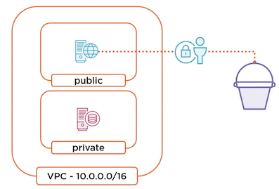
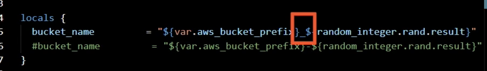
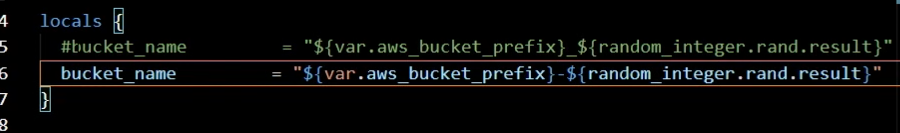
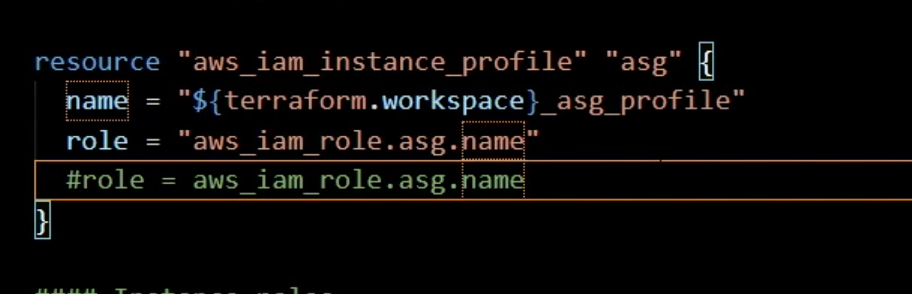
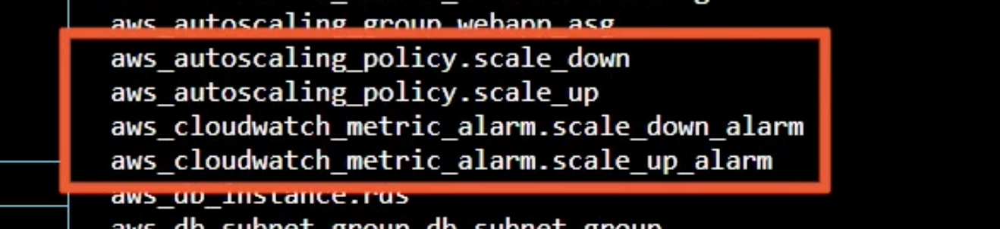
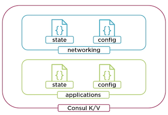
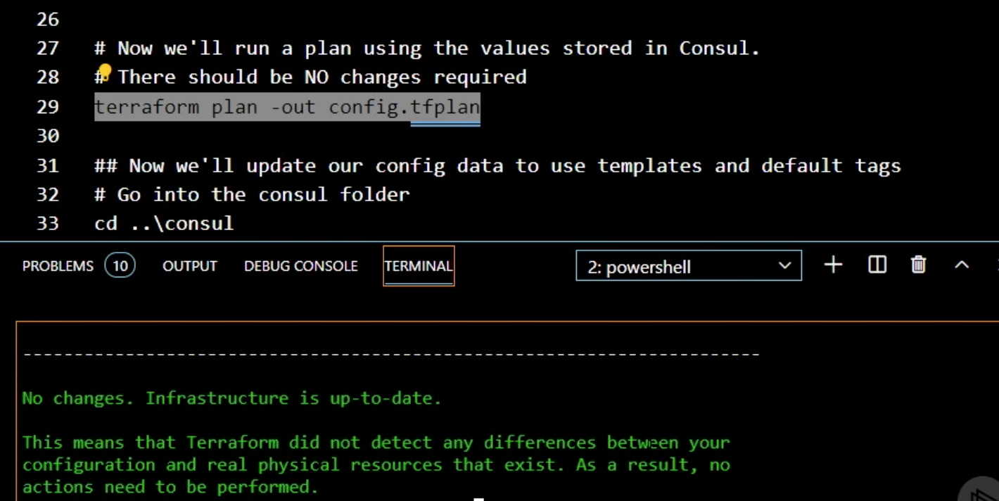
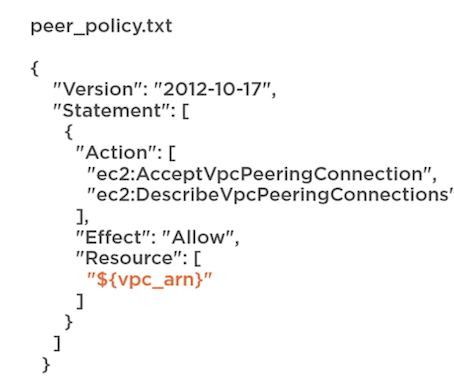
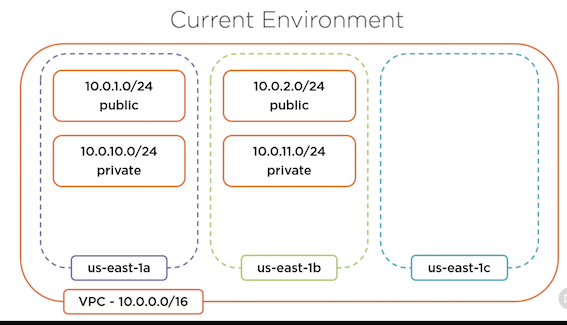
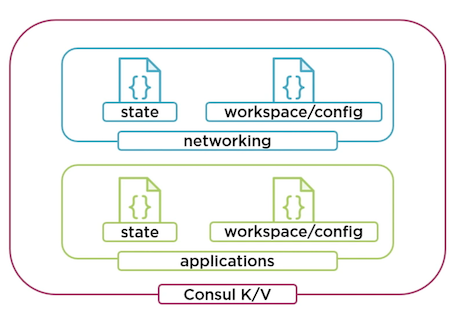

# **Terraform Advanced(Troubleshooting/Data Sources/Existing Resource)**

## **1 Troubleshooting Terraform**

### **Overview**

* Validating configurations
* Enable verbose logging
* Resource taints
* Crash logs

**Example: Application Update**




### **Type of Errors in Terraform**

**Command error / Syntax validation / Provider
validation /  Deployment error / Panic!**

* The first is a **command error**， so this is simply an error that happens when you're using the command line, and there are definitelv ways to troubleshoot that error.
* There's **syntax validation**, and this is the process by which Terraform validates the HashiCorp configuration language that you've laid out for your configuration and also some of the logic within that configuration
* **Provider validation** , when Terraform runs its **plan** process, the provider has to agree with what's in that configuration. Now, even if the provider agrees, when we get to the apply stage, **sometimes deployment errors happen**
* Things like resource taints.
* Sometimes **Terraform just breaks**.

### **Command Error**

* Happens at the command line
* Bad CLI syntax or arguments
* Use the help argument
* Read the docs

**Example: test Terraform file**

**`s3.tf`**

```
#### S3 buckets
variable "aws_bucket_prefix" {
  type    = strings
  #type = string
  
  default = "jack"
}

resource "random_integer" "rand" {
  min = 10000
  max = 99999
}

locals {
  bucket_name         = "${var.aws_bucket_prefix}_${random_integer.rand.result}"
  #bucket_name         = "${var.aws_bucket_prefix}-${random_integer.rand.result}"
}

resource "aws_s3_bucket" "logs_bucket" {
  bucket        = local.bucket_name
  acl           = "private"
  force_destroy = true

  versioning {
    enabled = true
  }

}

#### Instance profiles

resource "aws_iam_instance_profile" "asg" {

  lifecycle {
    create_before_destroy = false
  }

  name = "${terraform.workspace}_asg_profile_bug"
  role = "aws_iam_role.asg.name"
  #role = aws_iam_role.asg.name
}

#### Instance roles

resource "aws_iam_role" "asg" {
  name = "${terraform.workspace}_asg_role"
  path = "/"
  
  assume_role_policy = <<EOF
{
  "Version": "2012-10-17",
  "Statement": [
    {
      "Action": "sts:AssumeRole",
      "Principal": {
        "Service": "ec2.amazonaws.com"
      },
      "Effect": "Allow",
      "Sid": ""
    }
  ]
}
  EOF
}

#### S3 policies

resource "aws_iam_role_policy" "asg" {
  name = "${terraform.workspace}-jack-primary-rds"
  role = aws_iam_role.asg.ids
  #role = aws_iam_role.asg.id

  policy = <<-EOF
  {
    "Version": "2012-10-17",
    "Statement": [
      {
        "Action": [
          "s3:*"
        ],
        "Effect": "Allow",
        "Resource": [
                "arn:aws:s3:::${local.bucket_name}",
                "arn:aws:s3:::${local.bucket_name}/*"
            ]
      }
    ]
  }
  EOF
}
```

```
terraform init -h
```

**Try to run terraform init with a bad command switch**

```
terraform init -backend-confi="path=applications/state/primary"
# Report Error. -backend-confi
```

```
terraform init -backend-config="path=applications/state/primary"
Initializine provider plugins.
- Checkine for available provider plugins...
- Downloading plugin for provider "aws" (hashicorp/aws) 2.70.0.
```

### **Syntax Validation**

* Terraform init first
* Checks syntax and logic
* Does not check state
* Manual or automatic
* Automation checks


**Validating the syntax of HashiCorp**

configuration language, it's actually validating some of the logic in the providers, you're using in your configuration and we'll see how that works, it's simply checking the configuration itself,


The validation run can happen manually or automatically 

```
terraform validate

Error: Invalid type specification

	on s3.tf line 3, in variable "aws_bucket_prefix" :
	3: type = strings
The keyword "strings" is not a valid type specification.
```

```
terraform validate

Error: Unsupported attribute

	on s3.tf line 65, in resource "aws_iam_role_policy" "asg"
	65:  role = aws_iam_role.asg.ids

This object has no argument, nested block, or exported attribute named "ids"
Did you mean "id"?
```

```
### Try to run terraform validate 
terraform validate

terraform fmt

### Fix issues and run again
terraform validate
```

### Provider Validation and Deployment Errors

* Happens during plan or apply
* Read the error message, then read it again
* Enable logging for more detail
* Use taint to destroy bad resources

```
terraform workspace select development
Switched to workspace "development"

terraform plan -out dev.tfplan
```

```
bucket_name         = "${var.aws_bucket_prefix}_${random_integer.rand.result}"
```

* `"${var.aws_bucket_prefix}_$**`: They cannot include an **underscore**, and that's why we got an error.





```
Error: Error creating S3 bucket: InvalidBucketName: The specified bucket is not valid.
```



```
Error: Error creating IAM instance profile development asg profile: EntityAlreadyExists: Instance
Profile development_asg_profile already exists.
```


### **Verbose Logging**


* Exposes Terraform actions
* Enabled through `TF_LOG`
* Write to file with `TF_LOG_PATH`
* Trace is most verbose
* Useful in automation

Terraform takes are being exposed at different levels depending on what type of verbose logging you enable.

The way that you enable it is by setting the environment variable **`TF_LOG` to one of a number of different settings**. You can also write this logging out to a file by setting the environment variable `TF_LOG_PATH`, and that has to be the full path to a file, not just a directory. 

That's where it will **write the data from the logging** variable `TF_LOG_PATH`, and **that has to be the full path to a file**,

As far as different levels of logging, the most verbose is called **trace, and then there's debug, info, warn, and error**.

Generally speaking, you want to set it to something like **info or warn**, because trace and debug are incredibly verbose.


**Example**

> you may want a report of everything that Terraform did at a particular information level. So you can set `TF_LOG` as part of your automation process, and set `TF_LOG_PATH` to store that information in a file.

```
# Mac or Linux
export TF_LOG=INFO

# PowerShell
$env:TF_LOG="INFO"
```

```
### Fix issues and run again
terraform plan -out dev.tfplan
terraform apply "dev.tfplan"
```

```
resource "aws_iam_instance_profile" "asg" {

  lifecycle {
    create_before_destroy = false
  }

  name = "${terraform.workspace}_asg_profile_bug"
  role = "aws_iam_role.asg.name"
  #role = aws_iam_role.asg.name
}
```

### **Resource Taints**


* Marks a resource for recreation
* **Terraform will taint automatically**
* Identify resources by address
* Resources can be untainted as well

Resource taints are a way to **force the recreation of a resource**. It basically tells Terraform **recreate that resource for me** because there's something is wrong with it. 

Terraform will taint things automatically if it knows they weren't created successfully. You can also taint something manually and you identify that object by its address within Terraform. 

**Taint and Untaint Command**

```
# Command syntax
terraform taint [options] address

# Example single resource
terraform taint aws_instance.example

# Example module or collection
terraform taint aws_instance.collection[0]
terraform taint module.asg.aws_instance.example

#Untaint syntax
terraform untaint [options] address

# Example single resource
terraform untaint aws_instance.example
```

```
### Taint asg and try to destroy
terraform state list
terraform taint aws_autoscaling_group.webapp_asg
terraform taint aws_autoscaling_policy.scale_down
terraform taint aws_autoscaling_policy.scale_up
terraform taint aws_cloudwatch_metric_alarm.scale_down_alarm
terraform taint aws_cloudwatch_metric_alarm.scale_up_alarm
```



In our case, the autoscaling policies and CloudWatch metric alarms are both associated with that autoscaling group so those need to be tainted and recreated as well.

```
Error: Error creating AutoScaling Group: AlreadyExists: AutoScalingGroup by this name already exists
• A group with the name ddt webapp asg-development already exists
```

```
#create before destroy
```

The lifecycle setting, it should now destroy it before it tries to create 

### **Crash Log**

* Generated when Terraform panics
* Caused by Terraform or provider
* Similar to trace logging
* Open an issue on GitHub

```
terraform init -from-module="../toplevel"


SECURITY WARNING: the
"crash.log" file that was created may contain
sensitive information that must be redacted before it is safe to share
on the issue tracker
[1]: https://github.com/hashicorp/terraform/issues

TERRAFORM CRASH 
```

## **2 Using Data Sources and Templates**

### **Data Sources**

* Glue for multiple configurations
* Resources are data sources
* Providers have data sources
* **Alternate data sources**
	* Templates
	* HTTP
	* External
	* Consul


* **HTTP Data Source**

```
# Example data source
data "http" "my_ip"
{
	url = "http: //ifconfig.me"
}

# Using the response
data.http.my_ip.body
```

### **Consul Data Source**

```
# Consul data source

data "consul_keys" "networking" {

	key { 
		name = "vpc_cidr_range"
		path = "networking/config/vpc/cidr_range"
		default = "10.0.0.0/16"
	}
}

# Using the response
data.consul_keys.networking.var.vpc_cidr_range
```

Consul Setup



`consul/primary-2.json`

```
{
    "cidr_block": "10.0.0.0/16",
    "subnet_count": "3"
}
```

**`networking/backend.tf`**

```
terraform {
  backend "consul" {
    address = "127.0.0.1:8500"
    scheme  = "http"
  }
}
```

**`networking/variables.tf`**

```
##################################################################################
# VARIABLES
##################################################################################

variable "region" {
  default = "us-east-1"
}

variable "consul_address" {
  type        = string
  description = "Address of Consul server"
  default     = "127.0.0.1"
}

variable "consul_port" {
  type        = number
  description = "Port Consul server is listening on"
  default     = "8500"
}

variable "consul_datacenter" {
  type        = string
  description = "Name of the Consul datacenter"
  default     = "dc1"
}
```

**`networking/resources.tf`**

```
##################################################################################
# CONFIGURATION - added for Terraform 0.14
##################################################################################

terraform {
  required_providers {
    aws = {
      source  = "hashicorp/aws"
      version = "~>3.0"
    }
    consul = {
      source  = "hashicorp/consul"
      version = "~>2.0"
    }
  }
}

##################################################################################
# PROVIDERS
##################################################################################

provider "aws" {
  profile = "deep-dive"
  region  = var.region
}

provider "consul" {
  address    = "${var.consul_address}:${var.consul_port}"
  datacenter = var.consul_datacenter
}

##################################################################################
# DATA
##################################################################################

data "aws_availability_zones" "available" {}

data "consul_keys" "networking" {
  key {
    name = "networking"
    path = "networking/configuration/jack-primary/net_info"
  }
}

##################################################################################
# LOCALS
##################################################################################

locals {
  cidr_block      = jsondecode(data.consul_keys.networking.var.networking)["cidr_block"]
  private_subnets = jsondecode(data.consul_keys.networking.var.networking)["private_subnets"]
  public_subnets  = jsondecode(data.consul_keys.networking.var.networking)["public_subnets"]
  subnet_count    = jsondecode(data.consul_keys.networking.var.networking)["subnet_count"]
}

##################################################################################
# RESOURCES
##################################################################################

# NETWORKING #
module "vpc" {
  source  = "terraform-aws-modules/vpc/aws"
  version = "~>2.0"

  name = "jack-primary"

  cidr            = local.cidr_block
  azs             = slice(data.aws_availability_zones.available.names, 0, local.subnet_count)
  private_subnets = local.private_subnets
  public_subnets  = local.public_subnets

  enable_nat_gateway = false

  create_database_subnet_group = false


  tags = {
    Environment = "Production"
    Team        = "Network"
  }
}
```

Read from consul

```
locals {
  cidr_block      = jsondecode(data.consul_keys.networking.var.networking)["cidr_block"]
```


**Let's set the Consul token**

```
# Let's set the Consul token
# Replace SECRETID_VALUE with secret ID
# Linux and MacOS
export CONSUL_HTTP_TOKEN=SECRETID_VALUE

# Windows
$env:CONSUL_HTTP_TOKEN="SECRETID_VALUE"

# Write the configuration data for jack-primary config
consul kv put networking/configuration/jack-primary/net_info @jack-primary.json
consul kv put networking/configuration/jack-primary/common_tags @common-tags.json

## Now go up and into the networking folder
cd ..\networking

## We're going to initialize the Terraform config to use the Consul backend
terraform init -backend-config="path=networking/state/jack-primary"

# Verify our state is loaded
terraform state list
```




### **Template as resource** 

* Manipulation of strings
* Overloaded term
	*  Quoted strings
	*  Heredoc syntax
	*  Provider
	*  Function
* Interpolation and directives


**Simple interpolation**

```
"S{var.prefix}-app"
```

**Conditional directive**

```
"%{ if var.prefix != ""}S(var.prefix}-app%{ else }generic-app%{ endif }"
```

**Collection directive with heredoc**

```
<<EOT
%{ for name in local.names }
${name}-app
%{ endfor }
FOT
```

**Template Syntax In-line**

```
# Template data source
data "template_file" "example" {
	count = "2"
  template = "$${var1}-$${current_count}"
  
  vars = {
  		var1 = var.some_string
  		current_count = count.index
}
```

Using the template

```
data.template_file.example.rendered
```



```
# Template configuration
data "template_file" "peer-role"{
	template = file("peer_policy.txt")
	vars = { 
			vpc_arn = var.vpc_arn
	}
}
```

**Or templatefile function**

```
templatefile("peer_policy.txt", { vpc arn = var.vpc arn } )
```

**Example: Networking projects**


**`networking/templates.tf`**

```
data "template_file" "public_cidrsubnet" {
  count = local.subnet_count

  template = "$${cidrsubnet(vpc_cidr,8,current_count)}"

  vars = {
    vpc_cidr      = local.cidr_block
    current_count = count.index
  }
}

data "template_file" "private_cidrsubnet" {
  count = local.subnet_count

  template = "$${cidrsubnet(vpc_cidr,8,current_count)}"

  vars = {
    vpc_cidr      = local.cidr_block
    current_count = count.index + 10
  }
}
```

> What cidrsubnet does, is it takes a CIDR range and then, it adds whatever, number comes in the second argument to that CIDR range.

**`networking/resource.tf`**

```
##################################################################################
# CONFIGURATION - added for Terraform 0.14
##################################################################################

terraform {
  required_providers {
    aws = {
      source  = "hashicorp/aws"
      version = "~>3.0"
    }
    consul = {
      source  = "hashicorp/consul"
      version = "~>2.0"
    }
  }
}

##################################################################################
# PROVIDERS
##################################################################################

provider "aws" {
  profile = "deep-dive"
  region  = var.region
}

provider "consul" {
  address    = "${var.consul_address}:${var.consul_port}"
  datacenter = var.consul_datacenter
}

##################################################################################
# DATA
##################################################################################

data "aws_availability_zones" "available" {}

data "consul_keys" "networking" {
  key {
    name = "networking"
    path = "networking/configuration/jack-primary/net_info"
  }

  key {
    name = "common_tags"
    path = "networking/configuration/jack-primary/common_tags"
  }
}

##################################################################################
# LOCALS
##################################################################################

locals {
  cidr_block   = jsondecode(data.consul_keys.networking.var.networking)["cidr_block"]
  subnet_count = jsondecode(data.consul_keys.networking.var.networking)["subnet_count"]
  common_tags  = jsondecode(data.consul_keys.networking.var.common_tags)
}

##################################################################################
# RESOURCES
##################################################################################

# NETWORKING #
module "vpc" {
  source  = "terraform-aws-modules/vpc/aws"
  version = "~>2.0"

  name = "jack-primary"

  cidr            = local.cidr_block
  azs             = slice(data.aws_availability_zones.available.names, 0, local.subnet_count)
  private_subnets = data.template_file.private_cidrsubnet.*.rendered
  public_subnets  = data.template_file.public_cidrsubnet.*.rendered

  enable_nat_gateway = false

  create_database_subnet_group = false


  tags = local.common_tags
}
```


```
private_subnets = data.template_file.private_cidrsubnet.*.rendered
public_subnets  = data.template_file.public_cidrsubnet.*.rendered
```


**Run the example**

```
## We're going to initialize the Terraform config to use the Consul backend
terraform init -backend-config="path=networking/state/jack-primary"

# Verify our state is loaded
terraform state list

# Now we'll run a plan using the values stored in Consul.
# All the tags should be updated
terraform plan -out config.tfplan

terraform apply config.tfplan
```


## **3 Working with Existing Resources**



```
##################################################################################
# CONFIGURATION - added for Terraform 0.14
##################################################################################

terraform {
  required_providers {
    aws = {
      source  = "hashicorp/aws"
      version = "~>3.0"
    }
  }
}

##################################################################################
# PROVIDERS
##################################################################################

provider "aws" {
  profile = "deep-dive"
  region  = var.region
}

##################################################################################
# DATA
##################################################################################

data "aws_availability_zones" "available" {}

##################################################################################
# RESOURCES
##################################################################################

# NETWORKING #
module "vpc" {
  source  = "terraform-aws-modules/vpc/aws"
  version = "~>2.0"

  name = "jack-primary"

  cidr            = var.cidr_block
  azs             = slice(data.aws_availability_zones.available.names, 0, var.subnet_count)
  private_subnets = var.private_subnets
  public_subnets  = var.public_subnets

  enable_nat_gateway = false

  create_database_subnet_group = false


  tags = {
    Environment = "Production"
    Team        = "Network"
  }
}
```

## **Using Workspaces and Collaboration**

* Common configuration
* Individual state data instance
* Multiple environments
* terraform.workspace

**Consul Setup**



### **State as Data Source**

```
data "terraform_remote state" "networking"
{
	backend = "consul"
	config = {
		path    = var.network_path
		address = var.consul_address
		scheme  = var. consul_scheme
  }
}
```

### **The Import Command**


```
# Command syntax
terraform import [options] ADDR ID

# ADDR - configuration resource identifier
# EX. - module.vpc.aws_subnet.public[2]

# ID - provider specific resource identifier
# EX.- subnet-ad536afg9

# Importing a subnet into a configuration

terraform import -var-file="terraform.tfvars" \
module.vpc.aws_subnet.public[2] subnet-ad536afg9
```

**`datasources.tf`**

```
##################################################################################
# DATA SOURCES
##################################################################################

data "consul_keys" "applications" {
  key {
    name = "applications"
    path = terraform.workspace == "default" ? "applications/configuration/globo-primary/app_info" : "applications/configuration/globo-primary/${terraform.workspace}/app_info"
  }

  key {
    name = "common_tags"
    path = "applications/configuration/globo-primary/common_tags"
  }
}

data "terraform_remote_state" "networking" {
  backend = "consul"

  config = {
    address = "127.0.0.1:8500"
    scheme  = "http"
    path    = terraform.workspace == "default" ? "networking/state/globo-primary" : "networking/state/globo-primary-env:${terraform.workspace}"
  }
}

data "aws_ami" "aws_linux" {
  most_recent = true
  owners      = ["amazon"]

  filter {
    name   = "name"
    values = ["amzn-ami-hvm-20*"]
  }

  filter {
    name   = "architecture"
    values = ["x86_64"]
  }

  filter {
    name   = "virtualization-type"
    values = ["hvm"]
  }

  filter {
    name   = "root-device-type"
    values = ["ebs"]
  }
}
```

**`resources.tf`**

```
#Based on the work from https://github.com/arbabnazar/terraform-ansible-aws-vpc-ha-wordpress

##################################################################################
# CONFIGURATION - added for Terraform 0.14
##################################################################################

terraform {
  required_providers {
    aws = {
      source  = "hashicorp/aws"
      version = "~>3.0"
    }
    consul = {
      source  = "hashicorp/consul"
      version = "~>2.0"
    }
  }
}

##################################################################################
# PROVIDERS
##################################################################################

provider "aws" {
  profile = "deep-dive"
  region  = var.region
}

provider "consul" {
  address    = "${var.consul_address}:${var.consul_port}"
  datacenter = var.consul_datacenter
}

##################################################################################
# LOCALS
##################################################################################

locals {
  asg_instance_size = jsondecode(data.consul_keys.applications.var.applications)["asg_instance_size"]
  asg_max_size      = jsondecode(data.consul_keys.applications.var.applications)["asg_max_size"]
  asg_min_size      = jsondecode(data.consul_keys.applications.var.applications)["asg_min_size"]
  rds_storage_size  = jsondecode(data.consul_keys.applications.var.applications)["rds_storage_size"]
  rds_engine        = jsondecode(data.consul_keys.applications.var.applications)["rds_engine"]
  rds_version       = jsondecode(data.consul_keys.applications.var.applications)["rds_version"]
  rds_instance_size = jsondecode(data.consul_keys.applications.var.applications)["rds_instance_size"]
  rds_multi_az      = jsondecode(data.consul_keys.applications.var.applications)["rds_multi_az"]
  rds_db_name       = jsondecode(data.consul_keys.applications.var.applications)["rds_db_name"]

  common_tags = merge(jsondecode(data.consul_keys.applications.var.common_tags),
    {
      Environment = terraform.workspace
    }
  )
}

##################################################################################
# RESOURCES
##################################################################################

resource "aws_launch_configuration" "webapp_lc" {
  lifecycle {
    create_before_destroy = true
  }

  name_prefix   = "${terraform.workspace}-ddt-lc-"
  image_id      = data.aws_ami.aws_linux.id
  instance_type = local.asg_instance_size

  security_groups = [
    aws_security_group.webapp_http_inbound_sg.id,
    aws_security_group.webapp_ssh_inbound_sg.id,
    aws_security_group.webapp_outbound_sg.id,
  ]

  user_data                   = file("./templates/userdata.sh")
  associate_public_ip_address = true
}

resource "aws_elb" "webapp_elb" {
  name    = "ddt-webapp-elb-${terraform.workspace}"
  subnets = data.terraform_remote_state.networking.outputs.public_subnets

  listener {
    instance_port     = 80
    instance_protocol = "http"
    lb_port           = 80
    lb_protocol       = "http"
  }

  health_check {
    healthy_threshold   = 2
    unhealthy_threshold = 2
    timeout             = 3
    target              = "HTTP:80/"
    interval            = 10
  }

  security_groups = [aws_security_group.webapp_http_inbound_sg.id]

  tags = local.common_tags
}

resource "aws_autoscaling_group" "webapp_asg" {
  lifecycle {
    create_before_destroy = true
  }

  vpc_zone_identifier   = data.terraform_remote_state.networking.outputs.public_subnets
  name                  = "ddt_webapp_asg-${terraform.workspace}"
  max_size              = local.asg_max_size
  min_size              = local.asg_min_size
  wait_for_elb_capacity = local.asg_min_size
  force_delete          = true
  launch_configuration  = aws_launch_configuration.webapp_lc.id
  load_balancers        = [aws_elb.webapp_elb.name]

  dynamic "tag" {
    for_each = local.common_tags
    content {
      key                 = tag.key
      value               = tag.value
      propagate_at_launch = true
    }
  }
}

#
# Scale Up Policy and Alarm
#
resource "aws_autoscaling_policy" "scale_up" {
  name                   = "ddt_asg_scale_up-${terraform.workspace}"
  scaling_adjustment     = 2
  adjustment_type        = "ChangeInCapacity"
  cooldown               = 300
  autoscaling_group_name = aws_autoscaling_group.webapp_asg.name
}

resource "aws_cloudwatch_metric_alarm" "scale_up_alarm" {
  alarm_name                = "ddt-high-asg-cpu-${terraform.workspace}"
  comparison_operator       = "GreaterThanThreshold"
  evaluation_periods        = "2"
  metric_name               = "CPUUtilization"
  namespace                 = "AWS/EC2"
  period                    = "120"
  statistic                 = "Average"
  threshold                 = "80"
  insufficient_data_actions = []

  dimensions = {
    AutoScalingGroupName = aws_autoscaling_group.webapp_asg.name
  }

  alarm_description = "EC2 CPU Utilization"
  alarm_actions     = [aws_autoscaling_policy.scale_up.arn]
}

#
# Scale Down Policy and Alarm
#
resource "aws_autoscaling_policy" "scale_down" {
  name                   = "ddt_asg_scale_down-${terraform.workspace}"
  scaling_adjustment     = -1
  adjustment_type        = "ChangeInCapacity"
  cooldown               = 600
  autoscaling_group_name = aws_autoscaling_group.webapp_asg.name
}

resource "aws_cloudwatch_metric_alarm" "scale_down_alarm" {
  alarm_name                = "ddt-low-asg-cpu-${terraform.workspace}"
  comparison_operator       = "LessThanThreshold"
  evaluation_periods        = "5"
  metric_name               = "CPUUtilization"
  namespace                 = "AWS/EC2"
  period                    = "120"
  statistic                 = "Average"
  threshold                 = "30"
  insufficient_data_actions = []

  dimensions = {
    AutoScalingGroupName = aws_autoscaling_group.webapp_asg.name
  }

  alarm_description = "EC2 CPU Utilization"
  alarm_actions     = [aws_autoscaling_policy.scale_down.arn]
}

## Database Config 

resource "aws_db_subnet_group" "db_subnet_group" {
  name       = "${terraform.workspace}-ddt-rds-subnet-group"
  subnet_ids = data.terraform_remote_state.networking.outputs.private_subnets
}

resource "aws_db_instance" "rds" {
  identifier             = "${terraform.workspace}-ddt-rds"
  allocated_storage      = local.rds_storage_size
  engine                 = local.rds_engine
  engine_version         = local.rds_version
  instance_class         = local.rds_instance_size
  multi_az               = local.rds_multi_az
  name                   = "${terraform.workspace}${local.rds_db_name}"
  username               = var.rds_username
  password               = var.rds_password
  db_subnet_group_name   = aws_db_subnet_group.db_subnet_group.id
  vpc_security_group_ids = [aws_security_group.rds_sg.id]
  skip_final_snapshot    = true

  tags = local.common_tags
}
```

**`security_groups.tf`**

```
##################################################################################
# RESOURCES
##################################################################################

resource "aws_security_group" "webapp_http_inbound_sg" {
  name        = "demo_webapp_http_inbound"
  description = "Allow HTTP from Anywhere"

  ingress {
    from_port   = 80
    to_port     = 80
    protocol    = "tcp"
    cidr_blocks = ["0.0.0.0/0"]
  }

  egress {
    from_port   = 0
    to_port     = 0
    protocol    = "-1"
    cidr_blocks = ["0.0.0.0/0"]
  }

  vpc_id = data.terraform_remote_state.networking.outputs.vpc_id

  tags = {
    Name = "terraform_demo_webapp_http_inbound"
  }
}

resource "aws_security_group" "webapp_ssh_inbound_sg" {
  name        = "demo_webapp_ssh_inbound"
  description = "Allow SSH from certain ranges"

  ingress {
    from_port   = 22
    to_port     = 22
    protocol    = "tcp"
    cidr_blocks = [var.ip_range]
  }

  vpc_id = data.terraform_remote_state.networking.outputs.vpc_id

  tags = merge(local.common_tags, {
    Name = "terraform_demo_webapp_ssh_inbound"
  })
}

resource "aws_security_group" "webapp_outbound_sg" {
  name        = "demo_webapp_outbound"
  description = "Allow outbound connections"

  egress {
    from_port   = 0
    to_port     = 0
    protocol    = "-1"
    cidr_blocks = ["0.0.0.0/0"]
  }

  vpc_id = data.terraform_remote_state.networking.outputs.vpc_id

  tags = merge(local.common_tags, {
    Name = "terraform_demo_webapp_outbound"
  })
}

resource "aws_security_group" "rds_sg" {
  name        = "demo_rds_inbound"
  description = "Allow inbound from web tier"
  vpc_id      = data.terraform_remote_state.networking.outputs.vpc_id

  tags = {
    Name = "demo_rds_inbound"
  }

  // allows traffic from the SG itself
  ingress {
    from_port = 0
    to_port   = 0
    protocol  = "-1"
    self      = true
  }

  // allow traffic for TCP 3306
  ingress {
    from_port       = 3306
    to_port         = 3306
    protocol        = "tcp"
    security_groups = [aws_security_group.webapp_http_inbound_sg.id]
  }

  // outbound internet access
  egress {
    from_port   = 0
    to_port     = 0
    protocol    = "-1"
    cidr_blocks = ["0.0.0.0/0"]
  }
}
```

