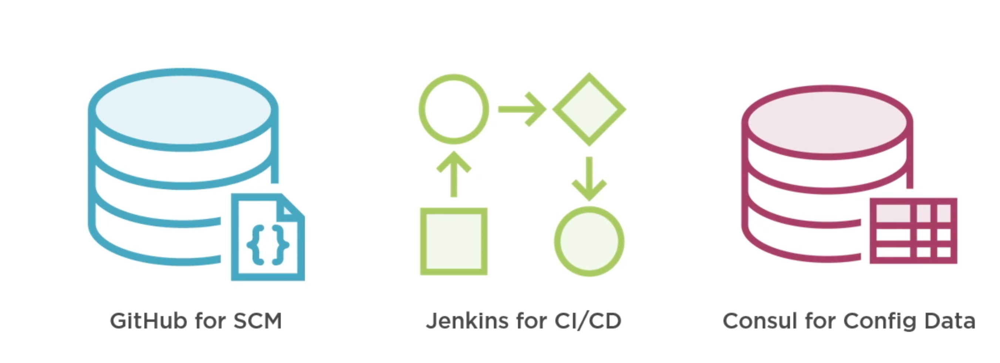
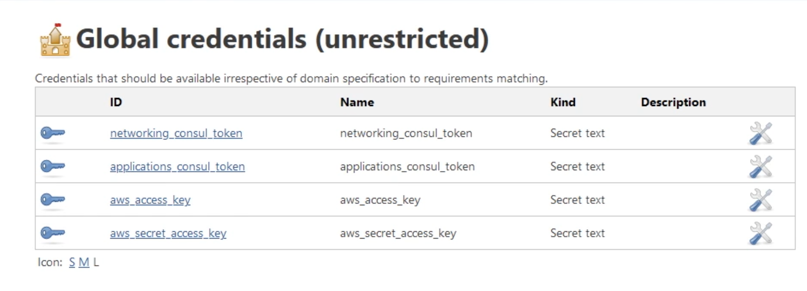

# **12 Adding Terraform to a CI/CD Pipeline**

### **1 CI/CD Pipelines**

**Multiple platforms**

- Jenkins, CodePipeline, Bamboo

**Continuous Integration for code check-in**

**Continuous Delivery of builds**

**Automated testing and validation**

**Multiple environments**

- Development, UAT, QA, Production




### Jenkins pipeline


## **2 Jenkins Setup**

* Install Jenkins as a traditional app
* Deploy Jenkins in a container
* Deploy Jenkins in the cloud

### 2-1 Start Consul


Make sure consul is still running, if not open a separate terminal

**`config/consul-config.hcl`**

```
## server.hcl

ui = true
server = true
bootstrap_expect = 1
datacenter = "dc1"
data_dir = "./data"

acl = {
    enabled = true
    default_policy = "deny"
    enable_token_persistence = true
}
```

```
consul agent -bootstrap -config-file="config/consul-config.hcl" -bind="127.0.0.1"
```

```
# We are going to create two tokens for Jenkins to use net and app
# First use the root token

# Linux and MacOS
export CONSUL_HTTP_TOKEN=SECRETID_VALUE

# Windows
$env:CONSUL_HTTP_TOKEN="SECRETID_VALUE"
```

```
# Create two tokens (networking and applications)
consul acl token create -policy-name=networking -description="Jenkins networking"
consul acl token create -policy-name=applications -description="Jenkins applications"
```

### **Create a Jenkins container**

```
docker pull jenkins/jenkins:lts
docker run -p 8080:8080 -p 50000:50000 -d -v jenkins_home:/var/jenkins_home --name jenkins jenkins/jenkins:lts
docker logs jenkins
```


```
# Install suggested plugins
# Create a user
# Manage jenkins
# Manage plugins
# Search for Terraform in Available and install without restart
```


```
# Back to Manage jenkins
# Global Tool Configuration
# Add Terraform
```


```
# Add Terraform
# Name: terraform 
# Install automatically
# Version - latest for linux (amd64)
# Click Save
```

**Add consul and terraform(aws) secret into Jenkins**


* Go to credentials -> global
* Create a credential of type secret text with ID `networking_consul_token` and the consul token as the secret
* Create a credential of type secret text with ID `applications_consul_token` and the consul token as the secret
* Create a credential of type secret text with ID `aws_access_key` and the access key as the secret
* Create a credential of type secret text with ID `aws_secret_access_key` and the access secret as the secret




**Automation Environment Variables**

* `TF_IN_AUTOMATION = TRUE`
	* `TF_IN_AUTOMATION` that can help you reduce the amount of output and the chatty-ness of Terraform by letting it know that there's not going to be a human being watching this output. 
* `TF_LOG = "INFO"`
* `TF_LOG_PATH = "tf_10g_MMDDYY_hhmmss"`
* `TF_INPUT = FALSE`
	* If that's set to **false**, Terraform will not prompt the end user for input, meaning if you run terraform destroy and it promots you yes or no, **Terraform is not going to do that**, it's just going to cancel an error out at that point. So if it encounters any situation where it does need user input, it's actually just going to error out rather than waiting for that user input.

* `TF_VAR_name = "value"`
	* `TF_VAR` THE name of the variable in the Terraform configuration. Terraform will see that and use that value in the value without adding it to the command line.
* `TF_CLI_ARGS = "-input=false"`

	
> Plug-in source  /  Workspace usage  /  State control  /  Output control  / Deploy pattern

And our pattern has mostly been to initialize, plan, and apply.


### Creating the Networking Pipeline

`Jenkinsfile`

[https://github.com/ned1313/Deep-Dive-Terraform/tree/v2/m8/networking](https://github.com/ned1313/Deep-Dive-Terraform/tree/v2/m8/networking)

```
pipeline {
    agent any
    tools {
        "org.jenkinsci.plugins.terraform.TerraformInstallation" "terraform"
    }
    parameters {
        string(name: 'CONSUL_STATE_PATH', defaultValue: 'networking/state/globo-primary', description: 'Path in Consul for state data')
        string(name: 'WORKSPACE', defaultValue: 'development', description:'workspace to use in Terraform')
    }

    environment {
        TF_HOME = tool('terraform')
        TF_INPUT = "0"
        TF_IN_AUTOMATION = "TRUE"
        TF_VAR_consul_address = "host.docker.internal"
        TF_LOG = "WARN"
        CONSUL_HTTP_TOKEN = credentials('networking_consul_token')
        AWS_ACCESS_KEY_ID = credentials('aws_access_key')
        AWS_SECRET_ACCESS_KEY = credentials('aws_secret_access_key')
        PATH = "$TF_HOME:$PATH"
    }

    stages {
        stage('NetworkInit'){
            steps {
                dir('m8/networking/'){
                    sh 'terraform --version'
                    sh "terraform init --backend-config='path=${params.CONSUL_STATE_PATH}'"
                }
            }
        }
        stage('NetworkValidate'){
            steps {
                dir('m8/networking/'){
                    sh 'terraform validate'
                }
            }
        }
        stage('NetworkPlan'){
            steps {
                dir('m8/networking/'){
                    script {
                        try {
                           sh "terraform workspace new ${params.WORKSPACE}"
                        } catch (err) {
                            sh "terraform workspace select ${params.WORKSPACE}"
                        }
                        sh "terraform plan -out terraform-networking.tfplan;echo \$? > status"
                        stash name: "terraform-networking-plan", includes: "terraform-networking.tfplan"
                    }
                }
            }
        }
        stage('NetworkApply'){
            steps {
                script{
                    def apply = false
                    try {
                        input message: 'confirm apply', ok: 'Apply Config'
                        apply = true
                    } catch (err) {
                        apply = false
                        dir('m8/networking/'){
                            sh "terraform destroy -auto-approve"
                        }
                        currentBuild.result = 'UNSTABLE'
                    }
                    if(apply){
                        dir('m8/networking/'){
                            unstash "terraform-networking-plan"
                            sh 'terraform apply terraform-networking.tfplan'
                        }
                    }
                }
            }
        }
    }
}
```

```
# Create a new item
# Name: net-deploy
# Type pipeline
# Select poll SCM
# Definition: Pipeline script from SCM
# SCM: Git
# Repo URL: YOUR_REPO_URL or https://github.com/ned1313/Deep-Dive-Terraform.git
# Script path: m8/networking/Jenkinsfile
# Uncheck lightweight checkout
```


Now we can run a build of the network pipeline

First build might fail, but now the parameters will be Available

Run a new build WITH parameters

When build is successful create a new pipeline for the application stack

### Creating the Application Pipeline

```
pipeline {
    agent any
    tools {
        "org.jenkinsci.plugins.terraform.TerraformInstallation" "terraform"
    }
    parameters {
        string(name: 'CONSUL_STATE_PATH', defaultValue: 'networking/state/globo-primary', description: 'Path in Consul for state data')
        string(name: 'WORKSPACE', defaultValue: 'development', description:'workspace to use in Terraform')
    }

    environment {
        TF_HOME = tool('terraform')
        TF_INPUT = "0"
        TF_IN_AUTOMATION = "TRUE"
        TF_VAR_consul_address = "host.docker.internal"
        TF_LOG = "WARN"
        CONSUL_HTTP_TOKEN = credentials('networking_consul_token')
        AWS_ACCESS_KEY_ID = credentials('aws_access_key')
        AWS_SECRET_ACCESS_KEY = credentials('aws_secret_access_key')
        PATH = "$TF_HOME:$PATH"
    }

    stages {
        stage('NetworkInit'){
            steps {
                dir('m8/networking/'){
                    sh 'terraform --version'
                    sh "terraform init --backend-config='path=${params.CONSUL_STATE_PATH}'"
                }
            }
        }
        stage('NetworkValidate'){
            steps {
                dir('m8/networking/'){
                    sh 'terraform validate'
                }
            }
        }
        stage('NetworkPlan'){
            steps {
                dir('m8/networking/'){
                    script {
                        try {
                           sh "terraform workspace new ${params.WORKSPACE}"
                        } catch (err) {
                            sh "terraform workspace select ${params.WORKSPACE}"
                        }
                        sh "terraform plan -out terraform-networking.tfplan;echo \$? > status"
                        stash name: "terraform-networking-plan", includes: "terraform-networking.tfplan"
                    }
                }
            }
        }
        stage('NetworkApply'){
            steps {
                script{
                    def apply = false
                    try {
                        input message: 'confirm apply', ok: 'Apply Config'
                        apply = true
                    } catch (err) {
                        apply = false
                        dir('m8/networking/'){
                            sh "terraform destroy -auto-approve"
                        }
                        currentBuild.result = 'UNSTABLE'
                    }
                    if(apply){
                        dir('m8/networking/'){
                            unstash "terraform-networking-plan"
                            sh 'terraform apply terraform-networking.tfplan'
                        }
                    }
                }
            }
        }
    }
}
```

```
# Create a new item
# Name: app-deploy
# Type pipeline
# Select poll SCM
# Definition: Pipeline script from SCM
# SCM: Git
# Repo URL: YOUR_REPO_URL or https://github.com/ned1313/Deep-Dive-Terraform.git
# Script path: m8/applications/Jenkinsfile
# Uncheck lightweight checkout
```

First build might fail, but now the parameters will be Available


