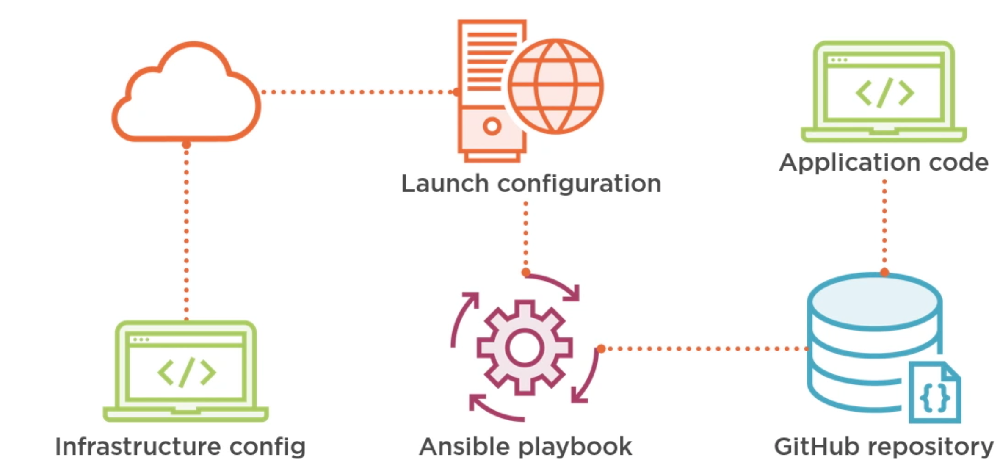

# **Terraform Integrating with Configuration Managers(Anisble)**


## **Configuration Management**

* **Identification**  What to manage
* **Control**  How to manage
* **Accounting** How to report
* **Verification**  How to validate


How do you push configuration or do you pull the configuration?

### **Push the configuration**

means there's some sort of **centralized server that has the desired configuration and an inventory of nodes to apply that configuration** to and it goes out and pushes against each node.

Ansible is a good example of that deployment methodology. When you run Ansible, you run it on a local box, you give it a list of remote hosts, and a configuration you want applied to those hosts, and it uses something like SSH or WinRM to push that config to each node

### **Pull configuration**

In a pull configuration, you have a centralized repository that has configurations in it, but each individual node is responsible for pulling that configuration down and applying it locally. Often that's done through some sort of agent. 


Puppet has an agent that you install on each node and then you set that agent to run on specific intervals to pull the current configuration from a Puppet Server.

### **Deployment Options**

* Terraform hand-off
* Push or pull
* **Centralized or distributed**


So a centralized model would mean that there is a **centralized inventory** and **configuration server** that holds all that information, and often that works in tandem with some sort of push configuration, 

**configuration management deployment**


The configuration could be stored in some sort of shared repository, but it's a distributed repository and there's no centralized server that is forcing configuration to happen on a certain cadence.

In the case of a distributed configuration, that scales much easier because you don't have to rely on but you are giving up some of the control of that centralized server when it comes to things like auditing and logging.





[https://github.com/ned1313/Deep-Dive-Terraform/tree/v2/m9](https://github.com/ned1313/Deep-Dive-Terraform/tree/v2/m9)

```
consul agent -bootstrap -config-file="config/consul-config.hcl" -bind="127.0.0.1"

## If you don't already have the development networking environment deployed
## let's do that know

# Let's set the Consul token to Mary Moe
# Replace SECRETID_VALUE with Mary Moe's secret ID
# Linux and MacOS
export CONSUL_HTTP_TOKEN=SECRETID_VALUE

# Windows
$env:CONSUL_HTTP_TOKEN="SECRETID_VALUE"

# Initialize the backend
terraform init -backend-config="path=networking/state/globo-primary"

# Select the workspace
terraform workspace select development

# Create and apply the configuration
terraform plan -out dev.tfplan

terraform apply "dev.tfplan"
```

### Application(server with ansible)

**`applications/datasources.tf`**

```
##################################################################################
# DATA SOURCES
##################################################################################

data "template_file" "userdata" {
  template = file("templates/userdata.sh")

  vars = {
    wp_db_hostname      = aws_db_instance.rds.endpoint
    wp_db_name          = "${terraform.workspace}${local.rds_db_name}"
    wp_db_user          = var.rds_username
    wp_db_password      = var.rds_password
    playbook_repository = var.playbook_repository
  }
}

data "consul_keys" "applications" {
  key {
    name = "applications"
    path = terraform.workspace == "default" ? "applications/configuration/globo-primary/app_info" : "applications/configuration/globo-primary/${terraform.workspace}/app_info"
  }

  key {
    name = "common_tags"
    path = "applications/configuration/globo-primary/common_tags"
  }
}

data "terraform_remote_state" "networking" {
  backend = "consul"

  config = {
    address = "${var.consul_address}:8500"
    scheme  = "http"
    path    = terraform.workspace == "default" ? "networking/state/globo-primary" : "networking/state/globo-primary-env:${terraform.workspace}"
  }
}

data "aws_ami" "ubuntu" {
  most_recent = true
  owners      = ["099720109477"]

  filter {
    name   = "name"
    values = ["ubuntu/images/hvm-ssd/ubuntu-xenial-16.04-amd64-server*"]
  }

  filter {
    name   = "architecture"
    values = ["x86_64"]
  }

  filter {
    name   = "virtualization-type"
    values = ["hvm"]
  }

  filter {
    name   = "root-device-type"
    values = ["ebs"]
  }
}
```

**`template = file("templates/userdata.sh")`**


`applications/templates/userdata.sh`

```
#!/bin/bash
# Copyright 2016 Amazon.com, Inc. or its affiliates. All Rights Reserved.
#
# Licensed under the Apache License, Version 2.0 (the "License"). You may not use this file
# except in compliance with the License. A copy of the License is located at
#
#     http://aws.amazon.com/apache2.0/
#
# or in the "license" file accompanying this file. This file is distributed on an "AS IS"
# BASIS, WITHOUT WARRANTIES OR CONDITIONS OF ANY KIND, either express or implied. See the
# License for the specific language governing permissions and limitations under the License.
apt-get update
apt-get install git ansible -y
mkdir /var/ansible_playbooks
git clone ${playbook_repository} /var/ansible_playbooks
ansible-playbook /var/ansible_playbooks/playbook.yml -i /var/ansible_playbooks/hosts --extra-vars "wp_db_hostname=${wp_db_hostname} wp_db_name=${wp_db_name} wp_db_user=${wp_db_user} wp_db_password=${wp_db_password}"
```


`git clone ${playbook_repository} /var/ansible_playbooks
ansible-playbook /var/ansible_playbooks/playbook.yml`

[https://github.com/ned1313/ansible-playbook-wordpress-nginx](https://github.com/ned1313/ansible-playbook-wordpress-nginx)

```
$ tree ansible-playbook-wordpress-nginx
ansible-playbook-wordpress-nginx
├── README.md
├── group_vars
│   └── all
├── hosts
├── installansible.sh
├── playbook.retry
├── playbook.yml
└── roles
    ├── nginx
    │   ├── handlers
    │   │   └── main.yml
    │   ├── tasks
    │   │   └── main.yml
    │   └── templates
    │       ├── default-site.conf
    │       └── nginx-wp-common.conf
    ├── php
    │   ├── handlers
    │   │   └── main.yml
    │   └── tasks
    │       └── main.yml
    ├── postfix
    │   ├── handlers
    │   │   └── main.yml
    │   └── tasks
    │       └── main.yml
    └── wordpress
        ├── README.md
        ├── handlers
        │   └── main.yml
        ├── tasks
        │   └── main.yml
        └── templates
            └── wp-config.php
```

**`playbook.yml`**

```
- hosts: webservers

  roles:
    - nginx
    - wordpress
    - php
    - postfix
```


**`hosts`**

```
[webservers]
localhost ansible_connection=local
```

```
cd ../applications

# Initialize the backend
terraform init -backend-config="path=applications/state/globo-primary"

# Select the workspace
terraform workspace select development

# Create and apply the configuration
terraform plan -out dev.tfplan

terraform apply "dev.tfplan"
```

