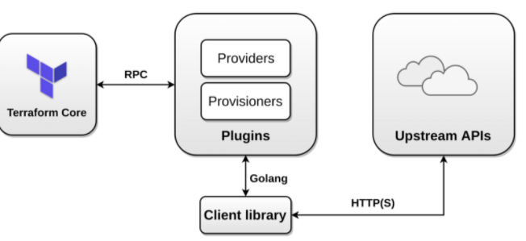
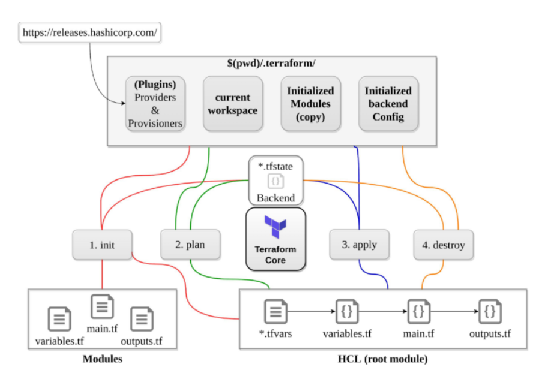
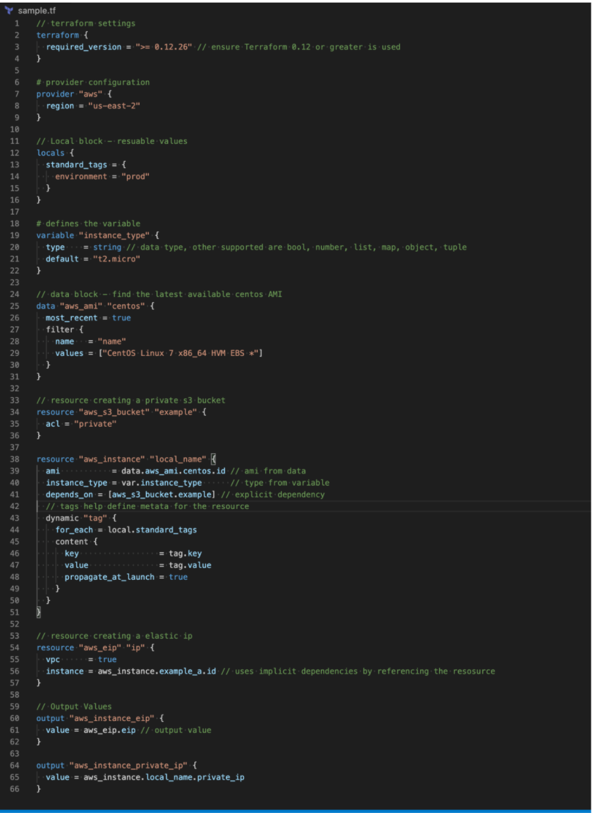

# **L2 Terraform Cheat Sheet**

* **An open source provisioning declarative tool that based on Infrastructure as a Code paradigm**
* designed on immutable infrastructure principles
* Written in Golang and uses own syntax – HCL (Hashicorp Configuration Language), but also supports JSON
* Helps to evolve the infrastructure, safely and predictably
* Applies Graph Theory to IaaC and provides Automation, Versioning and Reusability
* Terraform is a multipurpose composition tool:
	* Composes multiple tiers (SaaS/PaaS/IaaS)
	* A plugin-based architecture model
* Terraform is not a cloud agnostic tool. It embraces all major Cloud
* Providers and provides common language to orchestrate the infrastructure resources
* **Terraform is not a configuration management tool and other tools like chef, ansible exists in the market**.

## **1、Terraform Architecture**

## **2、Terraform Providers (Plugins)**

* provide abstraction above the upstream API and is responsible for understanding API interactions and exposing resources.
* Invoke only upstream APIs for the basic CRUD operations
* Providers are unaware of anything related to configuration loading, graph theory, etc.
* supports multiple provider instances **using `alias` for e.g. multiple aws provides with different region**
* can be integrated with any API using providers framework
* Most providers configure a specific infrastructure platform (either cloud or self-hosted).
* **can also offer local utilities for tasks like generating random numbers for unique resource names**.

## **3、Terraform Provisioners**

* run code **locally** or **remotely** on resource creation
	* local exec executes code on the machine running terraform
	* remote exec
		* runs on the provisioned resource
		* supports **ssh** and **winrm**
	* requires inline list of commands

* should be used as a last resort
* are defined within the resource block.
* support types – **Create and Destroy**
	* if creation time fails, resource is tainted if provisioning failed, by default. (next apply it will be re-created)
	* **behavior can be overridden by setting the `on_failure` to `continue`, which means ignore and continue**
	* for destroy, if it fails – resources are not removed

	
## **4、Terraform Workspaces**

* **<mark>helps manage multiple distinct sets of infrastructure resources or environments with the same code</mark>**.
* just need to **create needed workspace and use them**, instead of creating a directory for each environment to manage
* **state files for each workspace are stored in the directory `terraform.tfstate.d`**
* **`terraform workspace new dev` creates a new workspace** and switches to it as well
* **`terraform workspace select dev` helps select workspace**
* `terraform workspace list` lists the workspaces and shows the current active one with **`*`**
* does not provide strong separation as it uses the same backend

## **5、Terraform Workflow**

### **5-1 init**

* **`initializes` a working directory containing Terraform configuration files.**
* performs
	* **backend initialization , storage for terraform state file**.
	* modules installation, downloaded from terraform registry to local path
	* **provider(s) plugins installation**, the plugins are downloaded in the **sub-directory of the present working directory at the path of `.terraform/plugins`**

* supports `-upgrade` to update all previously installed plugins to the newest version that complies with the configuration’s version constraints
* **is safe to run multiple times, to bring the working directory up to date with changes in the configuration**
* **does not delete the existing configuration or state**

### **5-2 validate**

* validates syntactically for **format** and **correctness**.
* **is used to validate/check the syntax of the Terraform files.**
* verifies whether a configuration is syntactically valid and internally consistent, regardless of any provided variables or existing state.
* A syntax check is done on all the terraform files in the directory, **and will display an error if any of the files doesn’t validate.**

### **5-3 plan**

* create a execution plan
* traverses each vertex and requests each provider using **parallelism**
* calculates the difference between the **last-known state and
the current state and presents this difference as the output of the terraform plan** operation to user in their terminal
* does not modify the infrastructure or state.
* allows a user to see which actions Terraform will **perform prior to making any changes to reach the desired state**
* will **scan all `*.tf`  files in the directory and create the plan**
* will perform refresh for each resource and might hit rate limiting issues as it calls provider APIs
* all resources refresh can be disabled or avoided using
	* **`-refresh=false`** or
	* `target=xxxx` or
	* break resources into different directories.
* **supports `-out` to save the plan**

### **5-4 apply**

* apply changes to reach the desired state.
* scans the current directory for the configuration and applies the changes appropriately.
* can be provided with a explicit plan, saved as out from `terraform plan`
* If no explicit plan file is given on the command line, `terraform apply` will create a new plan automatically and prompt for approval to apply it
* will modify the infrastructure and the state.
* if a resource successfully creates but fails during provisioning,
	* **Terraform will error and mark the resource as “tainted”**.
	* A resource that is tainted has been physically created, but can’t be considered safe to use since provisioning failed.
	* **Terraform also does not automatically roll back and destroy the resource during the apply when the failure happens,** because that would go against the execution plan: **the execution plan would’ve said a resource will be created, but does not say it will ever be deleted.**
* **does not import any resource.**
* **supports `-auto-approve` to apply the changes without asking for a confirmation**
* **supports `-target` to apply a specific module**

### **5-5 refresh**

* used to reconcile the state Terraform knows about (via its state file) with the real-world infrastructure
* **does not modify infrastructure, but does modify the state file**

### **5-6 destroy**

* destroy the infrastructure and all resources
* modifies both state and infrastructure
* **`terraform destroy -target` can be used to destroy targeted resources**
* **`terraform plan -destroy` allows creation of destroy plan**

### **5-7 import**

* **helps import already-existing external resources,** not managed by Terraform, into Terraform state and allow it to manage those resources
* **Terraform is not able to auto-generate configurations for those imported modules**, for now, and requires you to first write the resource definition in Terraform and then import this resource

### **5-8 taint**

* marks a Terraform-managed resource as tainted, **forcing it to be destroyed and recreated on the next apply.**
* **will not modify infrastructure, but does modify the state file in order to mark a resource as tainted.** Infrastructure and state are changed in next apply.
* can be used to taint a resource within a module

### **5-9 fmt**

format to lint the code into a standard format

### **5-10 console**

command provides an interactive console for evaluating expressions.

## **6、Terraform Modules**

* enables code reuse
* supports versioning to maintain compatibility
* stores code remotely
* enables easier testing
* enables encapsulation with all the separate resources under one
* configuration block
* modules can be nested inside other modules, allowing you to quickly spin up whole separate environments.
* can be referred using **source** attribute
* supports **Local and Remote modules**
	* Local modules are stored alongside the Terraform configuration (in a separate directory, outside of each environment but in the same repository) with **source path `./` or `../`**
	* Remote modules are stored externally in a separate repository, **and supports versioning**
* supports following backends
	* Local paths
	* Terraform Registry
	* GitHub
	* Bitbucket
	* Generic Git, Mercurial repositories
	* HTTP URLs
	* S3 buckets
	* GCS buckets

### **6-1 Module requirements**

* must be on GitHub and must be a public repo, if using public registry.
* must be named **`terraform-<PROVIDER>-<NAME>`**, **where `<NAME>` reflects the type of infrastructure the module manages and `<PROVIDER>` **is the main provider where it creates that infrastructure. for e.g. *`terraform-google-vault` or `terraform-aws-ec2-instance`*.
* **must maintain `x.y.z` tags f**or releases to identify module versions. Release tag names must be a semantic version, which can optionally be prefixed with a **v for example, v1.0.4 and 0.9.2.** Tags that don’t look like version numbers are ignored.
* must maintain a Standard module structure, which allows the registry to inspect the module and generate documentation, track resource usage, parse submodules and examples, and more.

## **7、Terraform Read and write configuration**

### **7-1 Resources**

* **resource** are the most important element in the Terraform language that describes one or more infrastructure objects, such as compute instances etc
* resource type and local name together serve as an identifier for a given resource and must be unique within a module for e.g.  **`aws_instance.local_name`**

### **7-2 Data Sources**

* **data** allow data to be **fetched or computed for use elsewhere in Terraform configuration**
* allows a Terraform configuration to **make use of information defined outside of Terraform**, or defined by another separate Terraform configuration

### **7-3 Variables**

* **variable** serve as **parameters for a Terraform module** and **act like function arguments**
* allows aspects of the module to be customized without altering the module’s own source code, and allowing modules to be shared between different configurations
* can be defined through multiple ways
	* command line for e.g.**`-var="image_id=ami-abc123"`**
	* **variable definition files `.tfvars` or `.tfvars.json`.** By default, terraform automatically loads
		* **Files named exactly `terraform.tfvars` or `terraform.tfvars.json`**.
		* **Any files with names ending in `.auto.tfvars` or `.auto.tfvars.json`**
		* file can also be passed with `-var-file`
	* environment variables can be used to set variables using the format **`TF_VAR_name`**

**Environment variables**

* `terraform.tfvars` file, if present.
* `terraform.tfvars.json` file, if present.
* **Any `*.auto.tfvars` or `*.auto.tfvars.json` files**, processed in lexical order of their filenames.
* Any `-var` and `-var-file` options on the command line, in the order they are provided. Terraform loads variables in the following order, with later sources taking precedence over earlier ones:

### **7-4 Local Values**

* **locals** assigns a name to an expression, **allowing it to be used multiple times within a module without repeating it**.
* are like a function’s temporary local variables.
* helps to avoid repeating the same values or expressions multiple times in a configuration.

### **7-5 Output**

* are like function return values.
* **output can be marked as containing sensitive material using the optional `sensitive` argument**, which prevents Terraform from showing its value in the list of outputs. However, they are still stored in the state as plain text.
* **In a parent module, outputs of child modules are available in expressions as `module.<MODULE NAME>.<OUTPUT NAME>`**.

### **7-6 Named Values**

* **is an expression that references the associated value for e.g. `aws_instance.local_name, data.aws_ami.centos`, `var.instance_type` etc.**
* 
* **support Local named values for e.g `count.index`**

### **7-7 Dependencies**

identifies implicit dependencies as Terraform automatically infers when one resource depends on another by studying the resource attributes used in interpolation expressions for e.g **`aws_eip` on resource `aws_instance`**

explicit dependencies can be defined using **`depends_on` where dependencies between resources that are `not visible` to Terraform**

### **7-8 Data Types** 

* supports primitive data types of
	* **string, number and bool**
	* Terraform language will automatically convert **number and bool values to string** values when needed

* **supports complex data types of**

	* list – a sequence of values identified by consecutive whole numbers starting with zero.
	* map – a collection of values where each is identified by a string label.
	* set –  a collection of unique values that do not have any secondary 
identifiers or ordering.

* **supports structural data types of**
	* **object** – a collection of named attributes that each have their own type
	* **tuple** – a sequence of elements identified by consecutive whole numbers starting with zero, where each element has its own type.

### **7-9 Built-in Functions**

* includes a number of built-in functions that can be called from within expressions to transform and combine values for e.g. **min, max, file, concat, element, index, lookup** etc.
* **does not support user-defined functions**

### **7-10 Dynamic Blocks**

acts much like a for expression, but produces nested blocks instead of a complex typed value. It iterates over a given complex value, and generates a nested block for each element of that complex value.

### **7-11 Terraform Comments**

supports three different syntaxes for comments:

* `#`
* `//`
* `/*` and `*/`

## **8、Terraform Backends**

* determines how state is loaded and how an operation such as **apply** is executed
* are responsible for storing state and providing an API for optional state locking
* **needs to be initialized**
* if switching the backed for the first time setup, Terraform provides a migration option

### **8-1 helps**

* **collaboration and working as a team, with the state maintained remotely and state lockin**g
* can provide enhanced security for sensitive data
* support remote operations

### **8-2 supports local vs remote backends**

* local (default) backend stores state in a **local JSON **file on disk
* remote backend stores state remotely like **S3, OSS, GCS, Consul and support features like remote operation, state locking, encryption, versioning etc.**

* supports partial configuration with remaining configuration arguments provided as part of the initialization process
* **Backend configuration doesn’t support interpolations**.
* GitHub is not the supported backend type in Terraform.

## **9、Terraform State Management**

* state helps keep track of the infrastructure Terraform manages
* stored locally in the **`terraform.tfstate`**
* **recommended not to edit the state manually**
* Use **`terraform state`** command
	* **mv** – to move/rename modules
	* **rm** – to safely remove resource from the state. (destroy/retain like)
	* **pull** – to observe current remote state
	* **list & show** – to write/debug modules

## **10、State Locking**

* happens for all operations that could write state, if supported by backend
* **prevents others from acquiring the lock & potentially corrupting the state**
* backends which support state locking are
	* azurerm
	* **Hashicorp consul**
	* Tencent Cloud Object Storage (COS)
	* etcdv3
	* Google Cloud Storage GCS
	* HTTP endpoints
	* Kubernetes Secret with locking done using a Lease resource
	* AliCloud Object Storage OSS with locking via TableStore
	* **PostgreSQL**
	* **AWS S3 with locking via DynamoDB**
	* **Terraform Enterprise**

* Backends which do not support state locking are
	* artifactory
	* etcd

* can be disabled for most commands with the `-lock` flag
* use **force-unlock** command to manually unlock the state if unlocking failed

## **11、State Security**

* can contain sensitive data, depending on the resources in use for e.g ***passwords and keys***
* using local state, data is stored in plain-text JSON files
using remote state, state is held in memory when used by Terraform. It **may be encrypted at rest**, if supported by backend for e.g. **S3, OSS**

## **12、Terraform Logging**

* **debugging can be controlled using `TF_LOG`** , which can be configured for different levels TRACE, DEBUG, INFO, WARN or ERROR, with TRACE being the more verbose.
* **logs path can be controlled `TF_LOG_PATH`. ` TF_LOG` needs to be specified.**

## **13、Terraform Cloud and Terraform Enterprise**

* **Terraform Cloud provides Cloud Infrastructure Automation as a Service.** It is offered as a multi-tenant SaaS platform and is designed to suit the needs of smaller teams and organizations. Its smaller plans default to one run at a time, which prevents users from executing multiple runs concurrently.
* **Terraform Enterprise is a private install for organizations who prefer to self-manage.** It is designed to suit the needs of organizations with specific requirements for security, compliance and custom operations.

### **13-1 Terraform Cloud provides features**

* **Remote Terraform Execution** – supports Remote Operations for Remote Terraform execution which helps provide consistency and visibility for critical provisioning operations.
* **Workspaces** – organizes infrastructure with workspaces instead of directories. Each workspace contains everything necessary to manage a given collection of infrastructure, and Terraform uses that content whenever it executes in the context of that workspace.
* **Remote State Management – acts as a remote backend for the Terraform state. State storage is tied to workspaces, which helps keep state associated with the configuration that created it**.
* **Version Control Integration** – is designed to work directly with the version control system (VCS) provider.
* **Private Module Registry – provides a private and central library of versioned & validated modules to be used within the organization**
* **Team based Permission System – can define groups of users that match the organization’s** real-world teams and assign them only the permissions they need
* **Sentinel Policies** – embeds the Sentinel policy-as-code framework, which lets you define and enforce granular policies for how the organization provisions infrastructure. Helps eliminate provisioned resources that don’t follow security, compliance, or operational policies.
* **Cost Estimation **– can display an estimate of its total cost, as well as any change in cost caused by the proposed updates
* **Security** – encrypts state at rest and protects it with TLS in transit.

### **13-2 Terraform Enterprise features**

* includes all the Terraform Cloud features with
* **Audit – supports detailed audit logging and tracks the identity of the user requesting state and maintains a history of state changes**.
* **SSO/SAML – SAML for SSO provides the ability to govern user access to your applications.**

Terraform Enterprise currently supports running under the following operating systems for a Clustered deployment:

* Ubuntu 16.04.3 – 16.04.5 / 18.04
* Red Hat Enterprise Linux 7.4 through 7.7
* CentOS 7.4 – 7.7
* Amazon Linux
* Oracle Linux
* Clusters currently don’t support other Linux variants.

**Terraform Cloud currently supports following VCS Provider**

* GitHub.com
* GitHub.com (OAuth)
* GitHub Enterprise
* GitLab.com
* GitLab EE and CE
* Bitbucket Cloud
* Bitbucket Server
* Azure DevOps Server
* Azure DevOps Services

A Terraform Enterprise install that is provisioned on a network that does not have Internet access is generally known as an **air-gapped install.** These types of installs require you to pull updates, providers, etc. from external sources vs. being able to download them directly.

