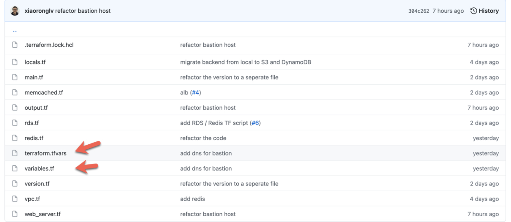

# **4 `terraform.tfvars` 与 `variables.tf` 的区别**



通常一个 Terraform 项目下，关于变量的文件有好几个：

* `output.tf`
* `variables.t`
* `locals.tf`
* `terraform.tfvars`

其中 variables.tf 和 terraform.tfvars 最容易让人困惑，他们之间有什么区别和联系？

### **`variables.tf`**

**variables.tf 用来定义变量，比如变量名，类型，有点像写代码时函数的参数定义。**

在以下范例文件中我定义了两个变量 project 和 environment，他们的类型是 string。

```
# variables.tf
# Input variable definitions

variable "project" {
  description = "project name"
  type = string
}

variable "environment" {
  description = "the environment of project, e.g. production, sandbox, staging"
  type = string
}
```

### **terraform.tfvars**

**`terraform.tfvars` 类似于一个 `.env` 文件，保存了一些 key-value，用来批量给变量赋值。**

```
project = "paylocity"
environment = "sandbox"
```

