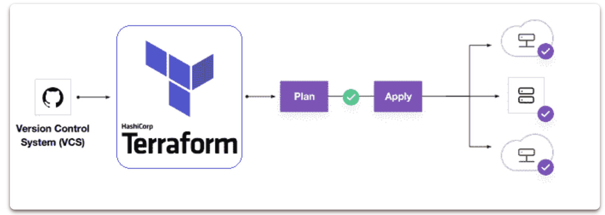
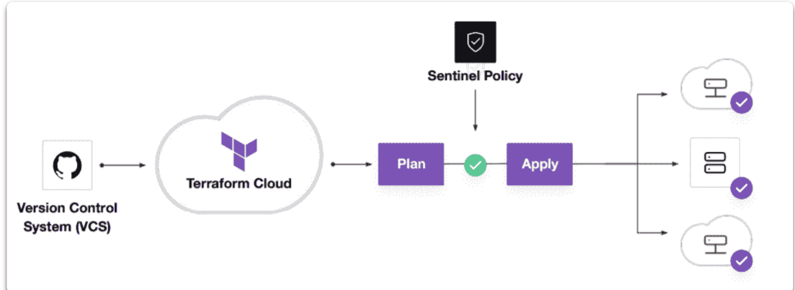
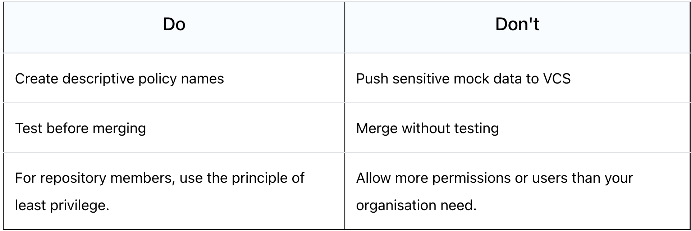

# **6 Top Terraform Interview Questions and Answers (2022)**



### **1 What is Terraform?**

Terraform is a tool for creating, updating, and versioning infrastructure securely and efficiently. 

Terraform is capable of managing both current and popular service providers, as well as custom in-house solutions. 

Configuration files notify Terraform which components are required to run a single application or an entire datacenter.

Terraform helps you **Manage All of Your Infrastructure** as Infrastructure as Code and promote **Self-Service Infrastructure** allows you to construct infrastructure as needed :

* Terraform code is written in the HCL programming language.
* Stop constructing things by hand.
* Put everything into a Terraform setup that can be repeated.
* **All of the build steps are now written in code.**
* **It's a lot easier if you ever have to rebuild something!**


### **2 What are the key features of Terraform**

Below are the key features of Terraform:

* **Infrastructure as Code**: A high-level configuration syntax is used to define infrastructure.
* **Execution Plans**: Terraform generates an execution plan during the "planning" phase.
* **Resource Graph**
* **Change Automation**

### **3 What are most useful terraform commands?**

Below are the key commands of Terraform:

```
terraform init    # Initialize the current directory
terraform plan    # Dry run to see what Terraform will do
terraform apply   # Apply the Terraform code and build stuff
terraform destroy # Destroy what was built by Terraform
terraform refresh # Refresh the state file
terraform output  # View Terraform outputs
terraform graph   # Create a DOT-formatted graph
```

### **4 What is Terraform Cloud**


**Terraform Cloud** is a hosted application that includes remote state management, API-driven runs, policy management, and other capabilities. 

Many users prefer a SaaS solution that is hosted in the cloud since they do not want to manage the infrastructure required to run it.

### **5 What is Terraform Cloud for Business**

**Terraform Cloud for Business** uses the same hosted environment as Terraform Cloud, but with additional features for larger teams. Single sign-on, audit logging, and the ability to Terraform on-premise resources from the cloud are just a few of the features available.

### **6 What is Terraform Enterprise**

**Terraform Enterprise is the same tool,** but it runs in your own data centre or cloud environment. 

Some users want more control over the Terraform Cloud application, or they want to execute it behind corporate firewalls in restricted networks.


### **7 What is module in terraform?**

> A module is a container for several resources that are used in conjunction with one another. Modules can be used to construct lightweight abstractions, allowing you to define the infrastructure in terms of architecture instead of physical objects.


模块是多个资源的容器，这些资源相互结合使用。模块可用于构建轻量级抽象，允许您根据架构而不是物理对象来定义基础架构。


**A Terraform module is a set of Terraform configuration files contained within a single directory**. 

Or a basic configuration with a single directory having one or more .tf file is a module. When Terraform commands are run directly from such a directory, it is referred to as the root module.

In this way, each Terraform configuration is a module. You may have a basic collection of Terraform configuration files like:

```
.
|--- LICENSE
|--- README.md
|--- main.tf
|--- variables.tf
|--- output.tf
```

### **8 What is Private Module Registry?**

Terraform Cloud provides a Private Module Registry, which allows you to store, version, and distribute modules to your organisations and teams.

### **9 What is main TF in terraform?**

`main.tf` contains the primary configuration for your module.

You can also build additional configuration files and arrange them in some helpful way for your project.

Variable definitions for your module will be stored in variables.tf.


### **10 How do you call a main TF module?**

When you run terraform plan or terraform apply, the`.tf` files in your working directory combine to form the root module. 

This module will call other modules and bind them by transferring output values from one to input values from another.

### **11  What language does terraform use?**

Terraform configuration syntax is known as **HashiCorp Configuration Language (HCL)**. It is designed to be both human-readable and editable, as well as machine-friendly. 

**Terraform can also read JSON configurations for machine-friendliness**.

### **12 How does terraform integrate with github and public cloud?**

The majority of businesses are migrating to the public cloud. Managing infrastructure in a secure and controlled manner is a critical step for businesses.

### **13 What is Terraform State?**

Terraform keeps track of the resources it has created in a ***state file***. 

This crucial file contains all of the information **Terraform requires to change, update, and delete infrastructure.**

The state file is saved in your local workspace by default. We can use Terraform Cloud to store the state file as a Remote State on the cloud.

### **14 What are the disadvantages of maintaining the Terraform state file on the local machine?**

* **State file sometimes contains secrets or sensitive data may be exposed**
* We are unable to collaborate with the team because the file is on someone's laptop.
* **On a local machine, there is a possibility of losing or deleting the state file.**
* **There is no centralised record keeping to track historical developments.**


### **15 What exactly is Sentinel?**

> Sentinel is the policy enforcement language used by HashiCorp. Sentinel policies are validated when the Terraform plan is executed. **Sentinel will detect incorrect settings before they reach production, not later.**




We can choose the scope of Sentinel policies that will be enforced at the Organization or Workspace level.

```
# Restricting region in GCP
google_region_valid = rule {
  all region_values as rv {
    rv == "us-west-1"
  }
}
```

### **16 What exactly do you mean when you say Policy-as-Code?**

* **Treat policies as applications**
* Store in version control
* **Proactive vs. reactive**
* Automate enforcement and review
* **Automate logic testing**

### **17 Can you provide few examples where we can use for Sentinel policies?**


Sentinel is a powerful tool that can be used to implement a variety of policies. Here are a few examples:

**Security Standards**

* Forbid or allow only certain resources, providers or data sources
* Restrict roles the cloud provider can assume
* Restrict roles the cloud provider can assume

**Audit Tracking**

* Review an audit trail for Terraform Cloud operations
* Enforce explicit ownership in resources

**Resource Restriction**

* Limit the size of VMs and clusters for cost
* Enforce mandatory tagging on resources built with Terraform
* Restrict modules to your organizations Private Module Registry

### **18 What are the various levels of sentinel enforcement?**

Sentinel is a powerful tool that can be used to implement a variety of policies. Here are a few examples:

**Advisory**

* Logged but allowed to pass
* When a user triggers a plan that violates the policy, an advisory is issued to the user.

**Soft-Mandatory**


* Teams based permissions for overrides
* Overrides logged for audit if the policy fails
* Prevents non-compliant infrastructure from being deployed by regular users. Only administrators have the ability to overrule.

**Hard-Mandatory**

* **Default enforcement level**
* The policy **must** pass
* Only way to override is to explicitly remove the policy
* Prevents non-compliant infrastructure from being deployed by all users and apps.

### **19 Why write tests for Sentinel policies?**

* Policies and infrastructure are prone to change for refactoring.
* Writing tests assures that your policy will continue to work as intended even if things change.
* Writing testing instils trust in the policymaking process.

### **20 What are best practices in Policy Repo Management?**



### **21 How to Store Sensitive Data in Terraform?**

**In order to communicate with your cloud provider's API, Terraform requires credentials.**

Although config files and environment variables are a preferable alternative, the credentials are still saved in plaintext on your desktop.

Sensitive Variable is Secure Place for API Credentials : **Terraform Cloud can securely store and encrypt your passwords. This encrypted storage can be used to store passwords, TLS certificates, SSH keys, and anything else that shouldn't be stored in plain text.**

