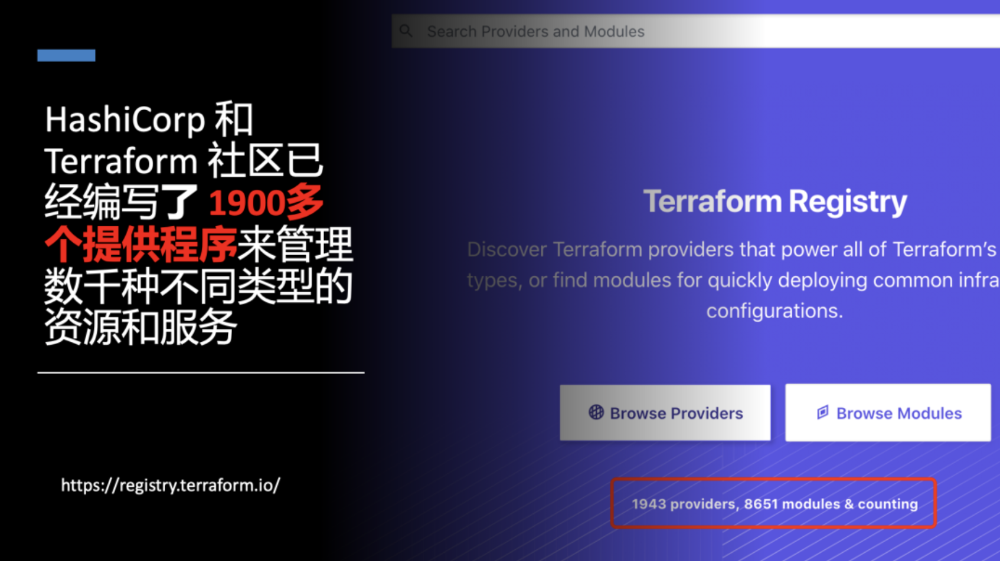
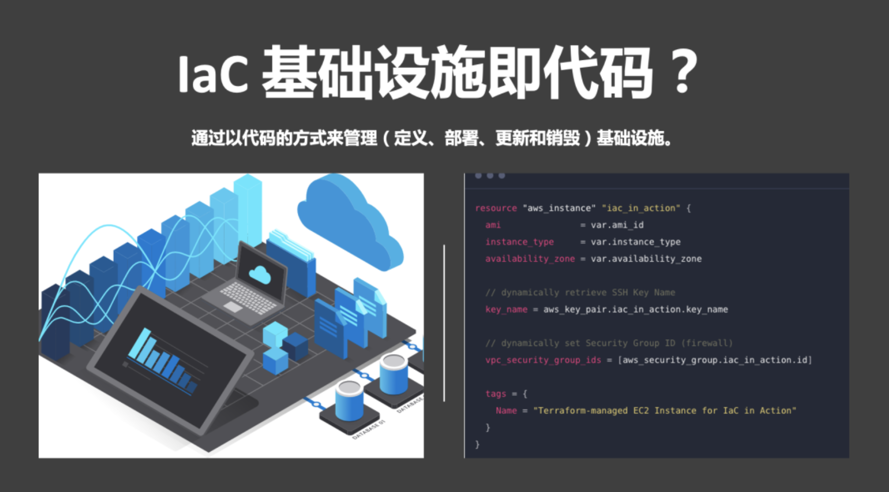
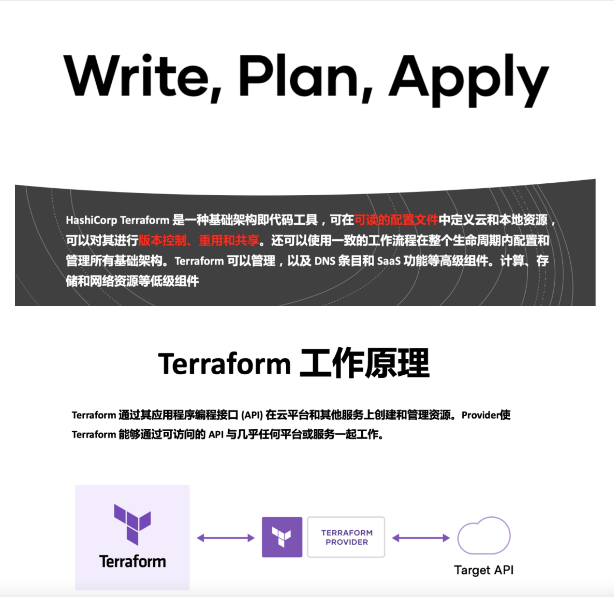
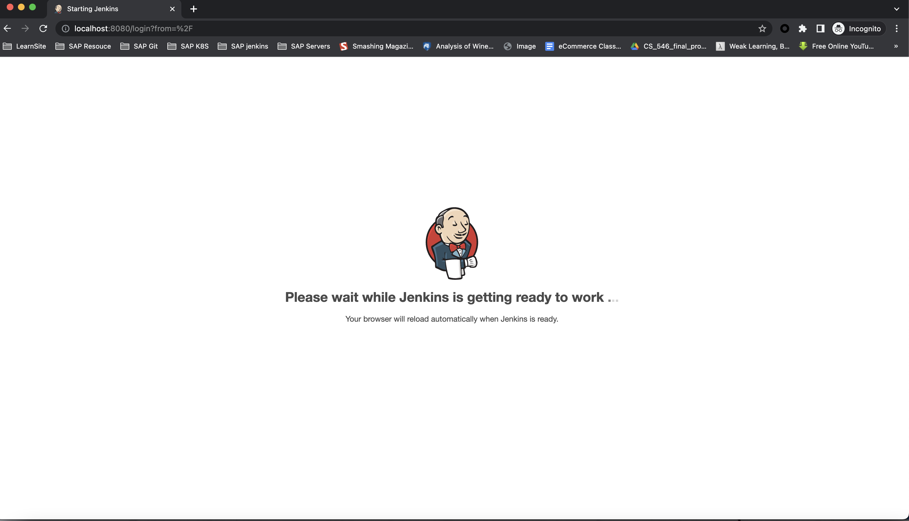
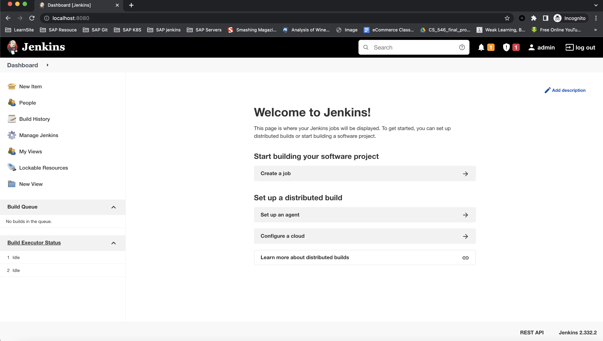

# **Terraform install Jenkins in Docker**




Terraform 是由 HashiCorp 所开发的自动化工具，是一个专注在 Infrastructure as code(基础设施即代码)的管理工具。





## **Terraform with docker**

**What is docker Terraform provider**

> The Docker provider is used to interact with Docker containers and images. It uses the Docker API to manage the lifecycle of Docker containers. Because the Docker provider uses the Docker API, it is immediately compatible not only with single server Docker but Swarm and any additional Docker-compatible API hosts.

**Terraform 0.13 and later**:

> Terraform need to upgrade to 0.13

### **Terraform install Jenkins with Docker**

`required_providers`: **kreuzwerker/docker**

**`main.tf`**

```
terraform {
  required_providers {
    docker = {
      source  = "kreuzwerker/docker"
      version = "2.16.0"
    }
  }
}

provider "docker" {}
  # host = "remote host"
  # host = "tcp://192/169.1.200:2375"
  # host = "unix:///var/run/docker.sock"
```

* **如果实在本地跑， host 值可以忽略**
* **如果是远程跑的话，需要加上host的IP已经端口**

### **`jenkins.tf`**

```
resource "docker_image" "jekins" {
  name         = "jenkins/jenkins:2.332.2-centos7-jdk8"
  keep_locally = true // Destroy will not delete local image
}

resource "docker_container" "jenkins" {
  image = docker_image.jekins.name
  name  = "docker_jenkins"
  ports {
    internal = 8080
    external = 8080
  }
  ports {
    internal = 50000
    external = 50000 # for agent connection
  }
  volumes {
    container_path = "/var/jenkins_home"
    host_path      = "/tmp/jenkins_home"
    # chmod 777 /tmp/jenkins_home
  }
}
```

* `keep_locally` (Boolean) If true, then the Docker image won't be deleted on destroy operation. If this is false, it will delete the image from the docker local storage on destroy operation.
* **`host_path`:  本地定义， 作为持久化目录**

### **运行init整个目录**

```
$ terraform init 

Initializing the backend...

Initializing provider plugins...
- Reusing previous version of kreuzwerker/docker from the dependency lock file
- Using previously-installed kreuzwerker/docker v2.16.0

Terraform has been successfully initialized!

You may now begin working with Terraform. Try running "terraform plan" to see
any changes that are required for your infrastructure. All Terraform commands
should now work.

If you ever set or change modules or backend configuration for Terraform,
rerun this command to reinitialize your working directory. If you forget, other
commands will detect it and remind you to do so if necessary.
```

```
$ tree
.
├── jenkins.tf
├── main.tf
├── terraform.tfstate
└── terraform.tfstate.backup

0 directories, 4 files
```

这条命令会创建一个文件`.terraform.lock.hcl`, `terraform.tfstate`和`terraform.tfstate.bak`

* `terraform.lock.hcl`会锁定 provider 的版本
* `terraform.tfstate` 会保持 terraform 的状态信息

### **运行apply，创建项目**

* **首先先看`terraform plan`, 会输出的的创建结果**
	* **docker container**
	* **ports**
	* **volumes**

```
$ terraform plan 

Terraform used the selected providers to generate the following execution plan. Resource actions are indicated with the following symbols:
  + create

Terraform will perform the following actions:
...

  # docker_image.jekins will be created
  + resource "docker_image" "jekins" {
      + id           = (known after apply)
      + keep_locally = true
      + latest       = (known after apply)
      + name         = "jenkins/jenkins:2.332.2-centos7-jdk8"
      + output       = (known after apply)
      + repo_digest  = (known after apply)
    }

Plan: 2 to add, 0 to change, 0 to destroy.
```

* **`terraform apply` 创建jenkins 服务**

```
$ terraform apply

Terraform used the selected providers to generate the following execution plan. Resource actions are indicated with the following symbols:
  + create

Terraform will perform the following actions:

  # docker_container.jenkins will be created
  + resource "docker_container" "jenkins" {
      ...

      + ports {
          + external = 8080
          + internal = 8080
          + ip       = "0.0.0.0"
          + protocol = "tcp"
        }
      + ports {
          + external = 50000
          + internal = 50000
          + ip       = "0.0.0.0"
          + protocol = "tcp"
        }

      + volumes {
          + container_path = "/var/jenkins_home"
          + host_path      = "/tmp/jenkins_home"
        }
    }

  # docker_image.jekins will be created
  + resource "docker_image" "jekins" {
      + id           = (known after apply)
      + keep_locally = true
      + latest       = (known after apply)
      + name         = "jenkins/jenkins:2.332.2-centos7-jdk8"
      + output       = (known after apply)
      + repo_digest  = (known after apply)
    }

Plan: 2 to add, 0 to change, 0 to destroy.

Do you want to perform these actions?
  Terraform will perform the actions described above.
  Only 'yes' will be accepted to approve.

  Enter a value: yes

docker_image.jekins: Creating...
docker_image.jekins: Still creating... [10s elapsed]
...
docker_image.jekins: Creation complete after 1m6s [id=sha256:0548d6c4555c748ace7a50448fff8ff5505e5bfdcc7611726d6eb9bb059f1e7ejenkins/jenkins:2.332.2-centos7-jdk8]
docker_container.jenkins: Creating...
docker_container.jenkins: Creation complete after 1s [id=53183d8421a2f3ad436eb224f7ccce12c9b877bef2893ac9e0462eec37a33080]

Apply complete! Resources: 2 added, 0 changed, 0 destroyed.
```



**获取`initial-password`**

```
$ docker ps | grep jenkins
53183d8421a2   jenkins/jenkins:2.332.2-centos7-jdk8   "/sbin/tini -- /usr/…"   About a minute ago   Up About a minute   0.0.0.0:8080->8080/tcp, 0.0.0.0:50000->50000/tcp   docker_jenkins

$ docker exec -it 53183d8421a2 sh
sh-4.2$ cd /var/jenkins_home/secrets/
h-4.2$ less initialAdminPassword
sh-4.2$ cat /var/jenkins_home/secrets/initialAdminPassword
cd58e709806b44778f3a4d97c0864275
```



### Destroy 项目

```
$ terraform destroy
```

**我们会发现Jenkins项目目录持久化到了本地目录**

```
$ cd /tmp/jenkins_home
$ ls
config.xml                                      jenkins.model.JenkinsLocationConfiguration.xml  secret.key.not-so-secret
copy_reference_file.log                         jenkins.telemetry.Correlator.xml                secrets
hudson.model.UpdateCenter.xml                   jobs                                            updates
hudson.plugins.git.GitTool.xml                  nodeMonitors.xml                                userContent
identity.key.enc                                nodes                                           users
jenkins.install.InstallUtil.lastExecVersion     plugins                                         war
jenkins.install.UpgradeWizard.state             secret.key                                      workflow-libs
```