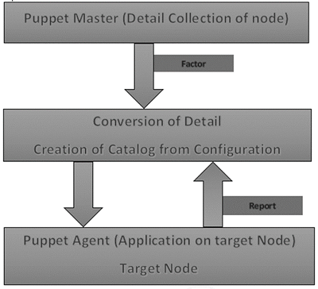
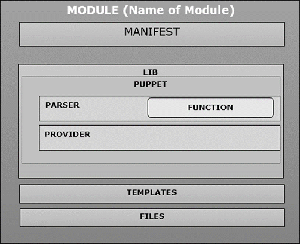
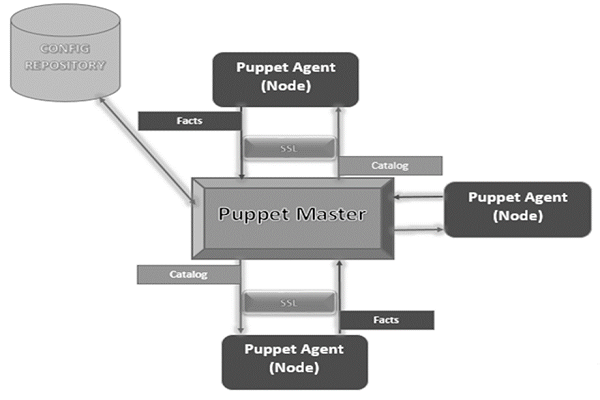

# **1 Puppet - Overview & Architecture**

[https://www.tutorialspoint.com/puppet/index.html](https://www.tutorialspoint.com/puppet/index.html)

Puppet 是 Puppet Labs 开发的一个配置管理工具，用于自动化基础设施管理和配置。 Puppet 是一个非常强大的工具，有助于实现基础设施即代码的概念。

该工具是用 Ruby DSL 语言编写的，有助于将完整的基础设施转换为代码格式，可以是 Puppet 是 Puppet Labs 开发的配置管理工具，用于自动化基础设施管理和配置。 Puppet 是一个非常强大的工具，有助于实现基础设施即代码的概念。该工具是用 Ruby DSL 语言编写的，有助于将完整的基础设施转换为代码格式，易于管理和配置。


Puppet 遵循客户端-服务器模型，其中任何集群中的一台机器充当服务器，称为 puppet 主机，另一台充当客户端，称为节点上的从机。 Puppet 能够从头开始管理任何系统，从初始配置到任何特定机器的生命周期结束。

## **1 Features of Puppet System**

**以下是 Puppet 最重要的功能。**

### **1-1 幂等性**


Puppet 支持幂等性，使其独一无二。与 Chef 类似，在 Puppet 中，可以安全地在同一台机器上多次运行同一组配置。在此流程中，Puppet 检查目标机器的当前状态，并且仅在配置发生任何特定更改时才会进行更改。

### **1-2 跨平台**


在 Puppet 中，借助使用 Puppet 的 Resource Abstraction Layer (RAL) ，可以针对系统的指定配置，而无需担心底层配置中定义的实现细节以及配置命令在系统内部的工作方式文件。

## **2 Puppet − Workflow**

Puppet 使用以下工作流程在系统上应用配置。



* 在 Puppet 中，Puppet master 做的第一件事就是收集目标机器的详细信息。使用所有 Puppet 节点上存在的因子（类似于 Chef 中的 Ohai），它可以获取所有机器级别的配置详细信息。这些详细信息被收集并发送回 Puppet master。
* 然后，puppet master 将检索到的配置与定义的配置详细信息进行比较，并根据定义的配置创建一个目录并将其发送到目标 Puppet 代理。
* 然后，Puppet 代理应用这些配置以使系统进入所需状态。
* 最后，一旦目标节点处于所需状态，它就会向 Puppet Master 发送一份报告，这有助于 Puppet Master 了解系统的当前状态，如目录中定义的那样。


## **3 Puppet − Key Components**


以下是 Puppet 的关键组件。



### **3-1 Puppet 资源**

Puppet 资源是为任何特定机器建模的关键组件。这些资源有自己的实现模型。 Puppet 使用相同的模型来获取处于所需状态的任何特定资源。


### **3-2 Providers**

Providers基本上是 Puppet 中使用的任何特定资源的履行者。例如，包类型“apt-get”和“yum”都对包管理有效。有时，一个特定平台上会提供多个提供商。虽然每个平台总是有一个默认的提供者。


### **3-3 Manifest**

Manifest是资源的集合，它们耦合在函数或类内部以配置任何目标系统。它们包含一组 Ruby 代码以配置系统。


### **3-4 Modules**


Modules 是 Puppet 的关键构建块，它可以定义为资源、文件、模板等的集合。它们可以很容易地分布在被定义的不同类型的操作系统之间，它们具有相同的风格。由于它们易于分发，因此一个模块可以在相同配置下多次使用。

### **3-5 模板**

**模板使用 Ruby 表达式来定义自定义内容和变量输入**。它们用于开发自定义内容。模板在清单中定义并复制到系统上的某个位置。

例如，如果想用可自定义的端口定义 httpd，那么可以使用以下表达式来完成。

```
Listen <% = @httpd_port %>
```

The `httpd_port` variable in this case is defined in the manifest that references this template.

### **3-6 Static Files**

静态文件可以定义为有时需要执行特定任务的通用文件。可以使用 Puppet 将它们简单地从一个位置复制到另一个位置。所有静态文件都位于任何模块的文件目录中。清单中文件的任何操作都是使用文件资源完成的。


## **4 Puppet - Architecture**




**Puppet Master** 

Puppet Master 是处理所有配置相关内容的关键机制。**它使用 Puppet 代理将配置应用于节点**

**Puppet Agents** 

Puppet Agents 是由 Puppet master 管理的实际工作机器。他们在其中运行 Puppet 代理守护程序服务。

**Config Repository**

这是所有节点和服务器相关配置在需要时保存和拉取的存储库。

**Facts**

Facts 是与节点或主机相关的详细信息，基本上用于分析任何节点的当前状态。根据事实，在任何目标机器上进行更改。 Puppet 中有预定义和自定义的事实。

**Catalog**

所有用 Puppet 编写的清单文件或配置首先转换为称为Catalog的编译格式，然后将这些Catalog应用到目标机器上。

