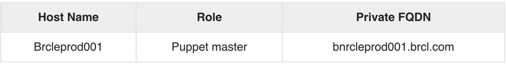

# **2 Puppet - 安装, 配置以及验证**


## **1 Installation**

Puppet 工作在客户端服务器架构上，其中我们将服务器称为 Puppet 主机，将客户端称为 Puppet 节点。这个设置是通过在客户端和所有服务器机器上安装 Puppet 来实现的。

对于大多数平台，可以通过选择的包管理器安装 Puppet。但是，对于少数平台，可以通过安装 tarball 或 RubyGems 来完成

### **先决条件**

Factor 是 Chef 中唯一不与 Ohai 一起出现的先决条件。

**Standard OS Library**

我们需要有任何底层操作系统的标准库集。其余所有系统都附带 Ruby 1.8.2 + 版本。以下是操作系统应包含的库项目列表。

* base64
* cgi
* digest/md5
* etc
* fileutils
* ipaddr
* openssl
* strscan
* syslog
* uri
* webrick
* webrick/https
* xmlrpc

### **Facter Installation**

如前所述，标准版 Ruby 不附带该因素。因此，为了在目标系统中获取因子，需要从源手动安装它，因为facter library是 Puppet 的先决条件。

该软件包可用于多个平台，但为了更安全，**可以使用 tarball 安装它，这有助于获取最新版本**。

首先，使用 wget 实用程序从 Puppet 的官方网站下载 tarball。

```
$ wget http://puppetlabs.com/downloads/facter/facter-latest.tgz ------: 1
```


接下来，解压缩 tar 文件。使用 CD 命令进入解压目录。最后，使用facter 目录中的`install.rb` 文件安装facter。

```
$ gzip -d -c facter-latest.tgz | tar xf - -----: 2
$ cd facter-* ------: 3
$ sudo ruby install.rb # or become root and run install.rb -----:4
```

### **Installing Puppet from the Source**


首先，使用 wget 从 Puppet 站点安装 Puppet tarball。然后，将 tarball 解压缩到目标位置。使用 CD 命令在创建的目录中移动。使用 install.rb 文件，在底层服务器上安装 Puppet。

```
# get the latest tarball
$ wget http://puppetlabs.com/downloads/puppet/puppet-latest.tgz -----: 1

# untar and install it
$ gzip -d -c puppet-latest.tgz | tar xf - ----: 2
$ cd puppet-* ------: 3
$ sudo ruby install.rb # or become root and run install.rb -------: 4
```

### **使用 Ruby Gem 安装 Puppet 和 Facter**

```
# Installing Facter
$ wget http://puppetlabs.com/downloads/gems/facter-1.5.7.gem
$ sudo gem install facter-1.5.7.gem

# Installing Puppet
$ wget http://puppetlabs.com/downloads/gems/puppet-0.25.1.gem
$ sudo gem install puppet-0.25.1.gem
```

## **2 Configuration**

一旦我们在系统上安装了 Puppet，下一步就是对其进行配置以执行某些初始操作。

### **打开机器上的防火墙端口**

为了使 Puppet 服务器集中管理客户端的服务器，需要在所有机器上打开一个指定的端口，即如果我们尝试配置的任何机器上都没有使用 8140，则可以使用 8140。我们需要在所有机器上同时启用 TCP 和 UDP 通信。

### **配置文件**

Puppet 的主要配置文件是 `etc/puppet/puppet.conf`。所有配置文件都是在基于包的 Puppet 配置中创建的。配置 Puppet 所需的大部分配置都保存在这些文件中，一旦 Puppet 运行，它会自动获取这些配置。

但是，对于某些特定任务，例如配置 Web 服务器或外部证书颁发机构 (CA)，Puppet 对文件和设置有单独的配置。

**服务器配置文件位于 `conf.d` 目录中，也称为 `Puppet master`。这些文件默认位于 `/etc/puppetlabs/puppetserver/conf.d `路径下。**

这些配置文件采用 HOCON 格式，保留了 JSON 的基本结构，但更具可读性。当 Puppet 启动时，它会从 conf.d 目录中提取所有 `.cong` 文件，并使用它们进行任何配置更改。这些文件中的任何更改仅在服务器重新启动时发生


### 列表文件和设置文件

* global.conf
* webserver.conf
* web-routes.conf
* puppetserver.conf
* auth.conf
* master.conf (deprecated)
* ca.conf (deprecated)


Puppet 中有不同的配置文件，它们特定于 Puppet 中的每个组件。

### **Puppet.conf**

Puppet.conf 文件是 Puppet 的主要配置文件。 Puppet 使用相同的配置文件来配置所有必需的 Puppet 命令和服务。

**所有与 Puppet 相关的设置，如 Puppet master、Puppet agent、Puppet apply 和证书的定义都在这个文件中定义。 Puppet 可以根据需要引用它们**。

配置文件类似于标准 ini 文件，其中设置可以进入主要部分的特定应用程序部分。

**主要配置部分**

```
[main]
certname = Test1.vipin.com
server = TestingSrv
environment = production
runinterval = 1h
```

**Puppet Master Config File**

```
[main]
certname = puppetmaster.vipin.com
server = MasterSrv
environment = production
runinterval = 1h
strict_variables = true
[master]

dns_alt_names = MasterSrv,brcleprod01.vipin.com,puppet,puppet.test.com
reports = puppetdb
storeconfigs_backend = puppetdb
storeconfigs = true
environment_timeout = unlimited
```

### **详细概述**
在 Puppet 配置中，将要使用的文件具有多个配置部分，其中每个部分具有不同类型的多个设置。

配置部分

Puppet 配置文件主要由以下配置部分组成。

* Main - 这被称为全局部分，**被 Puppet 中的所有命令和服务使用**。一个定义主要部分中的默认值，可以被 `puppet.conf` 文件中存在的任何部分覆盖。
* Master - 此部分由 Puppet master 服务和 Puppet cert 命令引用。
* Agent - 此部分由 Puppet 代理服务引用。
* 用户 - 它主要由 Puppet 应用命令以及许多不太常见的命令使用。

```
[main]
certname = PuppetTestmaster1.example.com
```

### 配置文件的关键组件

以下是配置文件的关键组成部分。

**注释行**

在 Puppet 中，任何注释行都以 (#) 符号开头。这可能意味着任何数量的空间。我们也可以在同一行中进行部分注释

```
# This is a comment.
Testing = true #this is also a comment in same line
```

### Settings Lines

设置行必须包括 -

* 任意数量的前导空格（可选）
* 设置名称
* 一个等于 = 符号，它可以被任意数量的空格包围
* 设置值


**设置变量**

在大多数情况下，设置的值将是一个单词，但在某些特殊情况下，很少有特殊值。

**路径**

在配置文件设置中，获取目录列表。在定义这些目录时，应该记住它们应该由系统路径分隔符分隔，在 *nix 平台上是 (:)，在 Windows 上是分号 (;)。

```
# *nix version:
environmentpath = $codedir/special_environments:$codedir/environments

# Windows version:
environmentpath = $codedir/environments;C:\ProgramData\PuppetLabs\code\environment
```

在定义中，首先列出的文件目录被扫描，然后如果没有找到，则移动到列表中的另一个目录。

### **文件和目录**

采用单个文件或目录的所有设置都可以接受可选的权限哈希。当服务器启动时，Puppet 将强制执行列表中的那些文件或目录。

```
ssldir = $vardir/ssl {owner = service, mode = 0771}
```

在上面的代码中，允许的哈希是所有者、组和模式。所有者和组密钥只有两个有效值。


## **3 Environment Conf**

在 Puppet 中，所有环境都有 **environment.conf** 文件。每当主服务器为任何节点或分配给该特定环境的所有节点提供服务时，此文件可以覆盖几个默认设置。

### **Location**

在 Puppet 中，对于所有定义的环境，`environment.conf ` 文件位于其主环境的顶层，非常靠近manifest和modules。

举个例子，如果您的环境在默认目录（`Vipin/testing/environment`）中，那么测试环境的配置文件位于 `Vipin/testing/environments/test/environment.conf`。

**Example**

```
# /etc/testingdir/code/environments/test/environment.conf
# Puppet Enterprise requires $basemodulepath; see note below under modulepath".
modulepath = site:dist:modules:$basemodulepath
# Use our custom script to get a git commit for the current state of the code:
config_version = get_environment_commit.sh
```

### **Format**

Puppet 中的所有配置文件都以相同的方式使用相同的类似 `INI 的格式`。 `environment.conf `文件遵循与其他类似 `Puppet.conf` 文件相同的类似 INI 的格式。 


**`environment.conf` 和 `puppet.conf` 之间的唯一区别是 `environment.conf` 文件不能包含 [main] 部分**。 

**environment.conf 文件中的所有设置都必须在任何配置部分之外**


### **Interpolation in Values**

Environment.conf 设置文件能够使用其他设置的值作为变量。有多个有用的变量可以插入到 `environment.conf` 文件中。以下是一些重要变量的列表 -

* `$basemodulepath` − 对于在模块路径设置中包含目录很有用。 Puppet 企业用户通常应该包含这个 modulepath 的值，因为 Puppet 引擎在 basemodulepath 中使用模块。
* `$environment` − 作为 `config_version` 脚本的命令行参数很有用。您只能在 `config_version` 设置中插入此变量。
* `$codedir` − 用于定位文件.

### **Allowed Settings**

默认情况下，Puppet environment.conf 文件只允许覆盖配置中列出的四个设置。

* Modulepath
* Manifest
* `Config_version`
* `Environment_timeout`

**Modulepath**

这是 environment.conf 文件中的关键设置之一。

在 modulepath 中定义的所有导向器默认由 Puppet 加载。这是 Puppet 加载其模块的路径位置。需要明确设置。如果未设置上述设置，则 Puppet 中任何环境的默认模块路径将是 -

```
<MODULES DIRECTORY FROM ENVIRONMENT>:$basemodulepath
```

**Manifest**

这用于定义主Manifest文件，Puppet master 将在启动和编译目录时使用已定义的清单文件，该清单文件将用于配置环境。在此，我们可以定义单个文件、文件列表，甚至是由多个清单文件组成的目录，这些文件需要按照定义的字母顺序进行评估和编译。

需要在 environment.conf 文件中明确定义此设置。如果不是，那么 Puppet 将使用环境默认清单目录作为其主要清单。

**`Config_version`**

`Config_version` 可以定义为用于标识catalogs和events的确定版本。

默认情况下，当 Puppet 编译任何清单文件时，它会将配置版本添加到生成的目录以及 `Puppet Master` 在 `Puppet` 节点上应用任何定义的目录时生成的报告中。

Puppet 运行一个脚本来执行上述所有步骤，并将所有生成的输出用作 `Config_version`。

**Environment Timeout**

它用于获取有关 Puppet 应用于为给定环境加载数据的时间量的详细信息。如果该值在 puppet.conf 文件中定义，那么这些值将覆盖默认超时值。

### 示例 environment.conf 文件

```
[master]
manifest = $confdir/environments/$environment/manifests/site.pp
modulepath = $confdir/environments/$environment/modules
```

* 上面代码中`$confdir`是目录的路径，环境配置文件所在的目录。
* `$environment` 是正在为其完成配置的环境的名称。

### **生产就绪环境配置文件**

```
# The environment configuration file
# The main manifest directory or file where Puppet starts to evaluate code
# This is the default value. Works with just a site.pp file or any other
manifest = manifests/
# The directories added to the module path, looked in first match first used order:
# modules - Directory for external modules, populated by r10k based on Puppetfile
# $basemodulepath - As from: puppet config print basemodulepath
modulepath = site:modules:$basemodulepath
# Set the cache timeout for this environment.
# This overrides what is set directly in puppet.conf for the whole Puppet server
# environment_timeout = unlimited
# With caching you need to flush the cache whenever new Puppet code is deployed
# This can also be done manually running: bin/puppet_flush_environment_cache.sh
# To disable catalog caching:
environment_timeout = 0
# Here we pass to one in the control repo the Puppet environment (and git branch)
# to get title and essential info of the last git commit
config_version = 'bin/config_script.sh $environment'
```

## **4 Master**

在 Puppet 中，Puppet Master 的客户端服务器架构被认为是整个设置的控制权限。 **Puppet Master 在设置中充当服务器并控制所有节点上的所有活动。**

对于任何需要充当 Puppet Master 的服务器，它都应该运行 Puppet 服务器软件。该服务器软件是控制节点上所有活动的关键组件。**在此设置中，要记住的一个关键点是让超级用户访问将在设置中使用的所有机器**。以下是设置 Puppet Master 的步骤。

### **先决条件**

* **Private Network DNS** - 应该配置Forward and backward，其中每个服务器应该有一个唯一的主机名。如果没有配置 DNS，则可以使用专用网络与基础设施进行通信。
* **Firewall Open Port** - Puppet master 应该在特定端口上打开，以便它可以侦听特定端口上的传入请求。我们可以使用防火墙上打开的任何端口。


### **Creating Puppet Master Server**

我们正在创建的 Puppet Master 将在 CentOS 7 × 64 机器上使用 Puppet 作为主机名。创建 Puppet Master 的最低系统配置是两个 CPU 核心和 1GB 内存。配置也可能具有更大的大小，具体取决于我们要使用该主节点管理的节点数量。在基础架构中，比使用 2 GB RAM 配置的要大。



接下来，需要生成 Puppet master SSL 证书，并将 master 机器的名称复制到所有节点的配置文件中。

### **安装 NTP**

由于 Puppet Master 是任何给定设置中代理节点的中央权威，因此维护准确的系统时间以避免潜在的配置问题是 Puppet Master 的主要职责之一，这些问题可能在向节点颁发代理证书时出现。

如果出现时间冲突问题，则如果主节点和节点之间存在时间差异，则证书可能会过期。网络时间协议是避免此类问题的关键机制之一。


### **列出可用时区**

```
$ timedatectl list-timezones
```
上述命令将提供可用时区的完整列表。它将为区域提供时区可用性。

以下命令可用于在机器上设置所需的时区。

```
$ sudo timedatectl set-timezone India/Delhi
```

使用 CentOS 机器的 yum 实用程序在 Puppet 服务器机器上安装 NTP。

```
$ sudo yum -y install ntp
```


将 NTP 与我们在上述命令中设置的系统时间同步。

```
$ sudo ntpdate pool.ntp.org
```

在通常的实践中，我们将更新 NTP 配置以使用更靠近机器数据中心的公共池。为此，我们需要编辑 `/etc` 下的 `ntp.conf` 文件。

```
$ sudo vi /etc/ntp.conf
```

从可用的 NTP 池时区添加时间服务器。以下是 ntp.conf 文件的外观。

```
brcleprod001.brcl.pool.ntp.org
brcleprod002.brcl.pool.ntp.org
brcleprod003.brcl.pool.ntp.org
brcleprod004.brcl.pool.ntp.org
```

Save the configuration. Start the server and enable the daemon.

```
$ sudo systemctl restart ntpd
$ sudo systemctl enable ntpd
```

### **设置 Puppet 服务器软件**

Puppet 服务器软件是在 Puppet 主机上运行的软件。它是将配置推送到运行 Puppet 代理软件的其他机器的机器。

使用以下命令启用官方 Puppet 实验室集合存储库。

```
$ sudo rpm -ivh https://yum.puppetlabs.com/puppetlabs-release-pc1-el7.noarch.rpm
```

Install puppetserver package.

```
$ sudo yum -y install puppetserver
```


### **在 Puppet 服务器上配置内存分配**

正如我们所讨论的，默认情况下，Puppet 服务器配置在 2GB RAM 的机器上。可以根据机器上的可用内存以及服务器将管理的节点数量来自定义设置。

在 vi 模式下编辑 puppet 服务器配置

```
$ sudo vi /etc/sysconfig/puppetserver
Find the JAVA_ARGS and use the –Xms and –Xms options to set the memory allocation.
We will allocate 3GB of space
JAVA_ARGS="-Xms3g -Xmx3g"
```

完成后，保存并退出编辑模式。

上述所有设置完成后，我们就可以使用以下命令在主机上启动 Puppet 服务器了。

```
$ sudo systemctl start puppetserver
```

接下来，我们将进行设置，以便在主服务器启动时启动 puppet 服务器。

```
$ sudo systemctl enable puppetserver
```

**`Puppet.conf` Master Section**

```
[master]
autosign = $confdir/autosign.conf { mode = 664 }
reports = foreman
external_nodes = /etc/puppet/node.rb
node_terminus = exec
ca = true
ssldir = /var/lib/puppet/ssl
certname = sat6.example.com
strict_variables = false
manifest =
/etc/puppet/environments/$environment/manifests/site.pp
modulepath = /etc/puppet/environments/$environment/modules
config_version =
```

## **Agent Setup**

Puppet Agent 是由 Puppet 实验室提供的软件应用程序，它运行在 Puppet 集群中的任何节点上。如果想要使用 Puppet Master 管理任何服务器，则需要在该特定服务器上安装 Puppet Agent软件。

通常，Puppet 代理将安装在任何给定基础设施上除 Puppet 主机之外的所有机器上。 Puppet 代理软件能够在大多数 Linux、UNIX 和 Windows 机器上运行。在下面的例子中，我们使用 CentOS 机器安装 Puppet 代理软件就可以了

Step 1 − 使用以下命令启用官方 Puppet 实验室集合存储库。

```
$ sudo rpm -ivh https://yum.puppetlabs.com/puppetlabs-release-pc1-el7.noarch.rpm
```

Step 2 − 安装 Puppet 代理包。

```
$ sudo yum -y install puppet-agent
```

Step 3 - 安装 Puppet 代理后，使用以下命令启用它。

```
$ sudo /opt/puppetlabs/bin/puppet resource service puppet ensure=running enable = true
```

Puppet 代理的一个关键特性是，**当 Puppet 代理第一次开始运行时，它会生成一个 SSL 证书并将其发送给将要管理它的 Puppet Master 以进行签名和批准**。一旦 Puppet Master 批准代理的证书签名请求，它将能够与代理节点进行通信和管理。

注意 - 需要在需要配置和管理任何给定 Puppet Master 的所有节点上重复上述步骤。

## **5 SSL Sign Certificate Setup**

当 Puppet 代理软件第一次在任何 Puppet 节点上运行时，它会生成一个证书并将证书签名请求发送给 Puppet Master。在 Puppet 服务器能够通信和控制代理节点之前，它必须签署该特定代理节点的证书。在以下部分中，我们将描述如何签名和检查签名请求。

### **列出当前的证书请求**

在 Puppet Master 上，运行以下命令以查看所有未签名的证书请求。

```
$ sudo /opt/puppetlabs/bin/puppet cert list
```

**由于我们刚刚建立了一个新的代理节点，我们将看到一个批准请求。以下将是输出。**

```
"Brcleprod004.brcl.com" (SHA259)
15:90:C2:FB:ED:69:A4:F7:B1:87:0B:BF:F7:ll:
B5:1C:33:F7:76:67:F3:F6:45:AE:07:4B:F 6:E3:ss:04:11:8d
```

它的开头不包含任何+（符号），这表明证书仍然没有签名。

### **签署请求**

为了对在新节点上运行 Puppet 代理时生成的新证书请求进行签名，将使用 Puppet cert sign 命令以及证书的主机名，该证书由新配置的节点生成，需要签署。由于我们有 Brcleprod004.brcl.com 的证书，我们将使用以下命令。

```
$ sudo /opt/puppetlabs/bin/puppet cert sign Brcleprod004.brcl.com
```


以下将是输出。

```
Notice: Signed certificate request for Brcle004.brcl.com
Notice: Removing file Puppet::SSL::CertificateRequest Brcle004.brcl.com at
'/etc/puppetlabs/puppet/ssl/ca/requests/Brcle004.brcl.com.pem'
```


puppet 服务器现在可以与签名证书所属的节点进行通信。

```
$ sudo /opt/puppetlabs/bin/puppet cert sign --all
```

### **从 Puppet 设置中撤销主机**

当需要从设置中删除主机并重新添加时，内核重建的配置存在条件。这些是偶人自身无法管理的条件。可以使用以下命令完成。

```
$ sudo /opt/puppetlabs/bin/puppet cert clean hostname
```

### **查看所有签名的请求**

以下命令将生成带有 +（符号）的签名证书列表，表示请求已被批准

```
$ sudo /opt/puppetlabs/bin/puppet cert list --all
```

以下将是它的输出。

```
+ "puppet" (SHA256) 5A:71:E6:06:D8:0F:44:4D:70:F0:
BE:51:72:15:97:68:D9:67:16:41:B0:38:9A:F2:B2:6C:B
B:33:7E:0F:D4:53 (alt names: "DNS:puppet", "DNS:Brcle004.nyc3.example.com")

+ "Brcle004.brcl.com" (SHA259) F5:DC:68:24:63:E6:F1:9E:C5:FE:F5:
1A:90:93:DF:19:F2:28:8B:D7:BD:D2:6A:83:07:BA:F E:24:11:24:54:6A

+ " Brcle004.brcl.com" (SHA259) CB:CB:CA:48:E0:DF:06:6A:7D:75:E6:CB:22:BE:35:5A:9A:B3
```

完成上述操作后，我们的基础设施已经准备就绪，Puppet master 现在能够管理新添加的节点。


## **6 安装和配置 r10K**

在 Puppet 中，我们有一个称为 r10k 的代码管理工具，它有助于管理与我们可以在 Puppet 中配置的不同类型的环境相关的环境配置，例如开发、测试和生产。**这有助于在源代码存储库中存储与环境相关的配置。使用源代码控制 repo 分支，r10k 在 Puppet master 机器上创建环境，使用 repo 中存在的模块安装和更新环境。**

Gem 文件可用于在任何机器上安装 r10k，但为了模块化，为了获得最新版本，我们将使用 rpm 和 rpm 包管理器。以下是相同的示例。

```
$ urlgrabber -o /etc/yum.repos.d/timhughes-r10k-epel-6.repo
https://copr.fedoraproject.org/coprs/timhughes/yum -y install rubygem-r10k
```

Configure environment in /etc/puppet/puppet.conf

```
[main]
environmentpath = $confdir/environments
```


### **为 r10k Config 创建一个配置文件**

```
cat <<EOF >/etc/r10k.yaml
# The location to use for storing cached Git repos
:cachedir: '/var/cache/r10k'
# A list of git repositories to create
:sources:
# This will clone the git repository and instantiate an environment per
# branch in /etc/puppet/environments
:opstree:
#remote: 'https://github.com/fullstack-puppet/fullstackpuppet-environment.git'
remote: '/var/lib/git/fullstackpuppet-environment.git'
basedir: '/etc/puppet/environments'
EOF
```

### **安装 Puppet Manifest 和模块**

```
r10k deploy environment -pv
```

**由于我们需要在每 15 分钟内继续更新环境，我们将为此创建一个 cron 作业。**

```
cat << EOF > /etc/cron.d/r10k.conf
SHELL = /bin/bash
PATH = /sbin:/bin:/usr/sbin:/usr/bin
H/15 * * * * root r10k deploy environment -p
EOF
```


### **测试安装**

为了测试是否一切正常，需要为 Puppet 模块编译 Puppet 清单。运行以下命令并获得 YAML 输出作为结果。

```
curl --cert /etc/puppet/ssl/certs/puppet.corp.guest.pem \
--key /etc/puppet/ssl/private_keys/puppet.corp.guest.pem \
--cacert /etc/puppet/ssl/ca/ca_crt.pem \
-H 'Accept: yaml' \
https://puppet.corp.guest:8140/production/catalog/puppet.corp.guest
```

## **7 验证 Puppet 设置**

在 Puppet 中，可以在本地测试设置。因此，一旦我们设置了 Puppet 主节点和节点，就该在本地验证设置了。我们需要在本地安装 Vagrant 和 Vagrant box，这有助于在本地测试设置。

### **设置虚拟机**


由于我们在本地测试设置，我们实际上并不需要正在运行的 Puppet Master。**这意味着无需在服务器上实际运行 `Puppet Master`，我们可以简单地使用 Puppet 应用命令来验证 Puppet 设置。** 

`Puppet apply` 命令将根据配置文件中虚拟机的主机名应用来自本地`/etc/puppet` 的更改。

为了测试设置，我们需要执行的第一步是构建以下 Vagrantfile 并启动一台机器并将 `/etc/puppet` 文件夹安装到位。所有需要的文件都将放在具有以下结构的版本控制系统中。

**Directory Structure**

```
- manifests
\- site.pp
- modules
\- your modules
- test
\- update-puppet.sh
\- Vagrantfile
- puppet.conf
```

Vagrant File

```
# -*- mode: ruby -*-
# vi: set ft = ruby :
Vagrant.configure("2") do |config|
config.vm.box = "precise32"
config.vm.box_url = "http://files.vagrantup.com/precise64.box"
config.vm.provider :virtualbox do |vb|
vb.customize ["modifyvm", :id, "--memory", 1028, "--cpus", 2]
end

# Mount our repo onto /etc/puppet
config.vm.synced_folder "../", "/etc/puppet"

# Run our Puppet shell script
config.vm.provision "shell" do |s|
s.path = "update-puppet.sh"
end

config.vm.hostname = "localdev.example.com"
end
```

在上面的代码中，我们使用了 Shell 配置器，我们试图在其中运行一个名为 `update-puppet.sh` 的 Shell 脚本。该脚本位于 Vagrant 文件所在的同一目录中，脚本的内容如下所示。

```
!/bin/bash
echo "Puppet version is $(puppet --version)"
if [ $( puppet --version) != "3.4.1" ]; then
echo "Updating puppet"
apt-get install --yes lsb-release
DISTRIB_CODENAME = $(lsb_release --codename --short)
DEB = "puppetlabs-release-${DISTRIB_CODENAME}.deb"
DEB_PROVIDES="/etc/apt/sources.list.d/puppetlabs.list"

if [ ! -e $DEB_PROVIDES ]
then
wget -q http://apt.puppetlabs.com/$DEB
sudo dpkg -i $DEB
fi
sudo apt-get update
sudo apt-get install -o Dpkg::Options:: = "--force-confold"
--force-yes -y puppet
else
echo "Puppet is up to date!"
fi
```

进一步处理，用户需要在 Manifests 目录中创建一个名为 site.pp 的清单文件，该文件将在 VM 上安装一些软件。

```
node 'brclelocal03.brcl.com' { 
   package { ['vim','git'] : 
      ensure => latest 
   } 
} 
echo "Running puppet" 
sudo puppet apply /etc/puppet/manifests/site.pp 
```

一旦用户准备好上述脚本和所需的 Vagrant 文件配置，用户可以 cd 到 test 目录并运行 vagrant up 命令。这将启动一个新的虚拟机，稍后安装 Puppet，然后使用 Shell 脚本运行它。

以下将是输出。

```
Notice: Compiled catalog for localdev.example.com in environment production in 0.09 seconds
Notice: /Stage[main]/Main/Node[brclelocal03.brcl.com]/Package[git]/ensure: created
Notice: /Stage[main]/Main/Node[brcllocal03.brcl.com]/Package[vim]/ensure: ensure changed 'purged' to 'latest'
```


### **验证多台机器配置**

如果我们需要在本地测试多台机器的配置，只需修改 Vagrant 配置文件即可。

新配置的 Vagrant 文件

```
config.vm.define "brclelocal003" do |brclelocal003|
brclelocal03.vm.hostname = "brclelocal003.brcl.com"
end

config.vm.define "production" do |production|
production.vm.hostname = "brcleprod004.brcl.com"
end
```

假设我们有一个新的生产服务器，需要安装 SSL 实用程序。我们只需要使用以下配置扩展旧清单。

```
node 'brcleprod004.brcl.com' inherits 'brcleloacl003.brcl.com' { 
   package { ['SSL'] : 
      ensure => latest 
   } 
} 
```

在清单文件中进行配置更改后，我们只需要移动到测试目录并运行基本的 vagrant up 命令，这将打开 brclelocal003.brcl.com 和 brcleprod004.brcl.com 机器。

在我们的例子中，我们正在尝试启动生产机器，这可以通过运行 vagrant up production 命令来完成。这将创建一个名为 production 的新机器，如 Vagrant 文件中定义的那样，它将安装 SSL 包。