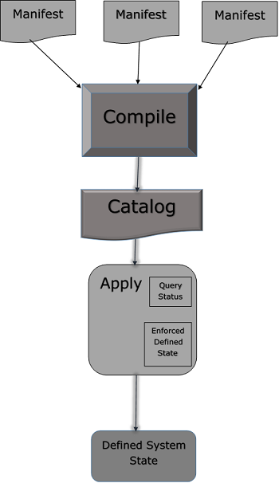

# **4 Puppet - 核心模块**

## **1 Manifest Files**

在 Puppet 中，所有使用 Ruby 编程语言编写并以 `.pp` 扩展名保存的程序都称为清单。一般而言，所有旨在创建或管理任何目标主机的 Puppet 程序都称为清单。

所有用 Puppet 编写的程序都遵循 Puppet 编码风格。

Puppet 的核心是声明资源的方式以及这些资源如何表示它们的状态。在任何清单中，用户都可以拥有一组不同类型的资源，这些资源使用类和定义组合在一起。

在某些情况下，`Puppet manifest` 甚至可以有一个条件语句以达到所需的状态。但是，最终归根结底是要确保所有资源都以正确的方式定义和使用，并且在转换为目录后应用定义的清单能够执行其设计的任务。

### **Manifest文件工作流程**

Puppet manifest 由以下组件组成 -

* File（这些是 Puppet 与它们无关的普通文件，只是将它们拾取并放置在目标位置）
* 资源Resources
* 模板Templates（这些可用于在节点上构建配置文件）。
* 节点Nodes（所有与客户端节点相关的定义都在这里定义）
* 类Classes

### **注意事项**
在 Puppet 中，所有清单文件都使用 Ruby 作为其编码语言，并以 .pp 扩展名保存。

许多清单中的“import”语句用于在 Puppet 启动时加载文件。

**为了导入目录中包含的所有文件，您可以以另一种方式使用 import 语句，例如 `import 'clients/*`'。这将导入该目录中的所有 .pp 文件。**



### **写Manifests**

**使用变量**

在编写清单时，用户可以在清单中的任何位置定义新变量或使用现有变量。 Puppet 支持不同类型的变量，但其中很少有人经常使用，例如字符串和字符串数组。除此之外，还支持其他格式。

**字符串变量示例**

```
$package = "vim"  

package {  $package: 
   ensure => "installed" 
}
```

**使用循环**

当人们希望对同一组代码进行多次迭代直到满足定义的条件时，就会使用循环。它们还用于执行具有不同值集的重复性任务。为 10 个不同的事物创建 10 个任务。可以创建一个任务并使用循环重复该任务，并使用想要安装的不同包。

最常见的是数组用于重复具有不同值的测试。

```
$packages = ['vim', 'git', 'curl']  

package { $packages: 
   ensure => "installed" 
}
```


**使用条件**

Puppet 支持传统编程语言中的大多数条件结构。条件可用于动态定义是执行特定任务还是执行一组代码。像 if/else 和 case 语句。此外，像执行这样的条件也将支持像条件一样工作的属性，但只接受命令输出作为条件。

```
if $OperatingSystem != 'Linux' { 
   warning('This manifest is not supported on this other OS apart from linux.') 
} else { 
   notify { 'the OS is Linux. We are good to go!': }
} 
```

## **2 Module**

在 Puppet 中，模块可以定义为resources、classes、files、definition和templates的集合。 

Puppet 支持轻松的模块重新分发，这对于代码的模块化非常有帮助，因为一个人可以编写一个指定的通用模块，并且可以多次使用它，只需很少的简单代码更改。例如，这将启用 `/etc/puppet` 下的默认站点配置，Puppet 提供的模块在 `/etc/share/puppet` 中。

### **Module Configuration**

在任何 Puppet 模块中，我们都有两个分区来帮助定义代码结构和控制面额。

模块的搜索路径是使用 **puppetmasterd** 或 **masterd** 中以冒号分隔的目录列表配置的，后者是 Puppet 主配置文件的后面部分，带有 **modulepath** 参数。

```
[puppetmasterd]
...
modulepath = /var/lib/puppet/modules:/data/puppet/modules
```

可以通过设置 PUPPETLAB 环境变量在运行时添加搜索路径，该环境变量也必须是冒号分隔的变量列表。

**`fileserver.conf `中文件服务器模块的访问控制设置，该模块的路径配置始终被忽略，指定路径将产生警告。**

### **模块源 Modules Source**

Puppet 支持存储模块的不同位置。任何模块都可以存储在任何特定机器的不同文件系统中。但是，存储模块的所有路径都必须在称为 modulepath 的配置变量中指定，这通常是一个路径变量，Puppet 扫描所有模块目录并在启动时加载它们。

一个合理的默认路径可以配置为 -

```
/etc/puppet/modules:/usr/share/puppet:/var/lib/modules.
```

或者，可以将 /etc/puppet 目录建立为一个特殊的匿名模块，它总是首先被搜索。


### **模块命名**

Puppet 遵循特定模块的相同命名标准，其中模块名称必须是普通单词，匹配 `[-\\w+]`（字母、单词、数字、下划线和破折号）并且不包含命名空间分隔符：: 或 /。虽然可能允许关于模块层次结构，但对于新模块，它不能嵌套。

### **模块内部组织**

当用户在 Puppet 中创建新模块时，它遵循相同的结构，并包含按特定目录结构排列的清单、分布式文件、插件和模板，如以下代码所示。

```
MODULE_PATH/
downcased_module_name/
files/
manifests/
init.pp
lib/
puppet/
parser/
functions
provider/
type/
facter/
templates/
README
```

每当创建一个模块时，它都会在清单目录内的指定修复位置包含 `init.pp` 清单文件。此清单文件是一个默认文件，它首先在任何特定模块中执行，并包含与该特定模块关联的所有类的集合。

**可以直接在 manifests 文件夹下添加其他 `.pp` 文件。如果我们要添加额外的` .pp` 文件，它们应该以类命名。**

使用模块实现的关键特性之一是代码共享。

一个模块本质上应该是自包含的，这意味着一个人应该能够从任何地方包含任何模块并将其放到模块路径上，当 Puppet 启动时会加载该路径。在模块的帮助下，人们在 Puppet 基础设施编码中获得了模块化。


**例子**

考虑一个安装固定 `auto.homes` 映射并从模板生成 `auto.master` 的 `autofs` 模块。

```
class autofs { 
   package { autofs: ensure => latest } 
   service { autofs: ensure => running } 
   
   file { "/etc/auto.homes": 
      source => "puppet://$servername/modules/autofs/auto.homes" 
   } 
   file { "/etc/auto.master": 
      content => template("autofs/auto.master.erb") 
   } 
}
```

文件系统将具有以下文件。

```
MODULE_PATH/
autofs/
manifests/
init.pp
files/
auto.homes
templates/
auto.master.erb
```

### **模块查找 Module Lookup**

Puppet 遵循一个预定义的结构，其中它在一个定义的结构中包含多个目录和子目录。这些目录包含模块执行某些操作所需的不同类型的文件。一些幕后魔术确保正确的文件与正确的上下文相关联。

**所有模块搜索都在 `modulepath` 中，这是一个以冒号分隔的目录列表**。

对于文件服务器上的文件引用，使用类似的引用，以便对 puppet 的引用：`//$servername/modules/autofs/auto.homes` 解析为模块路径中的文件 `autofs/files/auto.homes`。

要使模块可用于命令行客户端和 puppet master，可以使用 `from puppet:///path` 的 URL。即没有明确服务器名称的 URL。

**Puppet** 和 **puppetd** ​​对此类 URL 的处理方式略有不同。 Puppet 在本地文件系统中搜索无服务器 URL。

模板文件的搜索方式类似于清单和文件：

**提及模板（`autofs/auto.master.erb`）将使 `puppetmaster` 首先在 `$templatedir/autofs/auto.master.erb` 中查找文件，然后`autofs/templates/auto.master.erb` 在模块路径上。**

有了 Puppet 下所有东西的 Puppet 版本，它就可以使用了。这称为模块自动加载。 Puppet 将尝试从模块中自动加载类和定义。

## **3 文件服务器**

Puppet 遵循客户端和服务器的概念，其中设置中的一台机器作为运行 Puppet 服务器软件的服务器机器，其余作为运行 Puppet 代理软件的客户端工作。

文件服务器的这一特性有助于在多台机器上复制文件。 Puppet 中文件服务功能的这一特性是中央 Puppet 守护进程的一部分。 

**Puppetmasterd 和客户端功能在将文件属性作为文件对象时起着关键作用。**

```
class { 'java':  
   package               => 'jdk-8u25-linux-x64',  
   java_alternative      => 'jdk1.8.0_25',  
   java_alternative_path => '/usr/java/jdk1.8.0_25/jre/bin/java'  
}
```

如上面的代码片段，Puppet 的文件服务功能通过支持文件服务模块来抽象本地文件系统拓扑。我们将通过以下方式指定文件服务模块。

```
"puppet://server/modules/module_name/sudoers"
```

### **文件格式**

在 Puppet 目录结构中，默认情况下文件服务器配置位于 `/etc/puppet/fileserver.config `目录下，如果用户希望更改此默认配置文件路径，可以使用新的配置标志来完成 puppetmasterd。

配置文件类似于 INI 文件，但不完全相同。

```
[module]
path /path/to/files
allow *.domain.com
deny *.wireless.domain.com
```

如上面的代码片段所示，所有三个选项都在配置文件中表示。模块名称有点放在括号中。**路径是唯一必需的选项**。

默认安全选项是拒绝所有访问，因此如果没有指定允许行，将配置的模块将可供任何人使用。

**路径可以包含任何或所有 %d、%h 和 %H，它们会被其域名、主机名和完全限定的主机名动态替换**。

所有内容均取自客户端的 SSL 证书（因此，如果主机名和证书名称不匹配，请务必小心）。这在创建模块时非常有用，其中每个客户端的文件完全分开保存。例如，对于私有主机密钥。

```
[private]
path /data/private/%h
allow *
```

在上面的代码片段中，代码试图从客户端`client1.vipin.com` 搜索文件`/private/file.txt`。

它将在 `/data/private/client1/file.txt` 中查找它，而对 `client2.vipin.com` 的相同请求将尝试在文件服务器上检索文件 `/data/private/client2/file.txt`。


### **安全**

Puppet 支持 Puppet 文件服务器上保护文件的两个基本概念。

这是通过允许访问特定文件并拒绝访问不需要的文件来实现的。默认情况下，Puppet 不允许访问任何文件。它需要明确定义。可以在文件中使用的允许或拒绝访问的格式是使用 IP 地址、名称或全局允许。

如果客户端没有直接连接到 Puppet 文件服务器，例如使用反向代理和 Mongrel，那么文件服务器会将所有连接视为来自代理服务器而不是 Puppet 客户端。在上述情况下，基于主机名限制主机名是最佳实践。

定义文件结构时要注意的一个关键点是，所有的拒绝语句都在允许语句之前解析。因此，如果任何拒绝语句与主机匹配，则该主机将被拒绝，如果在即将到来的文件中没有写入任何允许语句，则该主机将被拒绝。此功能有助于设置任何特定站点的优先级。

### **主机名**

在任何文件服务器配置中，可以通过两种方式指定文件主机名，即使用完整的主机名或使用 `* 通配符`指定整个域名，如下例所示。

```
[export]
path /usr
allow brcleprod001.brcl.com
allow *.brcl.com
deny brcleprod002.brcl.com
```

### **IP地址**
在任何文件服务器配置中，可以使用完整的 IP 地址或通配符地址将文件地址指定为类似于主机名。也可以使用 CIDR 系统表示法

```
[export]
path /usr
allow 127.0.0.1
allow 172.223.30.*
allow 172.223.30.0/24
```


### **全局允许**

当用户希望每个人都可以访问特定模块时使用全局允许。为此，单个通配符有助于让每个人都访问该模块。

```
[export]
path /export
allow *
```

## **4 Facter & Facts**

**Puppet 支持将多个值保存为环境变量**。 **Puppet 通过使用 facter 支持此功能**。

在 Puppet 中，**facter 是一个保存环境级别变量的独立工具**。 in 可以认为类似于 Bash 或 Linux 的 env 变量。有时，存储在事实中的信息与机器的环境变量之间可能存在重叠。

在 Puppet 中，键值对被称为“事实”。每个资源都有自己的事实，在 Puppet 中，用户可以构建自己的自定义事实。

```
# facter
```

Factor 命令可用于列出所有不同的环境变量及其相关值。这些事实集合是开箱即用的事实，被称为核心事实。可以将自定义事实添加到集合中。

如果只想查看一个变量。可以使用以下命令来完成。

```
# facter {Variable Name}

Example
[root@puppetmaster ~]# facter virtual
virtualbox
```

facter 对 Puppet 很重要的原因是，facter 和 facter 在整个 Puppet 代码中都可以作为“全局变量”使用，这意味着它可以在任何时间点在代码中使用，而无需任何其他引用。

### **Example to Test**

```
[root@puppetmaster modules]# tree brcle_account 
brcle_account 
└── manifests  
└── init.pp 


[root@puppetmaster modules]# cat brcle_account/manifests/init.pp  
class brcle_account {  
   user { 'G01063908': 
      ensure => 'present', 
      uid => '121', 
      shell => '/bin/bash', 
      home => '/home/G01063908', 
   }  
   
   file {'/tmp/userfile.txt': 
      ensure => file, 
      content => "the value for the 'OperatingSystem' fact is: $OperatingSystem \n", 
   } 
} 
```

**Testing It**

```
[root@puppetmaster modules]# puppet agent --test 
Notice: /Stage[main]/Activemq::Service/Service[activemq]/ensure: 
ensure changed 'stopped' to 'running' 
Info: /Stage[main]/Activemq::Service/Service[activemq]: 
Unscheduling refresh on Service[activemq] 

Notice: Finished catalog run in 4.09 seconds  
[root@puppetmaster modules]# cat /tmp/testfile.txt  
the value for the 'OperatingSystem' fact is: Linux   

[root@puppetmaster modules]# facter OperatingSystem 
Linux
```


正如我们在上面的代码片段中注意到的那样，我们还没有定义**OperatingSystem**。我们刚刚将值替换为软编码值 `$OperatingSystem` 作为普通变量。

在 Puppet 中，可以使用和定义三种类型的事实 -

* Core Facts
* Custom Facts
* External Facts


核心事实是在顶层定义的，并且在代码中的任何位置都可以访问。


### **Puppet 事实**

就在代理向主服务器请求目录之前，代理首先以键值对的形式编译其自身可用信息的完整列表。代理的信息由一个名为facter的工具收集，每个键值对称为一个事实。以下是代理事实的常见输出。

```
[root@puppetagent1 ~]# facter
architecture => x86_64
augeasversion => 1.0.0
bios_release_date => 13/09/2012
bios_vendor => innotek GmbH
bios_version => VirtualBox
blockdevice_sda_model => VBOX HARDDISK
blockdevice_sda_size => 22020587520
blockdevice_sda_vendor => ATA
blockdevice_sr0_model => CD-ROM
blockdevice_sr0_size => 1073741312
blockdevice_sr0_vendor => VBOX
blockdevices => sda,sr0
boardmanufacturer => Oracle Corporation
boardproductname => VirtualBox
boardserialnumber => 0

domain => codingbee.dyndns.org
facterversion => 2.1.0
filesystems => ext4,iso9660
fqdn => puppetagent1.codingbee.dyndns.org
hardwareisa => x86_64
hardwaremodel => x86_64
hostname => puppetagent1
id => root
interfaces => eth0,lo
ipaddress => 172.228.24.01
ipaddress_eth0 => 172.228.24.01
ipaddress_lo => 127.0.0.1
is_virtual => true
kernel => Linux
kernelmajversion => 2.6
kernelrelease => 2.6.32-431.23.3.el6.x86_64
kernelversion => 2.6.32
lsbdistcodename => Final
lsbdistdescription => CentOS release 6.5 (Final)
lsbdistid => CentOS
lsbdistrelease => 6.5
lsbmajdistrelease => 6
lsbrelease => :base-4.0-amd64:base-4.0-noarch:core-4.0-amd64:core-4.0noarch:graphics-4.0-amd64:
graphics-4.0-noarch:printing-4.0-amd64:printing-4.0noarch
macaddress => 05:00:22:47:H9:77
macaddress_eth0 => 05:00:22:47:H9:77
manufacturer => innotek GmbH
memoryfree => 125.86 GB
memoryfree_mb => 805.86
memorysize => 500 GB
memorysize_mb => 996.14
mtu_eth0 => 1500
mtu_lo => 16436
netmask => 255.255.255.0
netmask_eth0 => 255.255.255.0

network_lo => 127.0.0.0
operatingsystem => CentOS
operatingsystemmajrelease => 6
operatingsystemrelease => 6.5
osfamily => RedHat
partitions => {"sda1"=>{
"uuid"=>"d74a4fa8-0883-4873-8db0-b09d91e2ee8d", "size" =>"1024000",
"mount" => "/boot", "filesystem" => "ext4"}, "sda2"=>{"size" => "41981952",
"filesystem" => "LVM2_member"}
}
path => /usr/lib64/qt3.3/bin:/usr/local/sbin:/usr/local/bin:/sbin:/bin:/usr/sbin:/usr/bin:/root/bin
physicalprocessorcount => 1
processor0 => Intel(R) Core(TM) i7 CPU 920 @ 2.67GHz
processor1 => Intel(R) Core(TM) i7 CPU 920 @ 2.67GHz
processor2 => Intel(R) Core(TM) i7 CPU 920 @ 2.67GHz
processorcount => 3
productname => VirtualBox
ps => ps -ef
puppetversion => 3.6.2
rubysitedir => /usr/lib/ruby/site_ruby/1.8
rubyversion => 1.8.7
selinux => true
selinux_config_mode => enforcing
selinux_config_policy => targeted
selinux_current_mode => enforcing
selinux_enforced => true
selinux_policyversion => 24
serialnumber => 0
sshdsakey => AAAAB3NzaC1kc3MAAACBAK5fYwRM3UtOs8zBCtRTjuHLw56p94X/E0UZBZwFR3q7
WH0x5+MNsjfmdCxKvpY/WlIIUcFJzvlfjXm4qDaTYalbzSZJMT266njNbw5WwLJcJ74KdW92ds76pjgm
CsjAh+R9YnyKCEE35GsYjGH7whw0gl/rZVrjvWYKQDOmJA2dAAAAFQCoYABgjpv3EkTWgjLIMnxA0Gfud
QAAAIBM4U6/nerfn6Qvt43FC2iybvwVo8ufixJl5YSEhs92uzsW6jiw68aaZ32q095/gEqYzeF7a2knr
OpASgO9xXqStYKg8ExWQVaVGFTR1NwqhZvz0oRSbrN3h3tHgknoKETRAg/imZQ2P6tppAoQZ8wpuLrXU
CyhgJGZ04Phv8hinAAAAIBN4xaycuK0mdH/YdcgcLiSn8cjgtiETVzDYa+jF
swapfree => 3.55 GB
swapfree_mb => 2015.99
swapsize => 3.55 GB
swapsize_mb => 2015.99
timezone => GMT
type => Other
uniqueid => a8c0af01
uptime => 45:012 hours
uptime_days => 0
uptime_hours => 6
uptime_seconds => 21865
uuid => BD8B9D85-1BFD-4015-A633-BF71D9A6A741
virtual => virtualbox
```

在上面的代码中，我们可以看到一些数据与 `bash "env"` 变量中可用的信息很少重叠。 Puppet 直接不使用数据，而是使用facter data，facter data被视为全局变量。

事实随后可作为顶级变量使用，Puppet master 可以使用它们为请求代理编译 Puppet 目录。因素在清单中被称为带有 `$ prefix`的普通变量。

### **Example**

```
if ($OperatingSystem == "Linux") { 
   $message = "This machine OS is of the type $OperatingSystem \n" 
} else { 
   $message = "This machine is unknown \n" 
} 

file { "/tmp/machineOperatingSystem.txt": 
   ensure => file, 
   content => "$message" 
}
```

上面的清单文件只关心一个名为 **`machineOperatingSystem.txt`** 的文件，其中该文件的内容被称为 **`OperatingSystem`** 的事实扣除。

```
[root@puppetagent1 /]# facter OperatingSystem 
Linux  

[root@puppetagent1 /]# puppet apply /tmp/ostype.pp 
Notice: Compiled catalog for puppetagent1.codingbee.dyndns.org 
in environment production in 0.07 seconds 
Notice: /Stage[main]/Main/File[/tmp/machineOperatingSystem.txt]/ensure: 
defined content as '{md5}f59dc5797d5402b1122c28c6da54d073' 
Notice: Finished catalog run in 0.04 seconds  

[root@puppetagent1 /]# cat /tmp/machinetype.txt 
This machine OS is of the type Linux
```

### **Custom Facts**

以上我们看到的所有事实都是机器的核心事实。可以通过以下方式将此自定义事实添加到节点 -

* Using the “export FACTER … Syntax”
* Using the $LOAD_PATH settings
* FACTERLIB
* Pluginsync

### **Using the “export FACTER” Syntax**

One can manually add the facts using the `export FACTER_{fact’s name}` syntax.

**Example**

```
[root@puppetagent1 facter]# export FACTER_tallest_mountain="Everest"
[root@puppetagent1 facter]# facter tallest_mountain Everest
```

### **Using the `$LOAD_PATH` Settings**

在 Ruby 中，`$LOAD_PATH` 等价于 Bash 特殊参数。虽然它类似于 bash `$PATH` 变量，但实际上 `$LOAD_PATH` 不是环境变量，而是预定义变量。

`$LOAD_PATH` has a synonym `“$:”`. This variable is an array to search and load the values.

```
[root@puppetagent1 ~]# ruby -e 'puts $LOAD_PATH'
# note you have to use single quotes.
/usr/lib/ruby/site_ruby/1.6
/usr/lib64/ruby/site_ruby/1.6
/usr/lib64/ruby/site_ruby/1.6/x86_64-linux
/usr/lib/ruby/site_ruby
/usr/lib64/ruby/site_ruby
/usr/lib64/site_ruby/1.6
/usr/lib64/site_ruby/1.6/x86_64-linux
/usr/lib64/site_ruby
/usr/lib/ruby/1.6
/usr/lib64/ruby/1.6
/usr/lib64/ruby/1.6/x86_64-linux
```


让我们举一个创建目录因子并添加 .pp 文件并向其附加内容的示例。

```
[root@puppetagent1 ~]# cd /usr/lib/ruby/site_ruby/
[root@puppetagent1 site_ruby]# mkdir facter
[root@puppetagent1 site_ruby]# cd facter/
[root@puppetagent1 facter]# ls
[root@puppetagent1 facter]# touch newadded_facts.rb
```

Add the following content to the `custom_facts.rb` file.

```
[root@puppetagent1 facter]# cat newadded_facts.rb
Facter.add('tallest_mountain') do
setcode "echo Everest"
end
```

Facter 的工作方式是扫描 `$LOAD_PATH` 中列出的所有文件夹，并寻找一个名为 `facter` 的导向器。

一旦找到该特定文件夹，它将在文件夹结构中的任何位置加载它们。如果它找到这个文件夹，那么它会在那个 facter 文件夹中查找任何 Ruby 文件，并加载关于内存中任何特定配置的所有已定义事实

### **Using FACTERLIB**


在 Puppet 中，FACTERLIB 的工作方式与 `$LOAD_PATH` 非常相似，但只有一个关键区别，它是操作系统级别的环境参数，而不是 Ruby 特殊变量。默认情况下，可能未设置环境变量。

```
[root@puppetagent1 facter]# env | grep "FACTERLIB"
[root@puppetagent1 facter]#
```

要测试 FACTERLIB，我们需要执行以下步骤。

在以下结构中创建一个名为 `test_facts` 的文件夹。

```
[root@puppetagent1 tmp]# tree /tmp/test_facts/
/tmp/some_facts/
├── vipin
│ └── longest_river.rb
└── testing
└── longest_wall.rb
```

Add the following contents to the `.rb` files.

```
[root@puppetagent1 vipin]# cat longest_river.rb 
Facter.add('longest_river') do 
   setcode "echo Nile" 
end 

[root@puppetagent1 testing]# cat longest_wall.rb 
Facter.add('longest_wall') do 
   setcode "echo 'China Wall'" 
end 
```


使用导出语句。

```
[root@puppetagent1 /]# export
FACTERLIB = "/tmp/some_facts/river:/tmp/some_facts/wall"
[root@puppetagent1 /]# env | grep "FACTERLIB"
FACTERLIB = /tmp/some_facts/river:/tmp/some_facts/wall
```

测试新因素。

```
[root@puppetagent1 /]# facter longest_river
Nile
[root@puppetagent1 /]# facter longest_wall
China Wall
```

### **外部 Facts**

当用户希望应用在供应时创建的一些新事实时，外部事实非常有用。外部 Facts是在配置阶段（例如使用 vSphere、OpenStack、AWS 等）将元数据应用到 VM 的关键方式之一。

Puppet 可以使用创建的所有元数据及其详细信息来确定目录中应该存在哪些详细信息，这些详细信息将被应用。

**Creating an External Fact**


在代理机器上，我们需要创建一个目录，如下所述。

```
$ mkdir -p /etc/facter/facts.d
```

Create a Shell script in the directory with the following content.

```
$ ls -l /etc/facter/facts.d
total 4
-rwxrwxrwx. 1 root root 65 Sep 18 13:11 external-factstest.sh
$ cat /etc/facter/facts.d/external-factstest.sh
#!/bin/bash
echo "hostgroup = dev"
echo "environment = development"
```

更改脚本文件的权限。

```
$ chmod u+x /etc/facter/facts.d/external-facts.sh
```

完成后，我们现在可以看到带有键/值对的变量。

```
$ facter hostgroup
dev
$ facter environment
development
```


可以在 Puppet 中编写自定义事实。作为参考，请使用 Puppet 网站的以下链接。

https://docs.puppet.com/facter/latest/fact_overview.html#writing-structured-facts