# 1 Introduction to Continuous Delivery

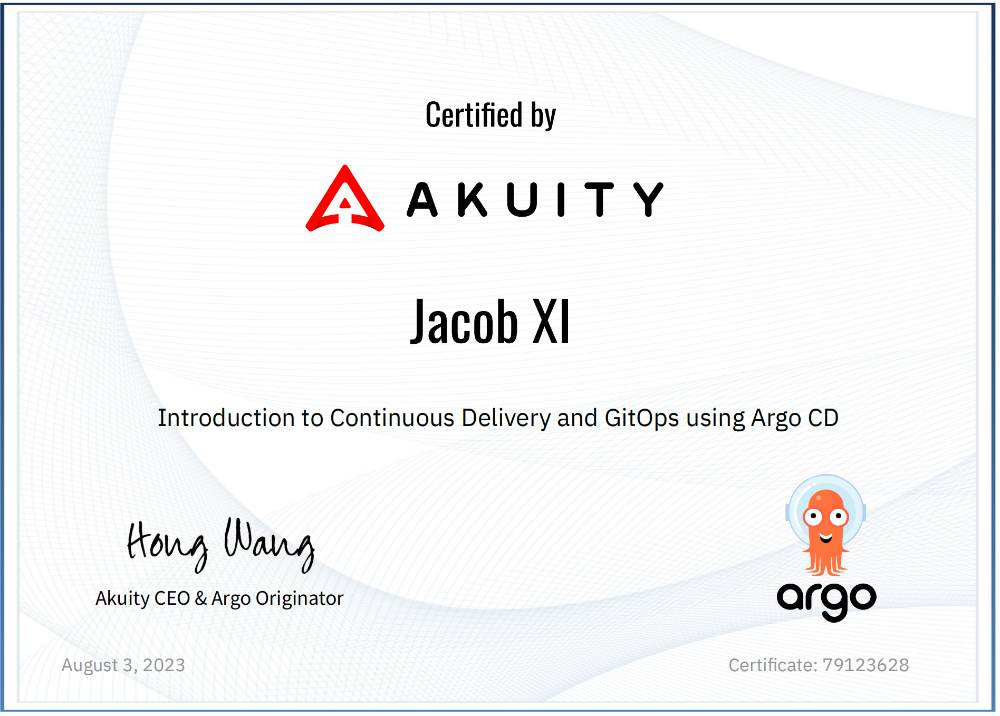

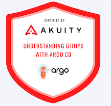


[https://academy.akuity.io/courses/gitops-argocd-intro](https://academy.akuity.io/courses/gitops-argocd-intro) 

## **1 Introduction to Continuous Delivery**

Like DevOps, Continuous Delivery (CD) is an organization's **technological** and **cultural**
transformation.


### **1-1 What Problems Does Continuous Delivery Solve?**

Continuous Delivery automates the manual, error-prone process of releasing code into production (or any environment)

The goal is to **codify** the specialized knowledge from both the developers and operators
responsible for releasing the software, freeing them from the toil of releases to focus on
delivering value.

Codifying the release process improves **visibility** into it. The steps required to go from a
build to running in production are laid out and made accessible. This helps identify
constraints to developer productivity and take a collaborative approach to improving
daily work.


Automating the release of code changes **speeds up** the delivery of value to the customer.
Going from weeks or months before seeing a change in production, to having it in the
hands of the users within days or even hours.


**Scaling** a release process dependent on humans requires finding qualified personnel and
training them. Continuous delivery can be scaled through improvements to the process
that will persist well into the future.

**Continuous Delivery can include the underlying infrastructure and configuration for an
environment.**

Leading to a better understanding of how environments are comprised and allowing them to be easily reproduced. 

This enables keeping lower environments as production-like as possible, reducing the risk of problems on release due to inconsistencies between environments.

### **1-2 How Does Continuous Delivery Differ From Continuous Integration?**

Commonly, Continuous Integration (CI) and Continuous Delivery (CD) are found together and referred to as one thing (CI/CD). 

They are entangled since CI is an essential prerequisite for CD.

CI is regularly merging code into a centralized branch. It focuses on detecting issues with
the source code early in the development cycle **using automated testing and linting to improve the feedback to developers. Enabling them to create value faster and fix issues when it's less costly**.

CD takes the changes that have been tested and integrated into the code base and automates the deployment of it into an environment.

The build process can be considered CI or CD, depending on the implementation. If the automated tests run against the build, it could be considered Cl. 

**If the build is not created until after the code has been integrated into the main branch and as a part of the deployment into an environment, then it would be CD**.

### **1-3 What about the other CD?**

You may have heard about Continuous Deployment, a similar practice to Continuous
Delivery. Both of these are often abbreviated to CD despite having distinct meanings.

**Continuous Delivery** automates deploying a build artifact into an environment.
Typically, the production release is gated with a requirement for a human to approve it
manually. This practice doesn't account for the promotion between environments (i.e.,
from staging to production) or when to roll back a release.


### **1-4 What about the other CD?**


You may have heard about Continuous Deployment, a similar practice to Continuous
Delivery. Both of these are often abbreviated to CD despite having distinct meanings.


**Continuous Delivery** automates deploying a build artifact into an environment.

Typically, the production release is gated with a requirement for a human to approve it manually. 

This practice doesn't account for the promotion between environments (i.e., from staging to production) or when to roll back a release.

**Continuous Deployment** 

is the practice of automating the entire deployment lifecycle for an application without any human intervention. 

For example, once the code reaches the repository's main branch, it will 

* Automatically go through testing
* Generating a build
* Releasing it into a staging environment
* Promoting it to production

Only stopping if tests fail or a problem is detected from the telemetry (e.g., too many 500 status codes or
errors in the application logs), triggering a rollback.


Continuous Deployment is an essential part of Continuous Delivery.

* **False**

False; 

* **Continuous Deployment is automating the entire deployment lifecycle for an application without any human intervention** and **requires complete incorporation of CI and CD (Continuous Delivery) practices**.

## **2 Introduction to GitOps**

### **2-1 What is GitOps?**


The OpenGitOps project has established **four key principles that define GitOps**.

* **Declarative** - "A system managed by GitOps must have its desired state expressed declaratively."
* **Versioned and Immutable** - "Desired State is stored in a way that **supports versioning, immutability of versions, and retains a complete version history."**
* **Pulled Automatically** - "Software agents automatically pull the desired state declarations from the source.'
* **Continuously Reconciled** - "Software agents continuously observe actual system state and attempt to apply the desired state."


GitOps is declaratively storing the desired state with immutable versions and using a software agent to reconcile the live state with the desired state.

In the context of Kubernetes: **<mark>Practicing GitOps is storing the Kubernetes manifests used in a cluster in Git and using a tool (e.g., Argo CD) to apply those manifests.</mark>**

### **2-2 Push vs. Pull Models**

Before practicing GitOps, many organizations used the push model, where changes are made to the cluster using a CI/CD pipeline. 


After changes have been pushed to the repo, it triggers the build of the software. 

**Once the build is complete, it generates the manifests
dynamically and applies them to the cluster from the pipeline.**

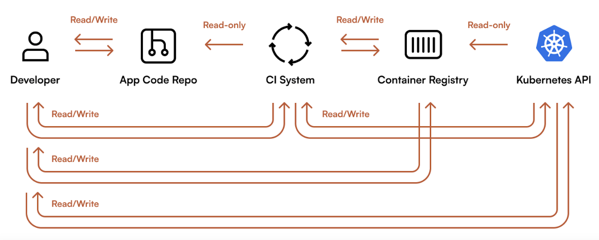


The push model is considered "imperative" - a set of steps necessary to achieve the end goal. Essentially, instructions for how to deploy the build into an environment. 

This approach has several disadvantages, including:


* The workflow requires credentials with write access to the cluster and direct access to the cluster's API server.
* Since the cluster's state is established imperatively, reproducing it would require re-running all workflows that modify the cluster.
* To achieve the desired state, you must carefully plan every step in the sequence.Changes to the steps require detailed consideration and meticulous testing.


**<mark>GitOps uses the pull model.</mark>** 

After changes have been made in the repo, it triggers the build and, once complete, **updates the manifests for the desired state in the environment configuration repository.** 

**The GitOps agent (e.g., Argo CD) will pull the change from the repo and apply it to the cluster.**


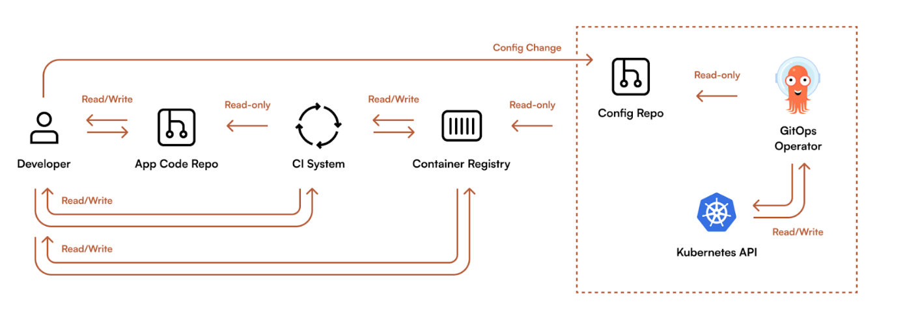

The pull model is "declarative", meaning that you define what should exist while relying on the tooling to figure out the implementation. This approach has many advantages:

* **Repeatability**: With a declarative desired state, deployments are repeatable, and environments can be easily recreated.
* **Collaboration**: Changes are made through Pull Requests, enabling a similar review process as used for changes to source code.
* **Visibility**: The commit history indicates how the desired state changed and why.
* **Consistency**: **Changes to the collective desired state of the cluster must first be integrated into the environment configuration repository**.
* **Security**: The workflow does not have credentials with write access or direct access to the cluster. The source of truth comes from a trusted repository and is applied using a service operating within your infrastructure (or cluster).


### **2-3 How are GitOps and Continuous Delivery Related?**


**GitOps is a framework for managing the state of environments where CD focuses on the automation of the changes.**

CD and GitOps work together to accomplish the same objective of delivering software faster and with <mark>better quality through automation and continuous feedback.</mark>

**GitOps changes how CD workflows interact with the infrastructure, pulling changes from an environment configuration repository instead of pushing them into the cluster.**


* GitOps implements pushing into the cluster as a part of the CI workflow.

**False**; GitOps uses the pull model independent of a CI workflow.


## **2 Introduction to ArgoCD**

### **2-1 What is Argo CD?**

The answer depends on who you ask. From the perspective of:

* **Non-technical business leadership**

Argo CD is a software that helps organizations achieve faster time-to-market by automating the deployment of internal and customer-facing application features and updates. 

It provides better visibility, simplifies compliance, and increases developer productivity.

* **An application developer**


Argo CD is a tool that automates deploying, updating, and managing applications using a command line tool, an elegant web UI, and configurations in git.

* **A cluster administrator** 

<mark>Argo CD is a control plane for automating Kubernetes cluster management using Continuous Delivery and GitOps practices.</mark>

Argo CD is a robust tool for deploying applications in multi-cluster environments. 

**It supports a variety of architectures, from running an instance in each cluster to a single-control plane that can manage many clusters.**

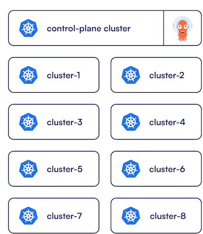

### **2-2 How does Argo CD relate to GitOps?**

Argo CD is commonly used to implement GitOps practices with Kubernetes. 


**<mark>It acts as the software agent that automatically pulls the desired state from the specified source** (e.g., the environment configuration repository) and continuously reconciles it with the live state of the cluster</mark>.

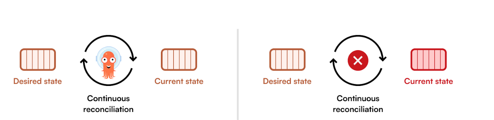

### **2-3 How does Argo CD relate to Continuous Delivery
(CD)?**

In a Continous Delivery workflow, where building, testing, configuring, and deploying an application
is automated, **Argo CD is used to deploy the application and its configuration to Kubernetes**.

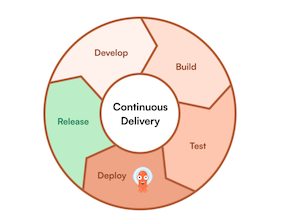

The Argo CD API / CLI can be integrated into workflows to trigger the deployment. 


When following GitOps principles, **the workflows can update the manifests in a configuration repository and Argo CD will automatically pick up the changes and deploy them to the cluster**.

### **2-3 Argo CD and Kubernetes**

Argo CD and its configurations are represented by Custom Resource Definitions (CRDs) in Kubernetes. 

Administrators already familiar with Kubernetes will be able to easily understand and work with the configuration in the YAML manifests. 

**The configurations are portable between Kubernetes clusters, regardless of the underlying infrastructure**.

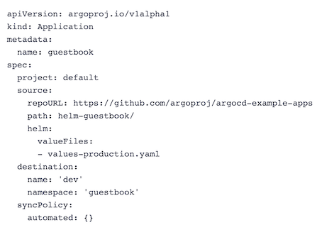

Using CDs promotes declarative management of the configuration. This simplifies the integration
of GitOps practices for managing changes to the desired state of Argo CD. 

After the initial bootstrapping, Argo CD can then manage itself the same way it would any other Kubernetes resource.


Beyond the improved usability, being Kubernetes-native allows for better integration with the rest of
the Kubernetes ecosystem. 

This enables community-driven projects to extend the functionality of Argo CD. 

For example, **the "argocd-vault-plugin" project**, which aims "at helping to solve the issue of
secret management with GitOps and Argo CD." 

More Argo Project ecosystem and community
projects can be found [https://github.com/argoproj-labs](https://github.com/argoproj-labs)


## 3 The Argo CD Application Resource

### **3-1 What is an Argo CD Application?**


The Application CRD is the most significant resource introduced by Argo CD. 

It declaratively defines the deployment process for manifests into Kubernetes. 

Including where to source the manifests, how to render them, when to deploy the resources, when to reconcile the live state with the desired state, and much more.

Below is a complete and functional example of an Argo CD Application manifest.

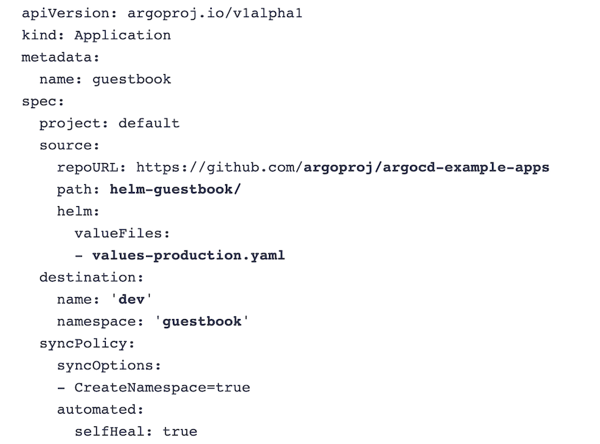


This Application will automatically deploy the Helm chart from the **`helm-guestbook/`** path in the
**`argoproj/argocd-example-apps`** GitHub repository with the **`values-production.yaml`** values file to
the guestbook namespace in the dev cluster.


**The sync policy will run automatically as changes are made in the repository**

**self-heal resources that
deviate from the desired state, and create the namespace if needed.**

### **3-2 How Does an Application Determine What Resources to Deploy?**

Applications use a config management tool, a source repository and path, and a target revision to
render the manifests and determine the difference between the desired and live states.


In this example, the source is the **`argoproj/argocd-example-apps`** GitHub repository and its **`helm-
guestbook`** path. 

The source also specifies to use the values-production.yaml file from the path as a values file for the Helm chart.

```
source:
	repoURL:https://github.com/argoproj/argocd-example-apps
	path: helm-guestbook/
helm:
	valueFiles:
	- values-production.yaml
```

Argo CD has built-in support for common config management tools (e.g., Helm, kustomize) and also
supports plain YAML. 

Beyond this, you can integrate any tool into Argo CD using a **config management plugin (CMP).** This mechanism provides a way to add additional tooling for use by Applications. 

Tool detection can happen automatically based on the files found in the source repository path.

The source can be a Git repository or a Helm chart repository. 

When using a Git repository, the target
revision can track branches or tags, or be pinned to a specific commit. 

Otherwise, for Helm, the target revision will be the chart version.


Argo CD adds labels or annotations (depending on the method used) to the resources deployed by an Application to keep track of them.

### **3-3 How Does An Application Know Where To Deploy Resources?**

Argo CD can deploy resources to the cluster it is running in or to connected clusters. 

In the Application manifest, the desired location is represented in the " destination' field with either the
name or server URL of the cluster and the namespace in it.

In this example, the resources will be deployed to the **guestbook namespace in the connected cluster named dev.**

```
destination:
	name: "dev"
namespace: "questbook"
```

### **3-4 What Does it Mean To Sync An Application?**

Syncing an Application will reconcile the live state of the cluster with the desired state as defined in
the source. 

Each Application has a sync policy that defines how to handle the reconciliation.

The policy defines whether the sync should be triggered manually ( by clicking a button, using the
CLI, or the API) or automatically as the changes are made to the source. Additionally, the policy can
customize numerous characteristics of how the Application syncs resources.


In this example, it will automatically **create the namespace** in the destination cluster and **self-heal**
itself if a resource in the cluster deviates from the desired state.

```
syncPolicy:
	syncOptions:
	- CreateNamespace=true
	automated:
		selfHeal: true
```

### **3-5 What is Application Health?**

What is Application Health?

Argo CD provides health checks for many common Kubernetes resources, including the standard
Deployment resource and other Kubernetes projects like the cert-manager Certificate resource. 

The Application then provides overall health depending on the health of its resources.


There are five health statuses for resources:


1. **Healthy** - The resource is running as expected.
2. **Progressing** - The resource is in the process of being updated or created.
3. **Degraded** - The resource is running, but a problem requires attention. For example, a pod may be failed due to an ImagePullBackOff error.
4. **Missing** - The resource does not exist in the cluster because it was not created or deleted
5. **Suspended** - The resource is waiting for an external event (e.g., **a suspended CronJob or a paused Deployment**).

When an Application's health is Degraded, a resource is
missing or hasn't been created yet. (**False**)

> The Degraded status indicates that a resource is running, but a problem requires attention.

An Application sync is triggered when a new tag is
created in a container registry. (**False**）

> An Application sync can be triggered manually via the UI, CLI, or API or automatically when changes are detected in the source.

## 4 Lab

**`leaderboard-dev.yaml`**

```
apiVersion: argoproj.io/v1alpha1
kind: Application
metadata:
  name: 'leaderboard-dev'
spec:
  destination:
    name: 'in-cluster'
    namespace: 'dev'
  source:
    path: 'charts/leaderboard'
    repoURL: 'ssh://root@10.5.0.206/root/argo-cd-learning-assets/'
    targetRevision: HEAD
    helm:
      valueFiles:
      - values-dev.yaml
  project: 'default'
  syncPolicy:
    syncOptions:
      - CreateNamespace=true
```

**`values-dev.yaml`**

```
replicaCount: 1
image:
  tag: 0.5.3
```

This manifest describes an Application.

* The name of the Application is `leaderboard-dev`
* The source is your GitOps repo, pointing to the `leaderboard` Helm chart.
* The `values-dev.yaml` file is being passed to the chart.
* The destination is the cluster Argo CD is running in and the `dev` namespace.
* The sync policy will automatically create the namespace.

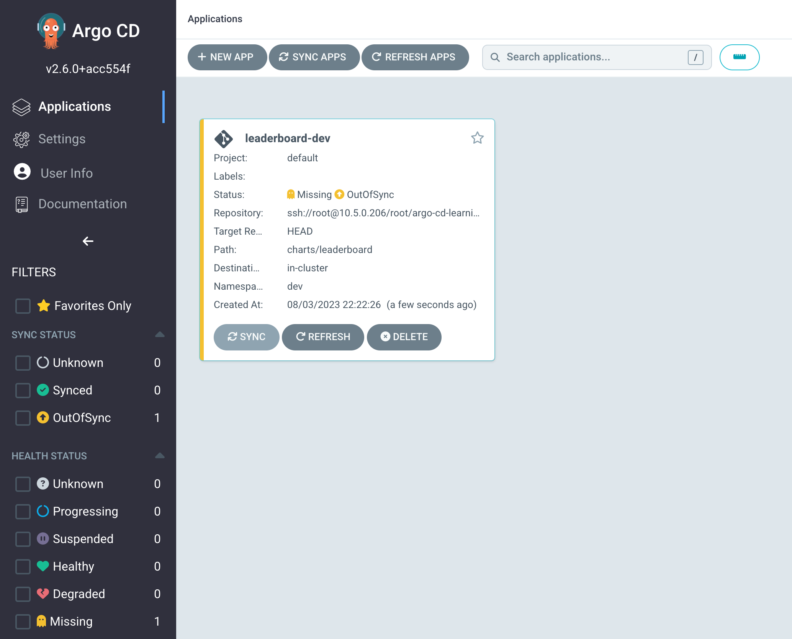

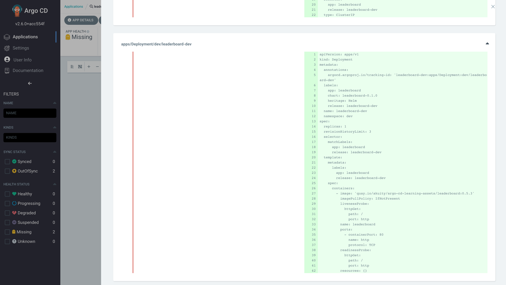

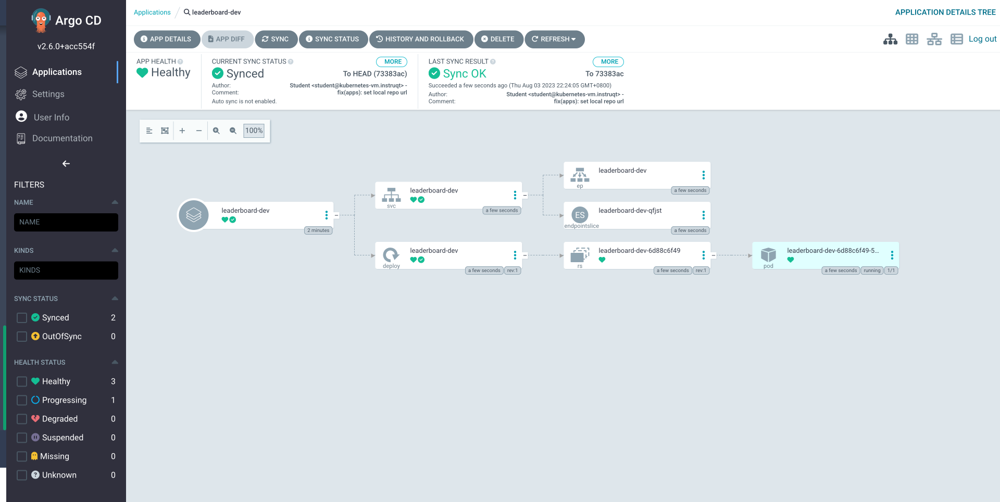


### Auto Sync

You will enable auto-sync so that this and any future changes will be automatically applied—removing the need for developers to manually trigger a deployment for changes that already made it through the approval processes (e.g., a pull request).

1. In the top menu, click APP DETAILS.
2. Under the `SYNC POLICY` section, click `ENABLE AUTO-SYNC` and on the prompt, click OK.
3. Below that, on the right of `"SELF HEAL"`, click `ENABLE` and on the prompt, click `OK`.

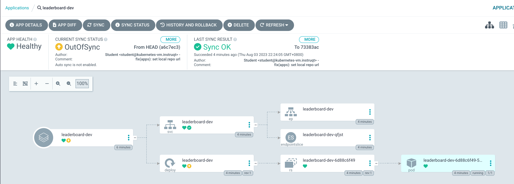

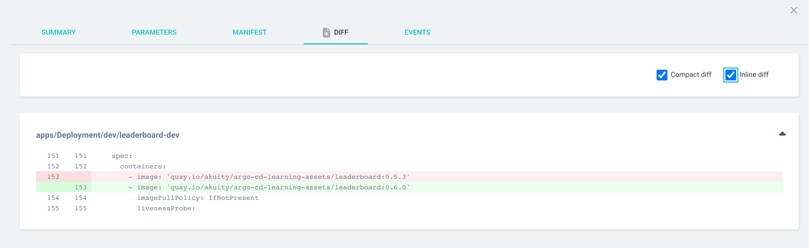

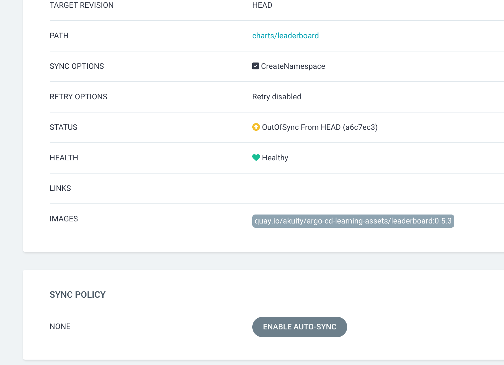

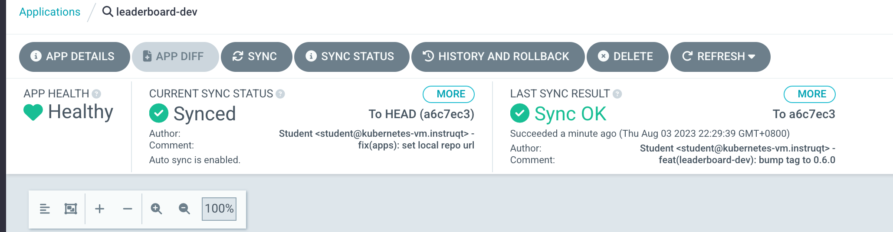

**`leaderboard-prod.yam`**